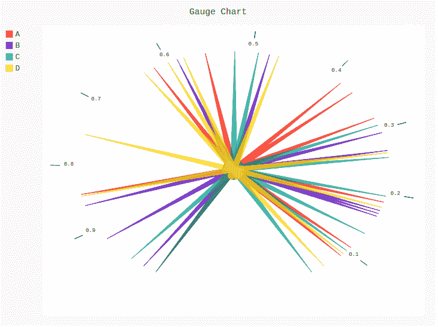
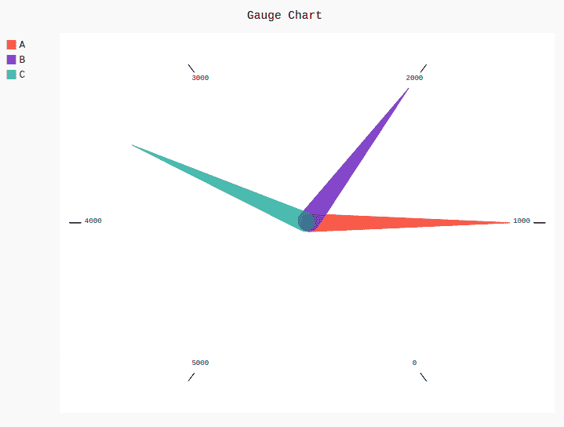

# 皮格尔仪表图

> 原文:[https://www.geeksforgeeks.org/gauge-chart-in-pygal/](https://www.geeksforgeeks.org/gauge-chart-in-pygal/)

Pygal 是一个 Python 模块，主要用于构建 SVG(标量矢量图形)图形和图表。SVG 是一种基于矢量的 XML 格式的图形，可以在任何编辑器中编辑。Pygal 可以用最少的代码行创建图表，这些代码行易于理解和编写。

## 仪表图

仪表图也称为刻度盘图或速度计图。这种类型的图表通常用于高管仪表板报告，以显示关键业务指标。通过在同一仪表上使用多个指针或使用多个仪表，仪表图对于比较少量变量之间的值非常有用。它显示正在分析的数据的最大值、最小值和现值。可以使用`Gauge()`方法创建。

**语法:**

```py
gauge_chart = pygal.Gauge()
```

**例 1:**

```py
# importing pygal
import pygal
import numpy

# creating the chart object
gauge = pygal.Gauge()

# naming the title
gauge.title = 'Gauge Chart'        

# Random data
gauge.add('A', numpy.random.rand(10))
gauge.add('B', numpy.random.rand(10))
gauge.add('C', numpy.random.rand(10))
gauge.add('D', numpy.random.rand(10))

gauge
```

**输出:**



**例 2:**

```py
# importing pygal
import pygal

# creating the chart object
gauge = pygal.Gauge()

# naming the title
gauge.title = 'Gauge Chart'     

gauge.range = [0, 5000]

# Random data
gauge.add('A', 1000)
gauge.add('B', 2000)
gauge.add('C', 3500)

gauge
```

**输出:**

