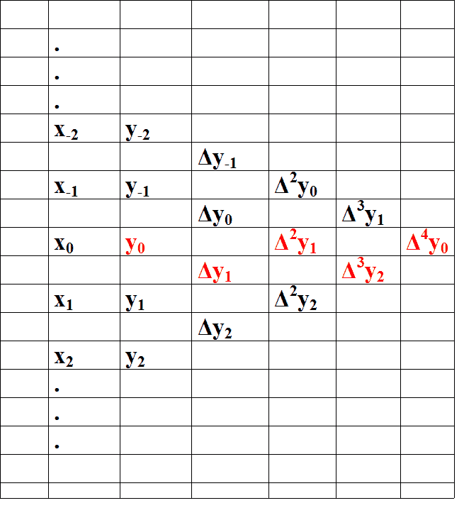
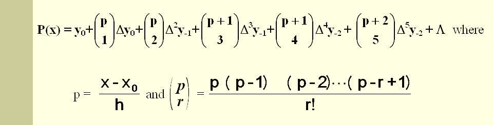
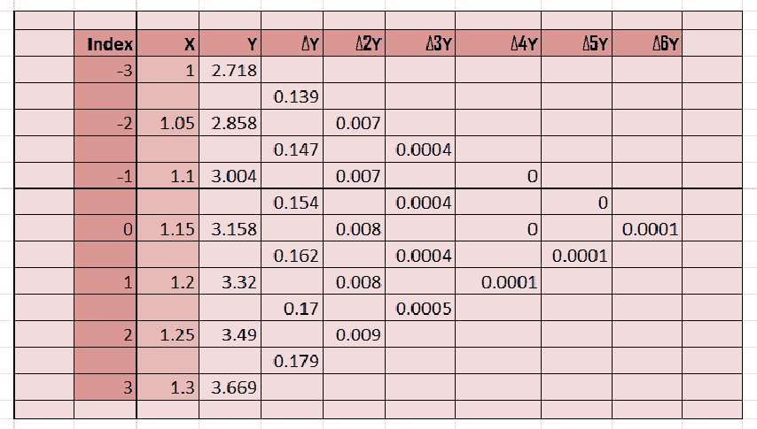

# 高斯正向插值

> 原文:[https://www.geeksforgeeks.org/gausss-forward-interpolation/](https://www.geeksforgeeks.org/gausss-forward-interpolation/)

插值是指在给定数据集内创建新数据点的过程。下面的代码使用高斯给出的公式和称为高斯正演法的方法，计算离散数据集给定范围内的所需数据点。

**高斯正演法:**

高斯插值属于中心差分插值公式。假设对于 X 的一组值，我们得到 y=f(x)的以下值:
X: x0 x1 x2 ……xn
Y:y0 y1 y2……yn
当分别用δy0、δy1、δy2、……和δyn–1 表示时，差 y1–y0、y2–y1、y3–y2、……和 yn–1 被称为第一向前差。因此，第一个向前的差异是:
δy<sub>0</sub>= y<sub>1</sub>–y<sub>0</sub>
，同样，我们可以计算高阶差异。



创建表后，我们根据以下公式计算值:



现在，让我们举个例子来解决它，以便更好地理解。
**问题:**
从下表中，利用高斯正演公式求出 **e <sup>1.17</sup>** 的值。

<figure class="table">

| **x** | One | One point zero five | One point one | One point one five | One point two | One point two five | One point three |
| **e<sup>x</sup>T3】** | 2.7183 | 2.8577 | 3.0042 | 3.1582 | 3.3201 | 3.4903 | 3.6693 |

</figure>

**解决方案:**
我们有

**y<sub>p</sub>= y<sub>0</sub>+pδy<sub>0</sub>+(p(p-1)/2！.δy<sup>2</sup><sub>0</sub>+((p+1)p(p-1)/3！.δy<sup>3</sup><sub>0</sub>+…**
其中 p =(x<sub>1.17</sub>–x<sub>1.15</sub>)/h
和 h = x<sub>1</sub>–x<sub>0</sub>= 0.05
所以，p = 0.04
现在，我们需要计算δy<sub>0</sub>



将所需值放在公式中-
y<sub>x = 1.17</sub>= 3.158+(2/5)(0.162)+(2/5)(2/5–1)/2。(0.008)……
y<sub>x = 1.17</sub>= 3.2246
**代码:实现高斯正演公式的 Python 代码**

## 蟒蛇 3

```py
# Python3 code for Gauss's Forward Formula
# importing library
import numpy as np

# function for calculating coefficient of Y
def p_cal(p, n):

    temp = p;
    for i in range(1, n):
         if(i%2==1):
             temp * (p - i)
         else:
             temp * (p + i)
    return temp;
# function for factorial
def fact(n):
    f = 1
    for i in range(2, n + 1):
        f *= i
    return f

# storing available data
n = 7;
x = [ 1, 1.05, 1.10, 1.15, 1.20, 1.25, 1.30 ];

y = [[0 for i in range(n)]
        for j in range(n)];
y[0][0] = 2.7183;
y[1][0] = 2.8577;
y[2][0] = 3.0042;
y[3][0] = 3.1582; 
y[4][0] = 3.3201;
y[5][0] = 3.4903;
y[6][0] = 3.6693;

# Generating Gauss's triangle
for i in range(1, n):
    for j in range(n - i):
        y[j][i] = np.round((y[j + 1][i - 1] - y[j][i - 1]),4);

# Printing the Triangle
for i in range(n):
    print(x[i], end = "\t");
    for j in range(n - i):
        print(y[i][j], end = "\t");
    print("");

# Value of Y need to predict on
value = 1.17;

# implementing Formula
sum = y[int(n/2)][0];
p = (value - x[int(n/2)]) / (x[1] - x[0])

for i in range(1,n):
    # print(y[int((n-i)/2)][i])
    sum = sum + (p_cal(p, i) * y[int((n-i)/2)][i]) / fact(i)

print("\nValue at", value,
    "is", round(sum, 4));
```

**输出:**

```py
1       2.7183  0.1394  0.0071  0.0004  0.0     0.0     0.0001  
1.05    2.8577  0.1465  0.0075  0.0004  0.0     0.0001  
1.1     3.0042  0.154   0.0079  0.0004  0.0001  
1.15    3.1582  0.1619  0.0083  0.0005  
1.2     3.3201  0.1702  0.0088  
1.25    3.4903  0.179   
1.3     3.6693  

Value at 1.17 is 3.2246
```