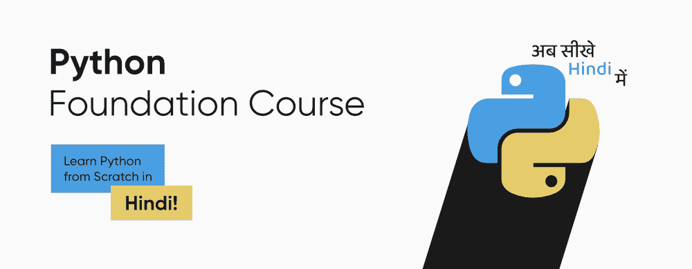

# GeeksforGeeks Python 基础课程——用印地语学习 Python！

> 原文:[https://www . geesforgeeks . org/geesforgeeks-python-foundation-course-learn-python-in-Hindi/](https://www.geeksforgeeks.org/geeksforgeeks-python-foundation-course-learn-python-in-hindi/)

**Python**–*它不仅仅是一种普通的编程语言，而是进入众多技术领域的门户或基本先决条件，包括网络开发、机器学习、数据科学和其他几个领域。*

尽管毫无疑问，Python 在各个领域都有替代品，但 Python 在科技领域的主导地位和受欢迎程度是无与伦比的。为什么不呢，因为这种语言具有各种显著的特点和优势，如易学、多功能和灵活性、庞大的库、巨大的社区支持等。随后，考虑到巨大的职业机会，学习 Python 语言肯定是一个值得的决定。

现在，阻止你从 Python 开始的原因是什么？？好吧，不管是什么原因，比如缺乏优质资源、结构化学习路线图，甚至语言障碍——geeks forgeeks 都会帮你解决所有这些问题。

出于同样的考虑，GeeksforGeeks 正在为您提供 [**Python 基础–印地语在线课程**](https://practice.geeksforgeeks.org/courses/python-foundation-hindi?vC=1) ，这一定会帮助您最方便地开始使用 Python 编程语言。这是一门**非常适合初学者的课程**，是专门为那些没有 Python 语言相关知识的人设计的，关键因素是，你将在这里**用印地语从头开始学习 Python**！

### 课程详情

这门在线课程是专门为那些希望开始用 Python 编程并为其打下基础的初学者设计的。无论您是在校生/大学生，还是只想从一开始就学习 Python 的其他人，我们都强烈推荐您学习这门 Python 基础-印地语课程。你需要知道课程视频讲座中使用的语言是印地语。由于这是一门在线课程，您可以随时随地参加这门课程。

在本课程中，您还将学习如何解决编码问题，这些问题肯定会将概念硬连接到您身上，为此，我们提供了各种方法来解决任何特定的问题。在本课程中，您将学习:

*   *Python 基础知识*
*   *Python 中的函数*
*   *Python 中的字符串*
*   *编写高效简洁代码的实践练习*
*   *如何解决与每个概念相关的编码问题*
*   *使用 Python 制作不同项目的实践练习*

除此之外，本课程的一些额外的突出特点如下:

*   *测验&基于理论的学习*
*   *基于轨迹的学习和评估测试*
*   *终身参加课程*
*   *极客集团的实习机会*
*   *访问极客博客工作门户*
*   *顶级公司信赖的课程结业证书*

本课程以学生友好的价格 499 印度卢比向您提供，您可以通过以下步骤直接注册本课程:

*   **步骤-1:** 访问 [**Python 基金会-印地语在线课程**](https://practice.geeksforgeeks.org/courses/python-foundation-hindi?vC=1) 的官方页面。
*   第二步:然后点击**【立即注册】**按钮，在表格中输入所需的详细信息，如姓名、毕业年份等。
*   第三步:注册后，您需要点击**“在线支付”**按钮进行支付。
*   第四步:然后您将成功注册课程，并能够访问内容。

如有任何疑问，您可以发送电子邮件至*geeks.classes@geeksforgeeks.org*

### 课程内容

本 Python 基础-印地语课程将提供以下内容:

**1。Python 基础**

*   Python 简介
*   Python 标准及其实现
*   Python 安装和第一个程序

**2。变量和数据类型**

*   Python 中的变量
*   列表简介
*   Python 中的元组和集合
*   Python 中的类型转换

**3。Python 中的输入和输出**

*   Python 中的 print()
*   Python 中的输入()

**4。操作员**

*   Python 中的算术运算符
*   Python 中的逻辑运算符
*   Python 中的按位运算符
*   基于算子的实践问题

**5。流量控制**

*   Python 中的 if、else 和 elif
*   Python 中的奇偶校验
*   流量控制的实践问题

**6。循环**

*   Python 中的 While 循环和 For 循环
*   Python 中的范围函数
*   Python 中的中断和继续
*   Python 中的嵌套循环

**7。功能**

*   函数在 Python 中的应用
*   Python 中的参数传递
*   在 Python 中返回多个值
*   使用函数练习问题

**8。琴弦**

*   Python 中的字符串
*   字符串操作
*   Python 中的字符串比较和模式搜索

**9。列表**

*   切片(列表、元组和字符串)
*   列表的平均值
*   练习 Python 中使用列表的问题

**10。项目**

*   使用 Python 制作不同项目的实践

> **要查看 Python 基础-印地语课程的详细教学大纲，** [**单击此处**](https://media.geeksforgeeks.org/courses/syllabus/ba9369cbab88452ebdd907bc95d22660.pdf) **。**

### 常见问题解答

**Q-1。如何注册课程？**

**Ans。**您需要报名参加 [**课程**](https://practice.geeksforgeeks.org/courses/python-foundation-hindi?vC=1) 。注册后，需要在付款链接打开时付款。

**Q-2。课程内容会在课程结束日期后提供吗？**

**Ans。**是的，课程内容自带终身有效期。

**Q-3。我们对这个项目有疑问支持吗？**

**Ans。**您可能会获得怀疑支持的附加功能。购买本课程时，请点击“添加到购物车”获取疑问支持和帮助。

**Q-4。该计划将提供什么类型的证书？**

**Ans。**课程结束后，您将获得课程结业证书。

**Q-5。我可以通过在线模式支付课程费用吗？**

**Ans。**可以，课程费用可以通过网上银行、信用卡/借记卡、UPI (Google Pay、PayTM、Phone pay 等)支付。).

*这个* [*Python 基础–印地语课程*](https://practice.geeksforgeeks.org/courses/python-foundation-hindi?vC=1) *一定会帮助你相当高效地学习 Python 语言。那么，你现在还在等什么…？？一定要尽快注册！！*