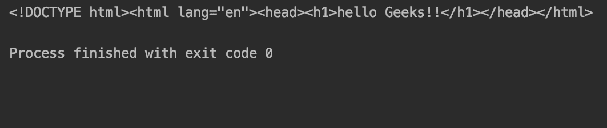
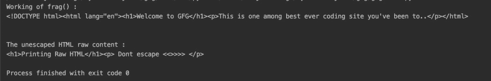
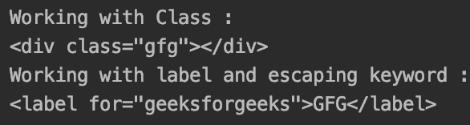
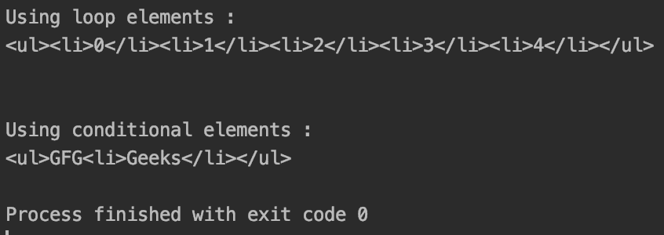
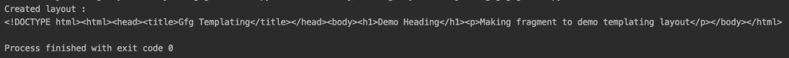

# 使用 Python 中的 tinyhtml 模块生成 HTML】

> 原文:[https://www . geeksforgeeks . org/generate-html-using-tinyhtml-module-in-python/](https://www.geeksforgeeks.org/generate-html-using-tinyhtml-module-in-python/)

创建 HTML 有时可能是乏味的任务，难以调试并且容易出错。解决这个问题的一个方法是使用一些库来处理打开和关闭 div 等，这样可以减少出错的机会。为此，我们将使用 **tinyhtml** 模块。

该模块提供了一组有助于使用 Python 代码呈现 html5 的类，并允许将几个 html 标记组合在一起。它还有助于发布原始的非转义 HTML，提供使用构建器进行循环或类型转换的功能。

### 装置

要安装此模块，请在终端中键入以下命令。

```
pip install tinyhtml
```

### **使用的功能**

*   **html() :** 标记 html 代码的开始。
*   **h()** :大部分实用功能，允许渲染属性，普通元素，以及空/自关闭元素。
*   **raw()** :用于打印未转义的 html 字符串。
*   **frag()** :将几个 HTML 标签组合在一起。
*   **render()** :处理并转换输入的 html。

**例 1:**

## 蟒蛇 3

```
from tinyhtml import html, h

# Constructing HTML using html() and h()
# nested h() is also supported
html_content = html(lang="en")(
    h("head")(
        (h("h1")("hello Geeks!!")),
    ),
).render()

# printing html formed on console.
print(html_content)
```

**输出:**



**实施例 2:使用 raw()和 frag()**

## 蟒蛇 3

```
from tinyhtml import html, h, frag, raw

# using frag() to group to h fncs.
print("Working of frag() : ")
html_content = html(lang="en")(
    frag(h("h1")("Welcome to GFG"), h("p")("This\
    is one among best ever coding site you've been\
    to.."))).render()

print(html_content)

print("\n")

# prints raw unescaped HTML.
print("The unescaped HTML raw content : ")
print(raw('<h1>Printing Raw HTML</h1>
<p> Dont escape <<>>>> </p>
'))
```

**输出:**



**示例 3:使用类和标签作为 HTML**

在这种情况下，我们使用“ **klass** ”运算符来初始化一个类。对于与 Python 保留关键字命名一致的其他标签，会附加一个尾随下划线。

## 蟒蛇 3

```
from tinyhtml import h

# using klass to initialize class
print("Working with Class : ")
class_inp = h("div", klass="gfg")()
print(class_inp)

# using _ to escape for loop operator
print("Working with label and escaping keyword : ")
label_inp = h("label", for_="geeksforgeeks")("GFG")
print(label_inp)
```

**输出:**



**示例 4:使用循环和条件**

基本的 python 循环和条件也可以呈现需要循环(如列表元素和条件)的 HTML 内容。

## 蟒蛇 3

```
from tinyhtml import h

# initializing loop elements
print("Using loop elements : ")
looped_element = h("ul")(h("li")(idx) for idx in range(5))
print(looped_element)

print("\n")

# using conditionals
print("Using conditional elements : ")
conditional_element = h("ul")(
    h("li")("Gfg") if False else "GFG", h("li")("Geeks"))
print(conditional_element)
```

**输出:**



**示例 5:使用函数模板化 HTMLs】**

## 蟒蛇 3

```
from tinyhtml import h, html, frag

# function to create layout.
# advantage is that this can be reused.
def create_layout(title, body):
    return html()(
        h("head")(
            h("title")(title),
        ),
        h("body")(body)
    )

# calling function to create layout.
layout = create_layout("Gfg Templating", frag(
    h("h1")("Demo Heading"),
    h("p")("Making fragment to demo templating layout"),
))

print("Created layout : ")
print(layout)
```

**输出:**



模板化 html