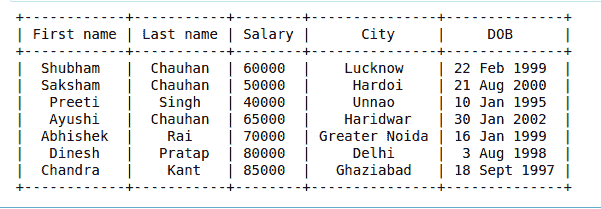
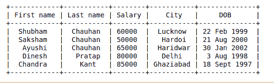
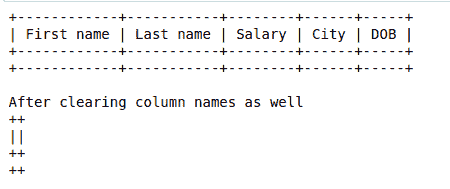
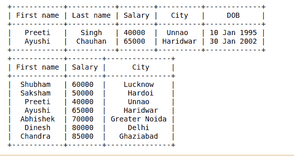

# 使用 Python 中可修改的代码生成简单的 ASCII 表

> 原文:[https://www . geesforgeks . org/generate-simple-ascii-tables-using-prettable-in-python/](https://www.geeksforgeeks.org/generate-simple-ascii-tables-using-prettytable-in-python/)

Prettytable 是一个 Python 库，用于以吸引人的形式打印 ASCII 表，并从 CSV、HTML 或数据库游标中读取数据，以及以 ASCII 或 HTML 输出数据。我们可以控制表格的许多方面，例如列填充的宽度、文本的对齐方式或表格边框。

### **安装**

为了能够使用可修改的库，我们首先需要使用画中画工具命令
安装它:

```py
pip install prettytable

```

## 插入数据

数据可以逐行插入**或逐列插入**中。****

### ******逐行插入数据******

****为此，您可以首先使用 field _ names 属性设置字段名，然后使用 add_row 方法一次添加一行。
**例:******

## ****蟒蛇 3****

```py
**# importing required library
from prettytable import PrettyTable

# creating an empty PrettyTable
x = PrettyTable()

# adding data into the table
# row by row
x.field_names = ["First name", "Last name", "Salary", "City", "DOB"]
x.add_row(["Shubham", "Chauhan", 60000, "Lucknow", "22 Feb 1999"])
x.add_row(["Saksham", "Chauhan", 50000, "Hardoi", "21 Aug 2000"])
x.add_row(["Preeti", "Singh", 40000, "Unnao", "10 Jan 1995"])
x.add_row(["Ayushi", "Chauhan", 65000, "Haridwar", "30 Jan 2002"])
x.add_row(["Abhishek", "Rai", 70000, "Greater Noida", "16 Jan 1999"])
x.add_row(["Dinesh", "Pratap", 80000, "Delhi", "3 Aug 1998"])
x.add_row(["Chandra", "Kant", 85000, "Ghaziabad", "18 Sept 1997"])

# printing generated table
print(x)**
```

******输出:******

********

### ******逐列插入数据******

****为此，您可以使用 add_column 方法，该方法接受两个参数——一个字符串，它是您要添加的列对应的字段的名称，以及一个包含列数据“
**”的列表或元组。示例:******

## ****蟒蛇 3****

```py
**# importing required library
from prettytable import PrettyTable

# creating an empty PrettyTable
x = PrettyTable()

# adding data into the table
# column by column
x.add_column("First name",
             ["Shubham", "Saksham", "Preeti", "Ayushi",
              "Abhishek", "Dinesh", "Chandra"])

x.add_column("Last name", ["Chauhan", "Chauhan", "Singh",
                           "Chauhan", "Rai", "Pratap",
                           "Kant"])

x.add_column("Salary", [60000, 50000, 40000, 65000, 70000,
                        80000, 85000])
x.add_column("City", ["Lucknow", "Hardoi", "Unnao", "Haridwar",
                      "Greater Noida", "Delhi", "Ghaziabad"])

x.add_column("DOB", ["22 Feb 1999", "21 Aug 2000", "10 Jan 1995",
                     "30 Jan 2002", "16 Jan 1999", "3 Aug 1998",
                     "18 Sept 1997"])

# printing generated table
print(x)**
```

******输出:******

********

## ****删除数据****

****可以使用 del_row()方法删除特定的行。要删除的行的索引作为参数传递。****

******示例:******

## ****蟒蛇 3****

```py
**# importing required library
from prettytable import PrettyTable

# creating an empty PrettyTable
x = PrettyTable()

# adding data into the table
# column by column
x.add_column("First name",
             ["Shubham", "Saksham", "Preeti", "Ayushi",
              "Abhishek", "Dinesh", "Chandra"])

x.add_column("Last name", ["Chauhan", "Chauhan", "Singh",
                           "Chauhan", "Rai", "Pratap",
                           "Kant"])

x.add_column("Salary", [60000, 50000, 40000, 65000, 70000,
                        80000, 85000])
x.add_column("City", ["Lucknow", "Hardoi", "Unnao", "Haridwar",
                      "Greater Noida", "Delhi", "Ghaziabad"])

x.add_column("DOB", ["22 Feb 1999", "21 Aug 2000", "10 Jan 1995",
                     "30 Jan 2002", "16 Jan 1999", "3 Aug 1998",
                     "18 Sept 1997"])

# Deleting row
x.del_row(2)
x.del_row(3)

# printing generated table
print(x)**
```

******输出:******

********

****可以使用 clear_rows()方法删除表中的所有行。此方法将保留列名。若要同时删除行和列，请使用 clear()方法。****

******示例:******

## ****蟒蛇 3****

```py
**# importing required library
from prettytable import PrettyTable

# creating an empty PrettyTable
x = PrettyTable()

# adding data into the table
# column by column
x.add_column("First name",
             ["Shubham", "Saksham", "Preeti", "Ayushi",
              "Abhishek", "Dinesh", "Chandra"])

x.add_column("Last name", ["Chauhan", "Chauhan", "Singh",
                           "Chauhan", "Rai", "Pratap",
                           "Kant"])

x.add_column("Salary", [60000, 50000, 40000, 65000, 70000,
                        80000, 85000])
x.add_column("City", ["Lucknow", "Hardoi", "Unnao", "Haridwar",
                      "Greater Noida", "Delhi", "Ghaziabad"])

x.add_column("DOB", ["22 Feb 1999", "21 Aug 2000", "10 Jan 1995",
                     "30 Jan 2002", "16 Jan 1999", "3 Aug 1998",
                     "18 Sept 1997"])

# Deleting all rows
x.clear_rows()

print(x)

# Deleting column name as well
print("\nAfter clearing column names as well")
x.clear()

print(x)**
```

******输出:******

********

## ******控制显示哪些数据******

****您可以控制要显示哪些行或哪些列。**** 

## ****蟒蛇 3****

```py
**# importing required library
from prettytable import PrettyTable

# creating an empty PrettyTable
x = PrettyTable()

# adding data into the table
# column by column
x.field_names = ["First name", "Last name", "Salary", "City", "DOB"]
x.add_row(["Shubham", "Chauhan", 60000, "Lucknow", "22 Feb 1999"])
x.add_row(["Saksham", "Chauhan", 50000, "Hardoi", "21 Aug 2000"])
x.add_row(["Preeti", "Singh", 40000, "Unnao", "10 Jan 1995"])
x.add_row(["Ayushi", "Chauhan", 65000, "Haridwar", "30 Jan 2002"])
x.add_row(["Abhishek", "Rai", 70000, "Greater Noida", "16 Jan 1999"])
x.add_row(["Dinesh", "Pratap", 80000, "Delhi", "3 Aug 1998"])
x.add_row(["Chandra", "Kant", 85000, "Ghaziabad", "18 Sept 1997"])

# With the start and end parameters, we can select
# which rows to display in the output.
print(x.get_string(start=2, end=4))

# With the fields option we can select columns
# which are going to be displayed.
print(x.get_string(fields=["First name", "Salary", "City"]))**
```

******输出:******

********

### ******可以执行的各种其他操作******

*   ****排序(升序或降序)可以使用 sortby 属性来执行，在该属性中，我们通过指定要排序的列来对表进行排序。****
*   ****可以使用 get_html_string 方法生成表的 HTML 输出。****

## ****蟒蛇 3****

```py
**# importing required library
from prettytable import PrettyTable

# creating an empty PrettyTable
x = PrettyTable()

# adding data into the table
# row by row
x.field_names = ["First name", "Last name", "Salary", "City", "DOB"]
x.add_row(["Shubham", "Chauhan", 60000, "Lucknow", "22 Feb 1999"])
x.add_row(["Saksham", "Chauhan", 50000, "Hardoi", "21 Aug 2000"])
x.add_row(["Preeti", "Singh", 40000, "Unnao", "10 Jan 1995"])
x.add_row(["Ayushi", "Chauhan", 65000, "Haridwar", "30 Jan 2002"])
x.add_row(["Abhishek", "Rai", 70000, "Greater Noida", "16 Jan 1999"])
x.add_row(["Dinesh", "Pratap", 80000, "Delhi", "3 Aug 1998"])
x.add_row(["Chandra", "Kant", 85000, "Ghaziabad", "18 Sept 1997"])

# printing generated table
print("Original Table:")
print(x)

# printing the HTML string of this table
print("\nHTML code for this Table:")
print(x.get_html_string())

# printing table after sorting(ascending) 
# by column salary
x.sortby = "Salary"
print("\nSorted Table by Salary:")
print(x.get_string())

# printing table after sorting(ascending) 
# by column city
x.sortby = "City"
x.reversesort = True
print("\nReverse Sorted Table by City:")
print(x.get_string())**
```

******输出:******

****<video class="wp-video-shortcode" id="video-466132-1" width="665" height="374" preload="metadata" controls=""><source type="video/webm" src="https://media.geeksforgeeks.org/wp-content/cdn-uploads/20200807193142/pyhton-pretty-table.webm?_=1">[https://media.geeksforgeeks.org/wp-content/cdn-uploads/20200807193142/pyhton-pretty-table.webm](https://media.geeksforgeeks.org/wp-content/cdn-uploads/20200807193142/pyhton-pretty-table.webm)</video>****