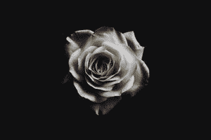
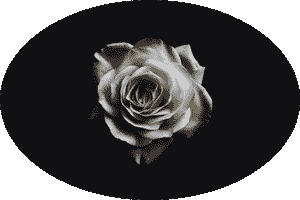
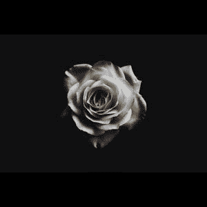

# 用 Python 生成方形或圆形缩略图–枕头

> 原文:[https://www . geesforgeks . org/generate-square-or-circular-缩略图-带 python 的图像-抱枕/](https://www.geeksforgeeks.org/generate-square-or-circular-thumbnail-image-with-python-pillow/)

**先决条件:** [枕头](https://www.geeksforgeeks.org/python-pillow-a-fork-of-pil/)[Numpy](https://www.geeksforgeeks.org/python-numpy/)

在“缩略图”这个词中，THUMB 这个词的意思是短。缩略图是原始图像的压缩预览图像，或者缩略图是图像的较小版本。简而言之，缩略图是代表较大/原始图像的较小图像。

通常，缩略图的形状取决于原始图像，但在本文中，我们将使用 Python 中的枕头库生成圆形和方形缩略图。

**安装:**

要安装枕头和 NumPy 库，请在命令提示符下编写以下命令。

```
pip install pillow
pip install numpy
```

**示例 1:使用枕头库打开图像。**

## 计算机编程语言

```
# importing necessary libraries
from PIL import Image

# opening the image from the storage using 
# Image.open() function
orig_img=Image.open('Geekwork/sebastian-molina.jpg')

# showing the image using show() function
orig_img.show()
```

**输出:**



**示例 2:使用枕头库生成圆形缩略图。**

**进场:**

*   使用 NumPy 库将图像转换为 NumPy 数组。
*   现在使用 [**PIL 创建一个新的蒙版图像。**](https://www.geeksforgeeks.org/python-pil-image-new-method/) 函数通过传递模式、图像大小和颜色，然后使用 **PIL 绘制图像。Image.Draw.Draw()** 函数通过传递新蒙版图像的大小并让存储在名为“Draw”的变量中。
*   使用 **ImageDraw 在蒙版图像上画圆。Draw.peislice()** 函数通过传递四个点来定义一个边界，开始角度=0，结束角度=360 这将在遮罩图像上创建一个圆，并使用它们传递填充参数来填充图像中的颜色。
*   将蒙版图像转换为 numpy 数组，然后使用 [**numpy.dstack()**](https://www.geeksforgeeks.org/python-numpy-dstack-method/) 函数沿第三个轴沿深度方向堆叠数组，并按照我们在上述步骤中转换的方式传递原始图像数组和蒙版图像数组，以获得圆形图像，并将其存储在名为“npImage”的变量中。
*   由于这个“npImage”是数组格式，我们必须将这个数组转换成一个图像，这是在 **PIL 的帮助下完成的。Image.fromarray()** 函数将 npImage 作为参数传递给这个函数，并让它存储在名为“final_image”的变量中。
*   因为我们已经生成了圆形图像。

**以下是完整实现:**

## 计算机编程语言

```
# importing necessary libraries
from PIL import Image, ImageDraw
import numpy as np

# opening the image from
# the storage using Image.open() function
orig_img=Image.open('sebastian-molina.jpg')

# getting height and width of 
# an image using size() function
height,width=orig_img.size

# converting image to numpy array
npImage=np.array(orig_img)

# Creating mask image in L mode with same image size
new_img = Image.new('L', orig_img.size,0)

# drawing on mask created image using Draw() function
draw = ImageDraw.Draw(new_img)

# making circle on mask image using pieslice() function
draw.pieslice([0,0,height,width],0,360,fill=255)

# Converting the mask Image to numpy array
np_new=np.array(new_img)

# stack the array sequence
# (original image array with mask image) depth wise
npImage=np.dstack((npImage,np_new))

# converting array to an image using fromarray() function
final_img = Image.fromarray(npImage)

# making thumbnail using thumbnail() 
# function by passing the size in it
final_img.thumbnail((500,500))

# saving the circular thumbnail Image
final_img.save('Circular_thumbnail.png')
```

**输出:**



**示例 3:使用枕头库生成方形缩略图。**

**进场:**

*   如果高度= =宽度或高度>宽度或宽度>高度，并且图像尺寸属于后两个条件中的任何一个，请检查这三个条件。
*   然后，我们必须使用图像最长边/维度的 new()函数创建新的遮罩图像。
*   然后使用 paste()函数将原始图像粘贴到新的蒙版图像上，并传递带有计算尺寸的原始图像，我们将在示例说明中讨论。
*   现在我们将按照上面的步骤得到正方形图像。
*   现在我们必须生成缩略图，我们可以通过使用 PIL 做到这一点。方法，将大小作为参数传递，然后使用 PIL 保存它。方法并用标准图像格式传递图像的名称。

**以下是完整实现:**

## 计算机编程语言

```
# importing necessary libraries
from PIL import Image, ImageDraw
import numpy as np

# function to generate squared image
def square_thumb(thum_img,width,height):

    # checking if height and width are
    # are equal then return image as it is
    if height == width:
        return thum_img

    # checking if height is greater than width
    elif height > width:

        # creating the new mask image of size i,e height of Image
        square_img = Image.new(thum_img.mode, (height, height))

        # pasting the original image on mask image
        # using paste() function to make it square
        square_img.paste(thum_img, ((height - width) // 2,0))

        # returning the generated square image
        return square_img

    # if width is greater than height
    else:

        # creating the new mask image of size i,e width of Image
        square_img = Image.new(thum_img.mode, (width, width))

        # pasting the original image on mask image using paste()
        # function to make it square
        square_img.paste(thum_img, (0, (width - height) // 2))

        # returning the generated square image
        return square_img 

# main function  
if __name__ == "__main__":

    # opening the image from the storage
    # using Image.open() function
    orig_img=Image.open('sebastian-molina.jpg')

    # extracting width and height of an
    # image from the image size 
    w,h = orig_img.size

    # calling the function by passing
    # image width and height as a parameter
    sq_img = square_thumb(orig_img,w,h)

    # generating square thumbnail of
    # required size using thumbnail() function
    sq_img.thumbnail((400,400))

    # saving the thumbnail using save function
    sq_img.save('Square_thumbnail.jpg')
```

**输出:**



**说明:**我们已经创建了通过传递图像来生成正方形图像的函数，它的宽度和高度是一个参数。在函数中，我们检查了三个条件，在此基础上，我们生成了正方形图像。

*   在第一个条件中，我们已经检查了图像的高度是否等于宽度，如果为真，那么我们已经按原样返回了图像，因为当高度和宽度相等时，图像已经是正方形了。
*   在第二种情况下，如果图像的高度大于宽度，那么我们使用 Image.new()函数通过传递图像的模式和大小作为它的高度(即高度，高度)来创建新的遮罩图像，并使用 paste()函数通过传递原始图像和原始图像粘贴在遮罩图像上的尺寸(即， 从计算的尺寸(用原始图像的宽度减去原始图像的高度，然后除以 2)到 0，这样原始图像就可以完美地粘贴在蒙版图像上。
*   在第三个条件中，如果图像的宽度大于高度，那么我们执行与第二个条件中相同的过程，但是唯一的变化是我们创建了大小为宽度(即宽度，宽度)的蒙版图像，在粘贴的情况下，我们必须传递原始图像和尺寸(即， 从 0 到计算的尺寸(通过用原始图像的高度减去原始图像的宽度，然后除以 2)，以便原始图像可以完美地粘贴在蒙版图像上。