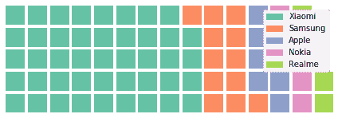

# 使用 Python 中的 py 华夫饼生成华夫饼图

> 原文:[https://www . geeksforgeeks . org/generate-waffle-chart-use-py waffle-in-python/](https://www.geeksforgeeks.org/generate-waffle-chart-using-pywaffle-in-python/)

华夫格图表是一种引人入胜的可视化技术，通常用于显示实现目标的进度。其中华夫格图中的每个单元格由`10 X 10`单元格网格组成，其中每个单元格代表一个百分点，总和为 100%。当您试图向视觉添加有趣的可视化功能时，这通常是一个有效的选项。华夫格图表被广泛用作 Excel 仪表板。

要在 Python 中生成华夫饼图，需要的模块是–**[【熊猫】](http://geeksforgeeks.org/pandas-tutorial/)** 和**华夫饼**。
要安装这些软件包，请运行以下命令:

```
pip install matplotlib
pip install pandas
pip install pywaffle

```

下面是实现:

```
# python program to generate Waffle Chart

# importing all necessary requirements
import pandas as pd
import matplotlib.pyplot as plt
from pywaffle import Waffle

# creation of a dataframe
data ={'phone': ['Xiaomi', 'Samsung',
                 'Apple', 'Nokia', 'Realme'],
       'stock': [44, 12, 8, 5, 3]
     }

df = pd.DataFrame(data)

# To plot the waffle Chart
fig = plt.figure(
    FigureClass = Waffle,
    rows = 5,
    values = df.stock,
    labels = list(df.phone)
)
```

**输出:**

上面的华夫格图是为数据框中的数据生成的

**优势:**

*   更具视觉吸引力。
*   用于吸引人的仪表板。

**缺点:**

*   当涉及太多细分市场时，华夫格图表会变得太复杂。
*   个性化的空间不会在视觉本身中留下放置数字或文本的位置。