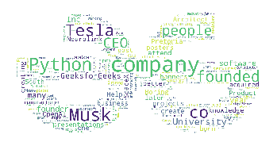

# 在 Python 中生成任意形状的单词云

> 原文:[https://www . geesforgeks . org/generate-word-任何形状的 python 云/](https://www.geeksforgeeks.org/generate-word-clouds-of-any-shape-in-python/)

在本文中，我们将讨论如何在 Python 中创建任何形状的单词云。

术语[字云](https://www.geeksforgeeks.org/generating-word-cloud-python/)是指一种数据可视化技术，用于显示文本数据，其中每个单词的大小指示其频率或相关性。要创建任何形状的字云，请使用 Python 的**[【Matplotlib】](https://www.geeksforgeeks.org/python-introduction-matplotlib/)、字云、 [NumPy](https://www.geeksforgeeks.org/python-numpy/) 和 [PIL](https://www.geeksforgeeks.org/python-pillow-a-fork-of-pil/) 包。**

## ****分步实施****

**让我们看一下分步实施–**

****步骤 1:** 安装下列模块，如下所示-**

```
pip install matplotlib
pip install wordcloud 
```

****步骤 2:** 导入下列模块，如下所示-**

```
import matplotlib.pyplot as plt
from wordcloud import WordCloud, STOPWORDS
import numpy as np
from PIL import Image
```

****步骤 3:** 按照以下步骤操作-**

*   **给出您要使用的文本文件的完整路径。**
*   **在读取模式下，打开文本文件。**
*   **最后，编码并读取。**
*   **本文将使用以下文本文件- [文本](https://media.geeksforgeeks.org/wp-content/cdn-uploads/20210826203649/Text.txt)**

```
text = open(r'C:\Users\Dell\Desktop\Wordcloud\Text.txt',
            mode='r', encoding='utf-8').read()
```

****第 4 步:**按照以下步骤操作-**

*   **给出整个图像路径，我们将使用它来获得相同形状的输出。**
*   **然后，使用 image.open 函数打开图像。**
*   **之后，使用 NumPy 创建图像的数组。**
*   **下图将在本文中用于所需的形状**

****

```
mask = np.array(Image.open(r'C:\Users\Dell|Downloads\Garbage\GFG.png'))
```

****第五步:**通过整合一个 stopword、一个 mask、一个背景色、wordcloud 中的最大字数、mask 的高度和 mask 的宽度来创建一个 wordcloud。**

*   ****stopwords-** 用于避免不必要的字符，如' '。/[{)*&^%~@！#%^ &。**
*   ****mask-** Mask 是我们将把字云转换成的形状。**
*   ****background_color-** 我们可以使用任何我们喜欢的背景颜色，比如黑色、绿色等等。**
*   ****max_words-** 是一个词云可以包含的最大字数。**
*   ****max_font-** 是最大字号。**
*   **字云的宽度和高度由宽度和高度表示。**

```
wc = WordCloud(stopwords = STOPWORDS,
               mask = mask, background_color = "white",
               max_words = 2000, max_font_size = 500,
               random_state = 42, width = mask.shape[1],
               height = mask.shape[0])
```

****第六步:****

*   **现在，使用生成函数，我们将根据提供的文本创建一个单词云。**
*   **要显示图像数据，请使用 imshow 功能。**
*   **我们将尝试偏离 x 轴和 y 轴。**
*   **最后，我们将使用 matplotlib 中定义的 show 函数显示生成的 wordcloud。**

```
wc.generate(text)
plt.imshow(wc, interpolation="None")
plt.axis('off')
plt.show()
```

**下面是完整的实现。**

## **蟒蛇 3**

```
# Python3 program to implement
# the above approach
# Import the following modules

# pip install matplotlib
import matplotlib.pyplot as plt 

# pip install wordcloud
from wordcloud import WordCloud, STOPWORDS 
import numpy as np
from PIL import Image

# Give the whole path of the text file,
# open it, read it, and encode it.
text = open(r'C:\Users\Dell\Desktop\Wordcloud\Text.txt',
            mode = 'r', encoding = 'utf-8').read()

# The Image shape in which you wanna convert it to.
mask = np.array(Image.open(
                r'C:\Users\Dell\Downloads\Garbage\GFG.png'))

# Now inside the WordCloud, provide some functions:
# stopwords - For stopping the unuseful words
# like [,?/\"]
# font_path - provide the font path to which you
# wanna convert it to.
# max_words - Maximum number of words in the
# output image. Also provide height and width
# of the mask
wc = WordCloud(stopwords = STOPWORDS,
               mask = mask,
               background_color = "white",
               max_words = 2000,
               max_font_size = 500,
               random_state = 42,
               width = mask.shape[1],
               height = mask.shape[0])

# Finally generate the wordcloud of the given text
wc.generate(text) 
plt.imshow(wc, interpolation = "None")

# Off the x and y axis
plt.axis('off')

# Now show the output cloud
plt.show()
```

****输出:****

****

## ****更改字体大小****

**按照以下步骤更改单词云中单词的字体大小-**

*   **首先，从这个 [**集合**](https://www.dafont.com/) **中选择一个字体。****
*   **下载字体文件，您会看到它在。zip 格式。**
*   **打开 zip 文件，从中提取 TTF 或 otf 文件。**
*   **现在只需提供 TTF 或 otf 文件的完整路径。**

```
path = r'C:\Users\Dell\Downloads\Garbage\Candy Beans.otf'
```

****完整代码:****

## **蟒蛇 3**

```
# Python3 program to implement
# the above approach
# Import the following modules

# pip install matplotlib
import matplotlib.pyplot as plt 

# pip install wordcloud
from wordcloud import WordCloud, STOPWORDS 
import numpy as np
from PIL import Image

# Give the whole path of the text file,
# open it, read it, and encode it.
text = open(r'C:\Users\Dell\Desktop\Wordcloud\Text.txt',
            mode = 'r', encoding = 'utf-8').read() 

# For changing the fonts of wordcloud fonts
path = r'C:\Users\Dell\Downloads\Garbage\Candy Beans.otf'

# The Image shape in which you wanna convert it to.
mask = np.array(Image.open(
                r'C:\Users\Dell\Downloads\Garbage\GFG.png'))

# Now inside the WordCloud, provide some functions:
# stopwords - For stopping the unuseful words
# like [,?/\"]
# font_path - provide the font path to which
# you wanna convert it to.
# max_words - Maximum number of words in
# the output image.
# Also provide height and width of the mask
wc = WordCloud(stopwords = STOPWORDS,
               font_path = path,
               mask = mask,
               background_color = "white",
               max_words = 2000,
               max_font_size = 500,
               random_state = 42,
               width = mask.shape[1],
               height = mask.shape[0])

# Finally generate the wordcloud of the given text
wc.generate(text) 
plt.imshow(wc, interpolation = "None")

# Off the x and y axis
plt.axis('off') 

# Now show the output cloud
plt.show()
```

****输出:****

****

## ****更改字体颜色****

**按照以下步骤更改单词云中文本的字体颜色-**

*   **创建一个改变字体颜色的函数。**
*   **因为每种颜色的 HSL 都是独一无二的，所以只要通过 HSL 就可以退货了。**

****完整代码:****

## **蟒蛇 3**

```
# Python3 program to implement
# the above approach
# Import the following modules

# pip install matplotlib
import matplotlib.pyplot as plt 

# pip install wordcloud
from wordcloud import WordCloud, STOPWORDS 
import numpy as np
from PIL import Image

# Function for changing the color of the text
def one_color_func(word = None, font_size = None,
                   position = None, orientation = None,
                   font_path = None, random_state = None):

   # This HSL is for the green color
    h = 99
    s = 62
    l = 45
    return "hsl({}, {}%, {}%)".format(h, s, l)

# Give the whole path of the text file,
# open it, read it, and encode it.
text = open(r'C:\Users\Dell\Desktop\Text.txt',
            mode = 'r', encoding = 'utf-8').read() 

# For changing the fonts of wordcloud fonts
path = r'C:\Users\Dell\Downloads\Garbage\Candy Beans.otf'

# The Image shape in which you wanna convert it to.
mask = np.array(Image.open(
                r'C:\Users\Dell\Downloads\Garbage\GFG!.png'))

# Now inside the WordCloud, provide some functions:
# stopwords - For stopping the unuseful words
# like [,?/\"]
# font_path - provide the font path to which
# you wanna convert it to.
# max_words - Maximum number of words in
# the output image.
# Also provide height and width of the mask
wc = WordCloud(stopwords = STOPWORDS,
               font_path = path,
               mask = mask,
               background_color = "white",
               max_words = 2000,
               max_font_size = 500,
               random_state = 42,
               width = mask.shape[1],
               height = mask.shape[0],
               color_func = one_color_func)

# Finally generate the wordcloud of
# the given text
wc.generate(text) 
plt.imshow(wc, interpolation = "None")

# Off the x and y axis
plt.axis('off')

# Now show the output cloud
plt.show()
```

****输出:****

****