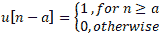
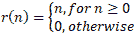
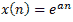
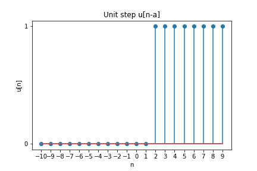
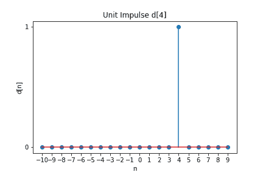
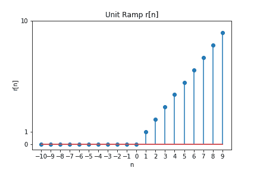
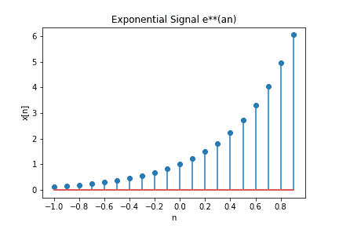

# 产生基本离散时间信号

> 原文:[https://www . geesforgeks . org/generating-basic-distributed-time-signal/](https://www.geeksforgeeks.org/generating-basic-discrete-time-signals/)

**为离散时间信号处理生成基本离散时间信号**单位阶跃、单位脉冲、单位斜坡、指数信号是信号处理中非常常用的信号，用于执行各种操作。

*   <center></center>

    给出单位步信号
*   单位脉冲信号由

    <center></center>

    给出
*   单位匝道信号由

    <center></center>

    给出
*   指数信号由

    <center></center>

    给出

**Examples:**

```
Input :
Unit Step Signal u[n-2]

Output :

```

<center></center>

```

Input :
Unit Impulse Signal d(4)

Output :

```

<center></center>

```

Input :
Unit Ramp Signal

Output: 

```

<center></center>

```

Input:
Exponential signal for a=2

Output: 

```

<center></center>

**代码:Python 代码实现生成基本离散时间信号**

```
# importing libraries
import numpy as np
import matplotlib.pyplot as plt

# function to generate unit step u[n-a]
# LL and UL are lower and upper limits of discrete time line
def unit_step(a, n):
    unit =[]
    for sample in n:
        if sample<a:
            unit.append(0)
        else:
            unit.append(1)
    return(unit)

# plot unit step function u[n-a]
a = 2 # Enter delay or advance
UL = 10
LL = -10
n = np.arange(LL, UL, 1)
unit = unit_step(a, n)
plt.stem(n, unit)
plt.xlabel('n')
plt.xticks(np.arange(LL, UL, 1))
plt.yticks([0, 1])
plt.ylabel('u[n]')
plt.title('Unit step u[n-a]')
plt.savefig('UnitStep.png')

# Function to plot Impulse signal d(a)
def unit_impulse(a, n):
    delta =[]
    for sample in n:
        if sample == a:
            delta.append(1)
        else:
            delta.append(0)

    return delta

a = 4 # Enter delay or advance
UL = 10
LL = -10
n = np.arange(LL, UL, 1)
d = unit_impulse(a, n)
plt.stem(n, d)
plt.xlabel('n')
plt.xticks(np.arange(LL, UL, 1))
plt.yticks([0, 1])
plt.ylabel('d[n]')
plt.title('Unit Impulse d[4]')
plt.savefig("UnitImpulse.png")

# Function to generate unit ramp signal r(n)
# r(n)= n for n>= 0, r(n)= 0 otherwise
def unit_ramp(n):
    ramp =[]
    for sample in n:
        if sample<0:
            ramp.append(0)
        else:
            ramp.append(sample)
    return ramp

UL = 10
LL = -10
n = np.arange(LL, UL, 1)
r = unit_ramp(n)
plt.stem(n, r)
plt.xlabel('n')
plt.xticks(np.arange(LL, UL, 1))
plt.yticks([0, UL, 1])
plt.ylabel('r[n]')
plt.title('Unit Ramp r[n]')
plt.savefig("UnitRamp.png")

# Function to generate exponential signals e**(at)
def exponential(a, n):
    expo =[]
    for sample in n:
        expo.append(np.exp(a * sample))
    return (expo)

a = 2
UL = 1
LL = -1
n = np.arange(LL, UL, 0.1)
x = exponential(a, n)
plt.stem(n, x)
plt.xlabel('n')
plt.xticks(np.arange(LL, UL, 0.2))
# plt.yticks([0, UL, 1])
plt.ylabel('x[n]')
plt.title('Exponential Signal e**(an)')
plt.savefig("Exponential.png")
```