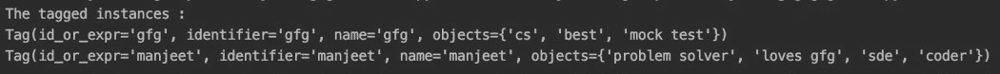
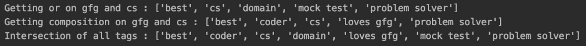

# Python 中的 gentag 库

> 原文:[https://www.geeksforgeeks.org/gentag-library-in-python/](https://www.geeksforgeeks.org/gentag-library-in-python/)

python 中的 ***gentag 库*** 提供了一种标记 Python 对象的有效方法。这些任意的 python 对象一旦被分配了 Python 标签，就可以基于这些标签进一步挖掘。在本文中，重点是使用 python 标记的赋值、操作和操作。

### 安装:

使用以下命令安装 *gentag* 库。

```
pip install gentag
```

### **定义和分配标签**

需要使用 *gentag* 库的**范围()类**来分配标签对象。发布可以使用**定义()方法**分配每个标签，该方法接受对象名称和要分配给它的标签列表作为参数。

**示例:**

## 蟒蛇 3

```
from gentag import Scope

# defining tag object
tags = Scope()

# assigning tags
tags.define('gfg', ['cs', 'mock test', 'best'])
tags.define('manjeet', ['loves gfg', 'sde', 'coder', 'problem solver'])

print("The tagged instances : ")
print(tags.tags['gfg'])
print(tags.tags['manjeet'])
```

**输出:**



标记的对象

### **处理操作和‘所有’标签:**

可以使用 evaluate()对标记执行简单的集合操作，如&(and)，或(|)，-(差分)和对称 difference(^)。所有标签的交集可以使用“all”来执行。

**示例:**

## 蟒蛇 3

```
from gentag import Scope

# defining tag object
tags = Scope()

# assigning tags
tags.define('gfg', ['cs', 'mock test', 'best'])
tags.define('manjeet', ['loves gfg', 'cs', 'coder', 'problem solver'])
tags.define('cs', ['domain', 'problem solver', 'best'])

# evaluating tags
or_res = tags.evaluate('gfg | cs')
print("Getting or on gfg and cs : " + str(or_res))

# composite operations
comp_res = tags.evaluate('(gfg & cs) | manjeet ')
print("Getting composition on gfg and cs : " + str(comp_res))

# all tags intersection using 'all'
print("Intersection of all tags : " + str(tags.evaluate('all')))
```

**输出:**



标签上的操作

### **将标签指定为标签:**

可以使用 define()将每个新标签初始化为一组标签操作的组合。只是将标记操作作为第二个参数传递。

**示例:**

## 蟒蛇 3

```
from gentag import Scope

# defining tag object
tags = Scope()

# assigning tags
tags.define('gfg', ['cs', 'mock test', 'best'])
tags.define('manjeet', ['loves gfg', 'cs', 'coder', 'problem solver'])
tags.define('cs', ['domain', 'problem solver', 'best'])

# assigning new tag as composition of others
tags.define('all_good', '(gfg & cs) | manjeet')
print("Getting newly assigned tag : " + str(tags.evaluate('all_good')))
```

**输出:**


新分配的标签。