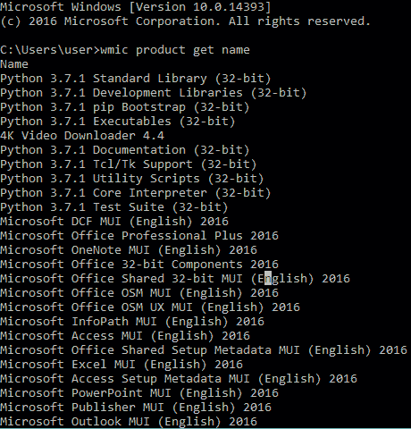
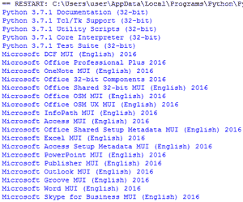

# 使用 Python 获取 Windows 中已安装软件的列表

> 原文:[https://www . geesforgeks . org/get-a-list-installed-software-in-windows-use-python/](https://www.geeksforgeeks.org/get-a-list-of-installed-softwares-in-windows-using-python/)

在本文中，我们将编写一个 Python 脚本来获取 windows 中已安装的软件列表。我们将使用 [**子流程**](https://docs.python.org/3/library/subprocess.html) 模块与 cmd 交互，并将信息检索到您的 Python IDE 中。我们可以通过子流程模块读取 cmd 命令。

让我们看看逻辑，如果我们运行这个 **wmic 产品获得名称**代码进入我们的终端，那么我们得到如下:



让我们编写 Python 代码来获取已安装的软件列表信息。

**进场:**

*   导入子流程模块。
*   使用 subprocess.check_output()获取命令“wmic 产品获取名称”的输出
*   现在拆分字符串，并根据自己的需要排列数据。

**实施:**

## 蟒蛇 3

```py
# importing the module
import subprocess

# traverse the software list
Data = subprocess.check_output(['wmic', 'product', 'get', 'name'])
a = str(Data)

# try block
try:

    # arrange the string
    for i in range(len(a)):
        print(a.split("\\r\\r\\n")[6:][i])

except IndexError as e:
    print("All Done")
```

**输出:**

