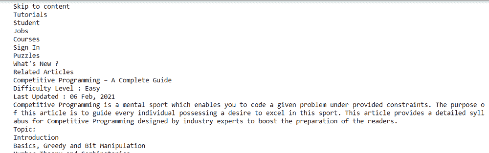

# 使用 Python 中的 Selenium 获取页面的所有文本

> 原文:[https://www . geesforgeks . org/get-全文本页面-使用 python 中的硒/](https://www.geeksforgeeks.org/get-all-text-of-the-page-using-selenium-in-python/)

众所周知，Selenium 是一个自动化工具，通过它我们可以通过编写一些代码来自动化浏览器。它兼容所有浏览器、操作系统，并且它的程序可以用任何编程语言编写，比如 Python、Java 等等。

硒提供了一个方便的应用编程接口来访问硒网络驱动程序，如火狐，工业工程，铬，远程等。目前支持的 Python 版本为 3.5 及以上。

**安装:**

使用 pip 安装硒包。只需在命令提示符下写下以下命令。

```
pip install selenium
```

一旦安装完成。打开 Python Console，只需编写这两个命令来验证是否安装了 Selenium。

## 蟒蛇 3

```
import selenium

print(selenium.__version__)
```

**输出:**

```
'3.141.0'
```

### Python 的网络驱动程序管理器:

之前，我们应该**下载二进制 chromedriver** 并解压到我们电脑的某个地方，同时设置一个路径。之后，像这样设置这个驱动程序的路径:

> webdriver。Chrome(可执行文件 _ 路径=“D:\ py charm _ project \ SeleniumLearning \ Drivers \ chromedriverserver . exe”)

但是每次，新版本的驱动发布，所以我们需要下载一个新的驱动，否则它会给我们错误。为了解决这个问题，我们需要安装**网络驱动管理器**:

**安装:**

```
pip install webdriver-manager
```

如果我们使用的是 **chrome 驱动**，那么我们需要写这几行:

## 蟒蛇 3

```
from selenium import webdriver
from webdriver_manager.chrome import ChromeDriverManager

driver = webdriver.Chrome(ChromeDriverManager().install())
```

像 Chrome 一样，我们也有一些其他的浏览器。**例如:**

**与铬一起使用:**

## 蟒蛇 3

```
from selenium import webdriver
from webdriver_manager.chrome import ChromeDriverManager
from webdriver_manager.utils import ChromeType

driver = webdriver.Chrome(ChromeDriverManager(chrome_type = ChromeType.CHROMIUM).install())
```

**配合 FireFox 使用:**

## 蟒蛇 3

```
from selenium import webdriver
from webdriver_manager.firefox import GeckoDriverManager

driver = webdriver.Firefox(executable_path = GeckoDriverManager().install())
```

**配合 IE 使用:**

## 蟒蛇 3

```
from selenium import webdriver
from webdriver_manager.microsoft import IEDriverManager

driver = webdriver.Ie(IEDriverManager().install())
```

**与边缘一起使用:**

## 蟒蛇 3

```
from selenium import webdriver
from webdriver_manager.microsoft import EdgeChromiumDriverManager

driver = webdriver.Edge(EdgeChromiumDriverManager().install())
```

### 使用 Python 中的 Selenium 获取页面的所有文本

让我们学习如何借助 Python 编程中的硒来自动化这些任务。在本文中，我们将讨论如何使用 selenium 获取页面的所有文本。

**进场:**

1.  从硒模块导入网络驱动程序
2.  在本文中，我们将在 Chrome 浏览器上自动完成这项任务。所以，我们必须从 webdriver_manager.chrome 导入 ChromeDriverManager。现在，我们不需要从互联网上下载任何驱动程序。该命令将自动从互联网下载驱动程序。目前，支持的网络驱动实现有火狐、Chrome、IE 和远程。
3.  安装 Chrome 驱动程序并存储在 webdriver 实例中。
4.  driver.get 方法将导航到 URL 给定的页面。WebDriver 将等到页面完全加载后，再将控制权返回给我们的程序。
5.  WebDriver 提供了各种方法来使用 find_element_by_*方法来查找页面中的元素。例如，给定页面的主体部分可以借助其 xpath 来定位，我们将使用 find_element_by_xpath 方法。
6.  最后，关闭浏览器窗口。我们将使用 driver.close 方法。还有一个方法，我们有 driver.exit 方法，它会关闭驱动程序所在的整个浏览器。close 只会关闭一个窗口选项卡。

**下面是实现:**

## 蟒蛇 3

```
# Importing necessary modules
from selenium import webdriver
from webdriver_manager.chrome import ChromeDriverManager

# WebDriver Chrome
driver = webdriver.Chrome(ChromeDriverManager().install())

# Target URL
driver.get("https://www.geeksforgeeks.org/competitive-programming-a-complete-guide/")

# print(driver.title)

# Printing the whole body text
print(driver.find_element_by_xpath("/html/body").text)

# Closing the driver
driver.close()
```

**输出:**

