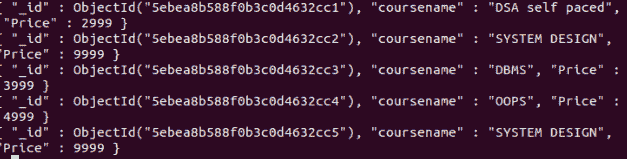

# 使用 PyMongo

获取收藏的所有文档

> 原文:[https://www . geeksforgeeks . org/get-all-of-documents-the-collection-use-pymongo/](https://www.geeksforgeeks.org/get-all-the-documents-of-the-collection-using-pymongo/)

要获取集合中的所有文档，请使用[查找()方法](https://www.geeksforgeeks.org/python-mongodb-find/)。find()方法将一个查询对象作为参数，如果我们想要查找所有文档，那么在 find()方法中不传递任何文档。要将该字段包含在结果中，传递的参数值应为 1，如果该值为 0，则将从结果中排除。

**注意:**如果我们在 find()方法中没有传递参数。它的工作原理类似于 MYSQL 中的 **select *** 。

**示例数据库:**
假设数据库看起来像这样


**例 1:**

```
import pymongo 

# establishing connection 
# to the database
client = pymongo.MongoClient("mongodb://localhost:27017/") 

# Database name 
db = client["mydatabase"] 

# Collection name 
col = db["gfg"] 

# if we don't want to print id then pass _id:0
for x in col.find({}, {"_id":0, "coursename": 1, "price": 1 }): 
    print(x)
```

**输出:**


**例 2:**

```
import pymongo 

# establishing connection 
# to the database
client = pymongo.MongoClient("mongodb://localhost:27017/") 

# Database name 
db = client["mydatabase"] 

# Collection name 
col = db["gfg"] 

# if we don't want to print id then pass _id:0 and price :0
for x in col.find({}, {"_id":0, "coursename": 1, "price": 0 }): 
    print(x)
```

**输出:**
