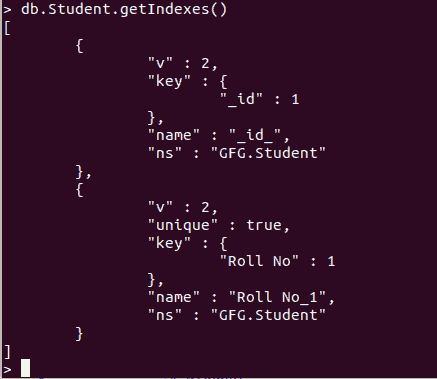

# 使用 PyMongo

获取集合索引的所有信息

> 原文:[https://www . geeksforgeeks . org/get-a-collections-indexes-use-pymongo/](https://www.geeksforgeeks.org/get-all-the-information-of-a-collections-indexes-using-pymongo/)

**先决条件:** [MongoDB Python 基础知识](https://www.geeksforgeeks.org/mongodb-and-python/)

本文是关于使用 PyMongo 模块的`index_information()`功能显示收藏的索引信息。

`index_information()`返回一个字典，其中键是索引名(由`create_index()`返回)，值是包含每个索引信息的字典。字典保证至少包含一个键，“键”是指定索引的(键、方向)对的列表(传递给 create_index())。它还将包含关于索引的任何其他元数据，但“ns”和“name”键除外，它们已被清除。

让我们开始吧:

1.  **Importing Required Modules:** Import the required module using the command:

    ```
    from pymongo import MongoClient

    ```

    如果您的机器上尚未安装 MongoDB，您可以参考指南:[使用 Python 安装 MongoDB 的指南](https://www.geeksforgeeks.org/guide-install-mongodb-python-windows/)

2.  **创建连接:**现在我们已经导入了模块，是时候建立与 MongoDB 服务器的连接了，该服务器大概运行在端口 27017(端口号)的 localhost(主机名)上。

    ```
    client = MongoClient(‘localhost’, 27017)
    ```

3.  **访问数据库:**由于与 MongoDB 服务器的连接已经建立。我们现在可以创建或使用现有的数据库。

    ```
    mydatabase = client.name_of_the_database
    ```

4.  **访问集合:**我们现在使用以下语法从数据库中选择集合:

    ```
    collection_name = mydatabase.name_of_collection
    ```

5.  **获取索引信息:**使用函数 index_information 获取集合中所有索引的信息。

    ```
    collection_name.index_information()

    ```

**示例:**

**样本数据库:**



```
# Python Program for demonstrating the 
# PyMongo Cursor to Pandas DataFrame

# Importing required modules
from pymongo import MongoClient
from pandas import DataFrame

# Connecting to MongoDB server
# client = MongoClient('host_name',
# 'port_number')
client = MongoClient('localhost', 27017)

# Connecting to the database named
# GFG
mydatabase = client.GFG

# Accessing the collection named
# Student
mycollection = mydatabase.Student

# Displaying the information of all the indexes
# using the function index_information()
ind_info = mycollection.index_information()
print(ind_info)
```

**输出:**

> {“_ id _”:{“v”:2，“key”:[(“_ id”，1)]，ns:“”GFG。学生' }，' Roll No_1': {'v': 2，' unique': True，' key': [('Roll No '，1)]，' ns': 'GFG。学生' }}