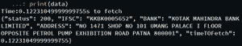
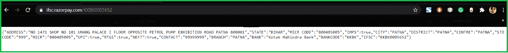
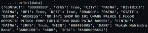

# 使用 Python 从 IFSC 代码获取银行详细信息

> 原文:[https://www . geesforgeks . org/get-bank-details-from-ifsc-code-use-python/](https://www.geeksforgeeks.org/get-bank-details-from-ifsc-code-using-python/)

**印度金融系统代码** (IFSC)是一个 11 位字母数字代码，由中央银行用于对国家电子资金转账(NEFT)网络内的银行分支机构进行唯一分类。

在本文中，我们将编写 python 脚本，从给定的 IFSC 代码中获取银行的详细信息。

### **方法 1:**

**使用的模块:**

**IfscApi:***IfscApi*模块将帮助收集银行的详细信息。IFSC 应用编程接口旨在从 IFSC 代码中轻松获取该银行的具体信息。

**安装:**

```
pip install ifscApi

```

**分步方法:**

*   导入模块。
*   将 IFSC 代码解析成 *getdata()* 函数( *FetchData* 的对象)。
*   上面的步骤返回了一个字典方法以及获取细节的时间。
*   显示银行详细信息

**以下是上述方法的完整程序:**

## 蟒蛇 3

```
# Import required module
from ifscApi.getDetails import FetchData

# Assign IFSC code
ifsc = 'KKBK0005652'

# Parse the ifsc code
data = FetchData().getdata(ifsc)

# Display details
print(data)
```

**输出:**



**注意:***getdata()*函数的 *dbFilePath* 参数可以被 IFSC 代码 Database 覆盖，该数据库有一个名为 data 的表，由三列 Ifsc、bank、address 组成。

### **方法 2:**

在这个方法中，我们将使用 [Razorpay IFSC 工具包](https://ifsc.razorpay.com/)来获取 IFSC 代码。

**模块:**

**请求:**这个模块可以让你极其轻松的发送 *HTTP/1.1* 请求。本模块的 *get()* 方法用于从 IFSC 代码中获取银行详细信息。

**安装:**

```
pip install requests

```

下面是 Razorpay IFSC 工具包从 IFSC 代码获取银行详细信息的工作。



**分步方法:**

*   导入模块。
*   将网址和 IFSC 代码传入请求。
*   获取这个 JSON 响应。
*   它以 Dict 数据类型返回银行详细信息。

**以下是上述方法的完整程序:**

## 蟒蛇 3

```
# Import required modules
import requests

# Assign IFSC code and URL
IFSC_Code = 'KKBK0005652'
URL = "https://ifsc.razorpay.com/"

# Use get() method
data = requests.get(URL+IFSC_Code).json()

# Display bank details
print(data)
```

**输出:**

