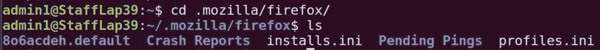
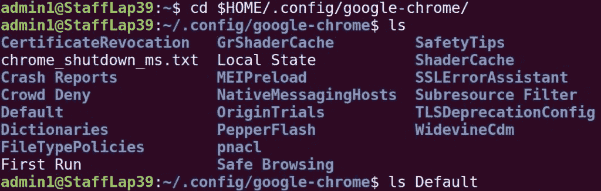

# 使用 Ubuntu 中的 Python 获取浏览器历史记录

> 原文:[https://www . geesforgeks . org/get-browser-history-use-python-in-Ubuntu/](https://www.geeksforgeeks.org/get-browser-history-using-python-in-ubuntu/)

为了获取 chrome 和 Mozilla Firefox 浏览器的浏览器历史记录，使用了 **os 模块**和 **sqlite3 模块**。Chrome 和 Firefox 历史数据存储在 SQLite 数据库中。所以需要 SQLite Python 包从浏览器历史中提取数据。

## 从火狐获取历史

Firefox 浏览器将所有细节存储在。mozilla/firefox 文件夹。历史文件扩展名为. default。要从火狐浏览器获取历史，请按照下面给出的步骤操作。从终端获取存储浏览器历史的默认文件的名称，如下所述



**注意:**系统中存储历史的文件名不同，但扩展名保持不变(。
默认)**示例**T5】

## 计算机编程语言

```py
import os
import sqlite3

# Build Data path
data_path = os.path.expanduser('~')+"/.mozilla/firefox/ri27ye3b.default"
history_db = os.path.join(data_path, 'places.sqlite')

# Make connection with sqlite3 database
c = sqlite3.connect(history_db)

# Create cursor object to execute query
cursor = c.cursor()
select_statement = "select moz_places.url, moz_places.visit_count from moz_places;"
cursor.execute(select_statement)

# Fetch the result and Prints the result
results = cursor.fetchall()

for url, count in results:
     print(url)

# Close the cursor
cursor.close()
```

**注意:**当你执行上面给出的 python 代码时，你的浏览器应该是关闭的。当浏览器打开时，它获得了对数据库的锁定，因此不允许访问 python 代码
**代码的工作如下所述**

1.  导入 os 模块和 sqlite3 模块。
2.  os.path.expanduser()方法用于扩展初始路径组件~或用户主目录的路径。
3.  os.path.join()方法连接一个或多个路径组件，除最后一个路径组件外，每个非空部分后面都有一个目录分隔符(“/”)，以获取最终路径。
4.  sqlite3 的 Connect 方法然后与数据库连接。
5.  一旦连接成功，它就会创建游标对象来访问表
6.  cursor 对象的 Execute 方法在 sqlite3 数据库上运行查询，并使用 fetchall 方法提取记录并存储在结果中
7.  for 循环打印从数据库中提取的记录
8.  关闭游标很重要，当它的任务完成时，它会释放 sqlite3 数据库上的所有锁。

## 从 Chrome 获取历史

Chrome 浏览器将所有细节存储在。配置/谷歌浏览器/默认文件夹。这里的历史是存储浏览器历史的数据库的名称。
要从 chrome 浏览器获取历史记录，请按照下面给出的步骤进行操作
要检查历史数据库的存在，请按照下面图片中给出的步骤进行操作。



**例**T2】

## 计算机编程语言

```py
import sqlite3

con = sqlite3.connect('/home/admin1/.config/google-chrome/Default/History')
c = con.cursor()

# Change this to your preferred query
c.execute("select url, title, visit_count, last_visit_time from urls")
results = c.fetchall()

for r in results:
    print(r)

c.close()
```

**注意:**当你执行上面给出的 Python 代码时，你的浏览器应该是关闭的。当浏览器打开时，它获得了对数据库的锁定，因此不允许访问 Python 代码
**代码的工作如下所述**

1.  导入 sqlite3 模块。
2.  sqlite3 的 Connect 方法然后与数据库连接。请注意，路径“home/admin1”因系统的根路径而异
3.  一旦连接成功，它就会创建游标对象来访问表
4.  cursor 对象的 Execute 方法在 sqlite3 数据库上运行查询，并使用 fetchall 方法提取记录并存储在结果中
5.  for 循环打印从数据库中提取的记录
6.  当游标的任务完成时，关闭游标是很重要的，因为它会释放 sqlite3 数据库上的所有锁。