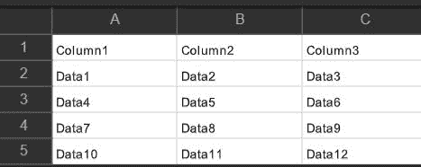
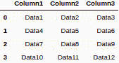

# 使用 Python 从 CSV 中获取列名

> 原文:[https://www . geesforgeks . org/get-column-name-from-CSV-using-python/](https://www.geeksforgeeks.org/get-column-names-from-csv-using-python/)

CSV 代表逗号分隔值，CSV 文件本质上是文本文件，用于以表格形式使用逗号(，)作为分隔符存储数据。csv 是一种文件格式，这种格式的所有文件都以. CSV 扩展名存储。这是一种非常流行且广泛使用的格式，用于以结构化形式存储数据。CSV 文件在机器学习和统计模型中有很多应用。Python 有一个专门处理 CSV 文件操作的库，例如读取、写入或修改 CSV 文件。下面是一个 CSV 文件的外观示例。



本文讨论了使用 Python 从 CSV 文件中获取列名的不同方法。以下方法可用于实现同样的目的:

*   使用 Python 的 CSV 库逐行读取 CSV 文件，并将标题打印为列名
*   使用字典阅读器将 CSV 文件作为字典读取，然后打印出字典的关键字
*   使用 Python 的 Pandas 库将 CSV 文件转换为数据框

**方法 1:**

使用这种方法，我们首先使用 Python 的 CSV 库读取 CSV 文件，然后输出代表列名的第一行。

## 蟒蛇 3

```py
# importing the csv library
import csv

# opening the csv file by specifying
# the location
# with the variable name as csv_file
with open('data.csv') as csv_file:

    # creating an object of csv reader
    # with the delimiter as ,
    csv_reader = csv.reader(csv_file, delimiter = ',')

    # list to store the names of columns
    list_of_column_names = []

    # loop to iterate through the rows of csv
    for row in csv_reader:

        # adding the first row
        list_of_column_names.append(row)

        # breaking the loop after the
        # first iteration itself
        break

# printing the result
print("List of column names : ",
      list_of_column_names[0])
```

**输出:**

```py
List of column names : ['Column1', 'Column2', 'Column3']
```

**方法二:**

在第二种方法下，我们使用 CSV 库的 DictReader 函数将 CSV 文件作为字典读取。我们可以简单地使用 key()方法来获取列名。

**步骤:**

*   使用 DictReader 打开 CSV 文件。
*   将此文件转换为列表。
*   将列表的第一行转换为字典。
*   调用字典的 key()方法，并将其转换为列表。
*   显示列表。

## 蟒蛇 3

```py
# importing the csv library
import csv

# opening the csv file
with open('data.csv') as csv_file:

        # reading the csv file using DictReader
    csv_reader = csv.DictReader(csv_file)

    # converting the file to dictionary
    # by first converting to list
    # and then converting the list to dict
    dict_from_csv = dict(list(csv_reader)[0])

    # making a list from the keys of the dict
    list_of_column_names = list(dict_from_csv.keys())

    # displaying the list of column names
    print("List of column names : ",
          list_of_column_names)
```

**输出:**

```py
List of column names : ['Column1', 'Column2', 'Column3']
```

**方法 3:**

在这种方法下，我们使用 Python 的 pandas 库将 CSV 文件作为数据框读取。然后，我们只需要调用数据框的列方法。

## 蟒蛇 3

```py
# importing the pandas library
import pandas as pd

# reading the csv file using read_csv
# storing the data frame in variable called df
df = pd.read_csv('data.csv')

# creating a list of column names by
# calling the .columns
list_of_column_names = list(df.columns)

# displaying the list of column names
print('List of column names : ',
      list_of_column_names)
```

**输出:**

```py
List of column names : ['Column1', 'Column2', 'Column3']
```

数据框如下所示:



作为数据框的 CSV 文件