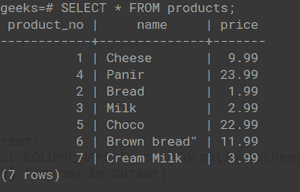

# 使用 Psycopg2

从 PostgreSQL 表中获取列名

> 原文:[https://www . geesforgeks . org/get-column-name-from-PostgreSQL-table-using-psycopg 2/](https://www.geeksforgeeks.org/get-column-names-from-postgresql-table-using-psycopg2/)

本文演示了如何使用 psycopg2 和 Python 从 PostgreSQL 表中提取列名。

**演示用表:**



**例 1:**

首先，我们使用 [psycopg2.connect()](https://www.geeksforgeeks.org/python-getting-started-with-psycopg2-postgresql/) 方法连接 PostgreSQL 数据库，然后我们使用 cursor()方法创建一个游标，之后我们使用 cursor()然后使用切片从其中提取第一个元素。

## 蟒蛇 3

```
import psycopg2

conn = psycopg2.connect(
    database="geeks",
    user='postgres',
    password='pass',
    host='localhost',
    port= '5432'
)

conn.autocommit = True
cursor = conn.cursor()

sql = '''SELECT * FROM products'''

cursor.execute(sql)
column_names = [desc[0] for desc in cursor.description]
for i in column_names:
    print(i)
conn.commit()
conn.close()
```

**输出:**

```
product_no
name
price
```

**示例 2:** 在第二种方法中，我们在 cursor.execute()方法中执行以下 SQL 命令。

> "从 information _ schema.columns 中选择 COLUMN_NAME，其中 table_schema = 'SCHEMA_NAME '和 table_name='TABLE_NAME ' "

## 蟒蛇 3

```
import psycopg2

conn = psycopg2.connect(
    database="geeks",
    user='postgres',
    password='root',
    host='localhost',
    port='5432'
)

conn.autocommit = True

with conn:
    with conn.cursor() as cursor:
        cursor.execute(
            "select COLUMN_NAME from information_schema.columns\
            where table_name='products'")
        column_names = [row[0] for row in cursor]

print("Column names:\n")

for i in column_names:
    print(i)
```

**输出:**

```
Column names:

product_no
name
price
```