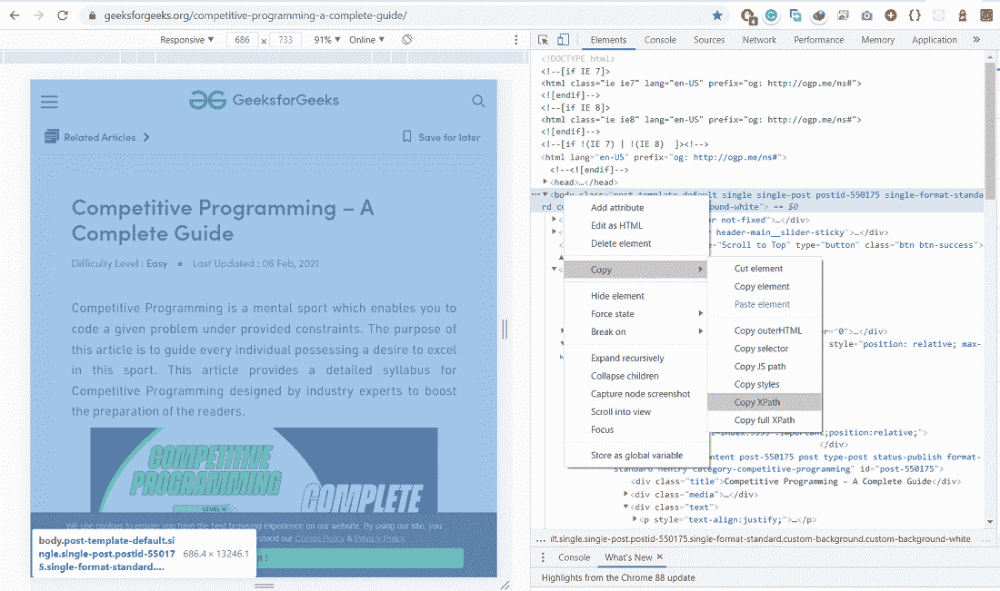

# 使用硒

获取整个页面的内容

> 原文:[https://www . geesforgeks . org/get-contents-整页使用-selenium/](https://www.geeksforgeeks.org/get-contents-of-entire-page-using-selenium/)

在本文中，我们将讨论使用 Selenium 获取整个页面内容的方法。大体上可以有两种方法。让我们详细讨论一下。

### 方法 1:

为了从整个页面中提取可见的文本，我们可以使用 **find_element_by_*** 方法来帮助我们找到或定位页面上的元素。然后，我们将使用**文本**方法，这有助于从特定的网络元素中检索文本。

**接近**

*   导入模块
*   实例化驱动程序
*   获取页面内容
*   显示刮下的内容
*   关闭驱动程序

**语法:**

> driver . find _ element _ by _ class _ XPath("/html/body ")。文本

#### **查找或定位页面上的多个元素:**

*   查找元素 by 链接文本
*   查找元素 by 部分链接文本
*   查找元素 by XPath
*   按标签名查找元素
*   按类名查找元素
*   find _ element _ by _ css _ 选择器
*   查找元素 by id
*   按名称查找元素

我们可以使用上述方法在整个页面上**查找**或**定位元素**。最常用的方法是**通过 xpath** 找到元素，这有助于我们轻松定位任何元素。我们将根据我们的要求使用适当的方法。

**程序:**

## 蟒蛇 3

```py
# importing the modules
from selenium import webdriver
from webdriver_manager.chrome import ChromeDriverManager

# using webdriver for chrome browser
driver = webdriver.Chrome(ChromeDriverManager().install())

# using target url
driver.get(
    "https://www.geeksforgeeks.org/competitive-programming-a-complete-guide/")

# printing the content of entire page
print(driver.find_element_by_xpath("/html/body").text)

# closing the driver
driver.close()
```

**输出:**



### 方法 2:

还有另一种方法可以实现我们想要的输出。这一行将检索整个网页的文本。一旦我们得到提取的数据，在文件系统的帮助下，我们会将结果存储在**result.html**文件中。

**进场:**

*   导入模块
*   实例化 webdriver
*   从网址获取内容
*   打开文件
*   将内容保存到文件中
*   关闭文件
*   关闭驱动程序

**语法:**

> driver.page_source

**程序:**

## 蟒蛇 3

```py
# Importing important library
from selenium import webdriver
from webdriver_manager.chrome import ChromeDriverManager

# using chrome browser
driver = webdriver.Chrome(ChromeDriverManager().install())

# Target url
driver.get(
    "https://www.geeksforgeeks.org/competitive-programming-a-complete-guide/")

# Storing the page source in page variable
page = driver.page_source.encode('utf-8')
# print(page)

# open result.html
file_ = open('result.html', 'wb')

# Write the entire page content in result.html
file_.write(page)

# Closing the file
file_.close()

# Closing the driver
driver.close()
```

**输出:**

[点击这里](https://drive.google.com/file/d/12vly0mgckrcw842-9k0Os-ctUsoJ7AQQ/view?usp=sharing)下载上述程序的输出文件。