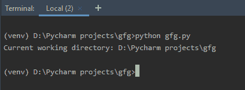
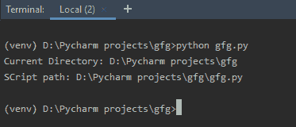

# 获取当前 Python 脚本的目录

> 原文:[https://www . geesforgeks . org/get-directory-of-current-python-script/](https://www.geeksforgeeks.org/get-directory-of-current-python-script/)

在使用[文件处理](https://www.geeksforgeeks.org/file-handling-python/)时，您可能已经注意到文件仅通过它们的名称来引用，例如“GFG.txt”，如果文件不在脚本的目录中，Python 会引发错误。那么，是如何做到的呢？
当前工作目录(CWD) 的概念在这里变得很重要。把 CWD 看作文件夹，Python 在里面运行。每当只通过名称调用文件时，Python 会假设它从 CWD 开始，这意味着只有当文件在 Python 的 CWD 中时，仅名称引用才会成功。

**注意:**运行 Python 脚本的文件夹称为当前目录。这不是 Python 脚本所在的路径。

#### 获取当前工作目录

Python 提供 [**OS 模块**](https://www.geeksforgeeks.org/os-module-python-examples/) 用于与操作系统交互。该模块属于 Python 的标准实用程序模块。在文件名和路径无效或不可访问的情况下，或者在其他具有正确类型但不被操作系统接受的参数的情况下，操作系统模块中的所有函数都会引发 **OSError** 。

获取当前工作目录的位置[使用 os.getcwd()](https://www.geeksforgeeks.org/python-os-getcwd-method/) 。

> **语法:**OS . getcwd()
> T3】参数:不需要参数。
> **返回值:**这个方法返回一个代表当前工作目录的字符串。

**示例:**

## 蟒蛇 3

```
# Python program to explain os.getcwd() method 

# importing os module 
import os 

# Get the current working 
# directory (CWD) 
cwd = os.getcwd() 

# Print the current working  
# directory (CWD) 
print("Current working directory:")
print(cwd) 
```

**输出:**



**注意:**想了解更多 [os.getcwd()](https://www.geeksforgeeks.org/python-os-getcwd-method/) 点击这里。

#### 获取脚本路径

[os.path.realpath()](https://www.geeksforgeeks.org/python-os-path-realpath-method/) 可以用来获取当前 Python 脚本的路径。实际上 Python 中的 [os.path.realpath()](https://www.geeksforgeeks.org/python-os-path-realpath-method/) 方法是通过消除路径中遇到的任何符号链接来获取指定文件名的规范路径。一个特殊的变量 __file__ 被传递给 realpath()方法来获取 Python 脚本的路径。

**注意:** __file__ 是从文件加载模块的文件的路径名。

> **语法:** os.path.realpath(路径)
> **参数:**
> **路径:**表示文件系统路径的类路径对象。
> 类路径对象是表示路径的字符串或字节对象。
> **返回类型:**这个方法返回一个代表规范路径的字符串值。

**示例:**

## 蟒蛇 3

```
# Python program to get the
# path of the script

import os

# Get the current working 
# directory (CWD) 
cwd = os.getcwd() 
print("Current Directory:", cwd)

# Get the directory of
# script
script = os.path.realpath(__file__)
print("SCript path:", script)
```

**输出:**



**注意:**想了解更多 os.path.realpath() [点击这里](https://www.geeksforgeeks.org/python-os-path-realpath-method/)。