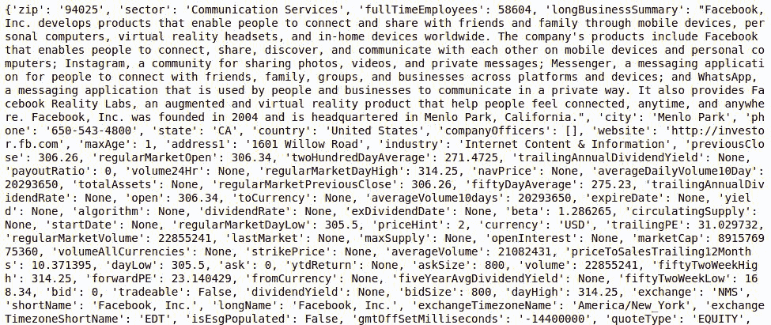
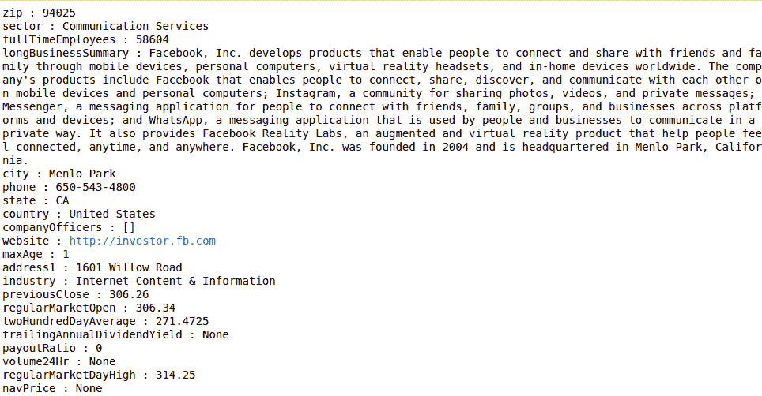
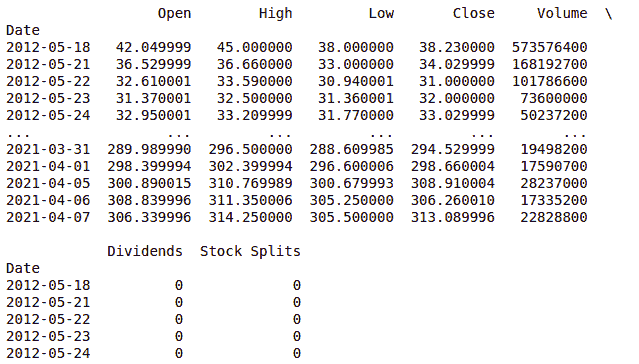
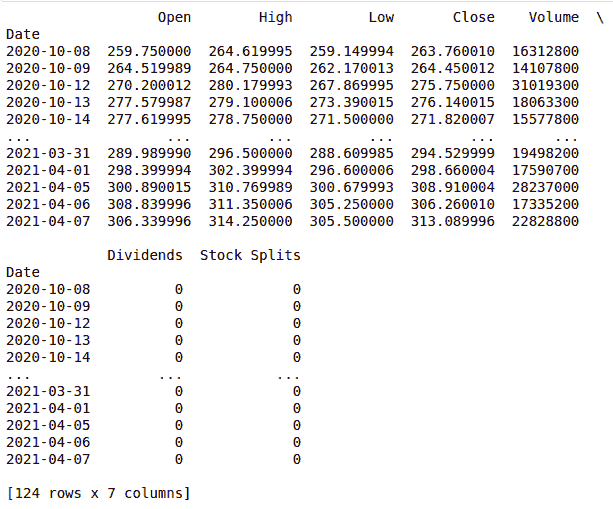
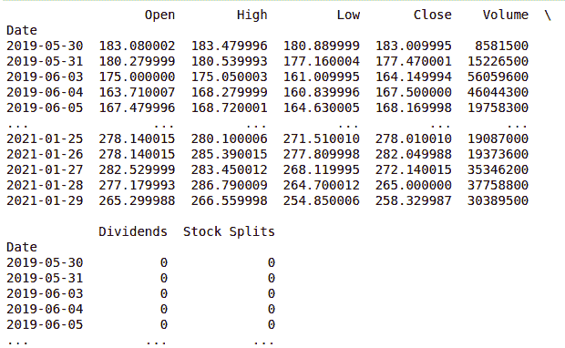

# 用 Python 从雅虎财经获取财务数据

> 原文:[https://www . geesforgeks . org/get-financial-data-from-Yahoo-finance-with-python/](https://www.geeksforgeeks.org/get-financial-data-from-yahoo-finance-with-python/)

在本文中，我们将看到如何使用 Python 从雅虎金融获取财务数据。我们可以使用它来检索公司财务信息(例如财务比率)以及历史市场数据。

**安装:**

让我们通过 pip 命令安装它们

```
pip install yfinance
```

一旦安装完成，我们就可以用 python 代码导入一个财务包。我们需要传递一个 ticker 的参数，即公司的 Ticker

**注:**股票符号或股票代码是出于交易目的分配给证券的一系列独特字母。例如:

1.  对亚马逊来说，就是“AMZN”
2.  对脸书来说，它是“FB”
3.  对谷歌来说，就是“GOOGL”

**以下是描述如何从雅虎财经检索财务数据的各种程序:**

让我们以脸书的结果为例，使用“FB”。

## 蟒蛇 3

```
import yfinance as yahooFinance

# Here We are getting Facebook financial information
# We need to pass FB as argument for that
GetFacebookInformation = yahooFinance.Ticker("FB")

# whole python dictionary is printed here
print(GetFacebookInformation.info)
```

**输出:**



我们可以很容易地从上面的项目字典中检索财务关键指标，如公司部门、市盈率和公司测试版。让我们看看下面的代码。

## 蟒蛇 3

```
import yfinance as yahooFinance

GetFacebookInformation = yahooFinance.Ticker("FB")

# display Company Sector
print("Company Sector : ", GetFacebookInformation.info['sector'])

# display Price Earnings Ratio
print("Price Earnings Ratio : ", GetFacebookInformation.info['trailingPE'])

# display Company Beta
print(" Company Beta : ", GetFacebookInformation.info['beta'])
```

**输出:**

```
Company Sector :  Communication Services
Price Earnings Ratio :  31.029732
 Company Beta :  1.286265
```

虽然我们检索到的财务关键指标很少，因为它是一个字典值，但我们可以通过键值对来拆分它。

## 蟒蛇 3

```
import yfinance as yahooFinance
GetFacebookInformation = yahooFinance.Ticker("FB")

# get all key value pairs that are available
for key, value in GetFacebookInformation.info.items():
    print(key, ":", value)
```

**输出:**



我们也可以检索历史市场价格并显示出来。

## 蟒蛇 3

```
import yfinance as yahooFinance

GetFacebookInformation = yahooFinance.Ticker("FB")

# Let us  get historical stock prices for Facebook
# covering the past few years.
# max->maximum number of daily prices available
# for Facebook.
# Valid options are 1d, 5d, 1mo, 3mo, 6mo, 1y, 2y,
# 5y, 10y and ytd.
print(GetFacebookInformation.history(period="max"))
```

**输出:**



甚至我们可以有 1d、5d、1mo、3mo、6mo、1y、2y、5y、10y 和 ytd 的数据。

让我们检查 6 个月

## 蟒蛇 3

```
import yfinance as yahooFinance

GetFacebookInformation = yahooFinance.Ticker("FB")

# Valid options are 1d, 5d, 1mo, 3mo, 6mo, 1y,
# 2y, 5y, 10y and ytd.
print(GetFacebookInformation.history(period="6mo"))
```

**输出:**



我们还可以灵活地获取所提供的开始和结束日期的历史市场数据。

## 蟒蛇 3

```
import yfinance as yahooFinance

# in order to specify start date and
# end date we need datetime package
import datetime

# startDate , as per our convenience we can modify
startDate = datetime.datetime(2019, 5, 31)

# endDate , as per our convenience we can modify
endDate = datetime.datetime(2021, 1, 30)
GetFacebookInformation = yahooFinance.Ticker("FB")

# pass the parameters as the taken dates for start and end
print(GetFacebookInformation.history(start=startDate,
                                     end=endDate))
```

**输出:**

