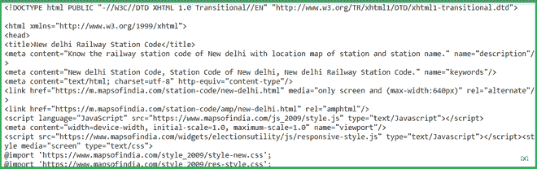

# 使用 Python 获取印度火车站代码

> 原文:[https://www . geesforgeks . org/get-Indian-rails-station-code-use-python/](https://www.geeksforgeeks.org/get-indian-railways-station-code-using-python/)

网页抓取是一种从网站获取数据的技术。在网上冲浪时，许多网站不允许用户保存数据供个人使用。一种方法是手动复制粘贴数据，这既繁琐又耗时。网页抓取是从网站提取数据过程的自动化。这项活动是在称为刮网器的刮网软件的帮助下完成的。

在本文中，我们将编写 Python 脚本，使用城市名称来抓取火车站代码。

**示例:**

```py
Input: new-delhi
Output: NDLS

Input: Patna
Output: PNBE

```

### **需要的模块**

*   [**bs4:**](https://www.geeksforgeeks.org/implementing-web-scraping-python-beautiful-soup/) 美人汤(bs4)是一个从 HTML 和 XML 文件中拉出数据的 Python 库。这个模块没有内置 Python。要安装此软件，请在终端中键入以下命令。

```py
pip install bs4

```

*   [**请求**](https://www.geeksforgeeks.org/python-requests-tutorial/) **:** 请求让你发送 HTTP/1.1 请求极其轻松。该模块也没有内置 Python。要安装此软件，请在终端中键入以下命令。

```py
pip install requests

```

**我们来看看脚本的分步执行。**

**第一步:**导入所有依赖

## 蟒蛇 3

```py
# import module
import requests
from bs4 import BeautifulSoup
```

**步骤 2:** 创建一个 URL 获取函数

## 蟒蛇 3

```py
# user define function 
# Scrape the data 
def getdata(url): 
    r = requests.get(url) 
    return r.text
```

**第三步:**现在将城市名称合并到 URL 中，并将 URL 传递给 getdata()函数，并将该数据转换为 HTML 代码。

## 蟒蛇 3

```py
# input by geek
station = "new-delhi"

# url
url = "https://www.mapsofindia.com/railways/station-code/"+station+".html"

# pass the url
# into getdata function
htmldata=getdata(url)
soup = BeautifulSoup(htmldata, 'html.parser')

# display html code
print(soup)
```

**输出:**



**第 4 步:**从 HTML 文档中遍历车站代码。

## 蟒蛇 3

```py
# traverse the station code
data = []
for item in soup.find("table", class_="extrtable").find_all('b'):
    data.append(item.get_text())
print(data[-1])
```

**输出:**

```py
NDLS

```