# 使用 Python 获取 Google Drive 存储中的文件和文件夹列表

> 原文:[https://www . geesforgeks . org/get-list-in-Google-drive-storage-use-python/](https://www.geeksforgeeks.org/get-list-of-files-and-folders-in-google-drive-storage-using-python/)

在本文中，我们将了解如何使用 Python 中的 **Google Drive API** 获取存储在我们的 Google Drive 云存储中的文件(或文件夹)列表。这是一个 REST 应用编程接口，允许您从应用程序或程序中利用谷歌硬盘存储。

因此，让我们创建一个简单的 Python 脚本，与谷歌驱动应用编程接口通信。

### **要求:**

*   Python (2.6 或更高版本)
*   启用了谷歌驱动的谷歌帐户
*   谷歌应用编程接口客户端和谷歌 OAuth 库

### **安装:**

通过运行以下命令安装所需的库:

```py
pip install --upgrade google-api-python-client google-auth-httplib2 google-auth-oauthlib

```

现在，按照以下步骤设置您的谷歌帐户，以使用谷歌驱动应用编程接口。

*   转到[谷歌云控制台](https://console.cloud.google.com/)并使用您的谷歌帐户登录。
*   创建新项目。

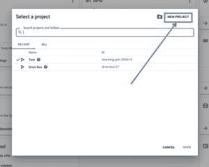

创建新项目

*   转到**应用编程接口和服务**。

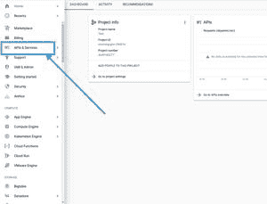

转到应用编程接口和服务

*   为此项目启用**谷歌驱动 API** 。

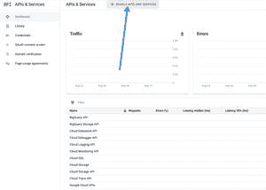

启用 API

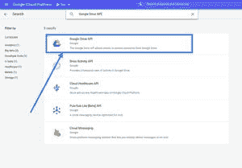

启用谷歌驱动应用编程接口

*   转到**审核同意屏幕**并为您的项目配置同意屏幕。

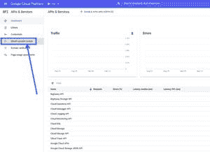

转到审核同意屏幕

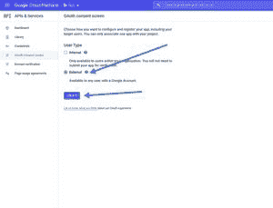

选择外部，然后单击创建

*   输入应用程序的名称。它将显示在同意屏幕上。

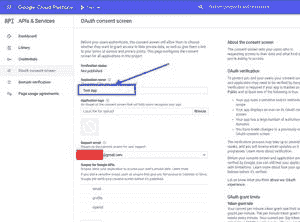

输入应用程序名称并选择电子邮件地址

*   现在转到**凭证。**

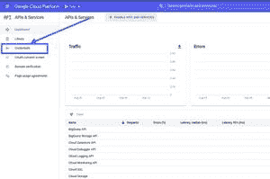

转到凭据

*   点击**创建凭证**，进入**验证客户端标识。**

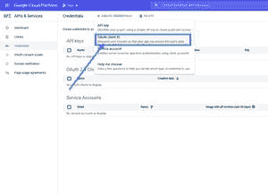

单击创建凭据，然后选择验证客户端标识

*   输入你的应用程序名称，点击**创建**。

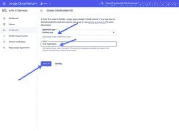

输入应用程序名称，然后单击创建

*   将创建您的客户标识。下载到你的电脑，保存为**凭证**

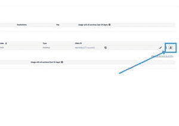

下载 json 文件

**注意:**不要与任何人分享你的客户编号或客户机密。

现在，我们已经完成了设置和安装。那么，让我们编写 python 脚本:

## 蟒蛇 3

```py
# import the required libraries
import pickle
import os.path
from googleapiclient.discovery import build
from google_auth_oauthlib.flow import InstalledAppFlow
from google.auth.transport.requests import Request

# Define the SCOPES. If modifying it,
# delete the token.pickle file.
SCOPES = ['https://www.googleapis.com/auth/drive']

# Create a function getFileList with 
# parameter N which is the length of 
# the list of files.
def getFileList(N):

    # Variable creds will store the user access token.
    # If no valid token found, we will create one.
    creds = None

    # The file token.pickle stores the 
    # user's access and refresh tokens. It is
    # created automatically when the authorization 
    # flow completes for the first time.

    # Check if file token.pickle exists
    if os.path.exists('token.pickle'):

        # Read the token from the file and 
        # store it in the variable creds
        with open('token.pickle', 'rb') as token:
            creds = pickle.load(token)

    # If no valid credentials are available, 
    # request the user to log in.
    if not creds or not creds.valid:

        # If token is expired, it will be refreshed,
        # else, we will request a new one.
        if creds and creds.expired and creds.refresh_token:
            creds.refresh(Request())
        else:
            flow = InstalledAppFlow.from_client_secrets_file(
                'credentials.json', SCOPES)
            creds = flow.run_local_server(port=0)

        # Save the access token in token.pickle 
        # file for future usage
        with open('token.pickle', 'wb') as token:
            pickle.dump(creds, token)

    # Connect to the API service
    service = build('drive', 'v3', credentials=creds)

    # request a list of first N files or 
    # folders with name and id from the API.
    resource = service.files()
    result = resource.list(pageSize=N, fields="files(id, name)").execute()

    # return the result dictionary containing 
    # the information about the files
    return result

# Get list of first 5 files or 
# folders from our Google Drive Storage
result_dict = getFileList(5)

# Extract the list from the dictionary
file_list = result_dict.get('files')

# Print every file's name
for file in file_list:
    print(file['name'])
```

现在，运行脚本:

```py
python3 script.py

```

这将尝试在默认浏览器中打开一个新窗口。如果失败，请从控制台复制网址，并在浏览器中手动打开它。

现在，如果您还没有登录，请登录您的谷歌帐户。如果有多个帐户，将要求您选择其中一个。然后，单击允许按钮。


认证完成后，你的浏览器会显示一条消息**认证流程已经完成**。**你可以关上这扇窗户。**

一旦身份验证完成，这将打印您的谷歌驱动器存储中第一个 **N** 文件(或文件夹)的名称。

**注意:**文件 **credentials.json** 应该和 Python 脚本在同一个目录下。如果不是这样，您必须在程序中指定文件的完整路径。