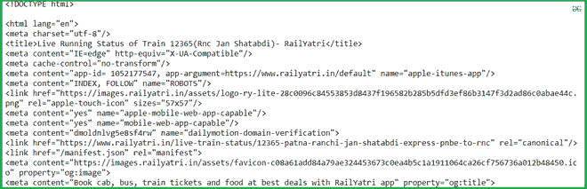

# 使用 Python 获取列车实时状态

> 原文:[https://www . geesforgeks . org/get-live-train-status-use-python/](https://www.geeksforgeeks.org/get-live-train-status-using-python/)

假设您想使用印度铁路去旅行，并且已经预订了火车。但是你不确定火车是否准时，手动操作可能会非常忙乱。因此，在本文中，我们将编写一个 Python 脚本，使用列车名称或列车代码获取实时列车状态。

### **需要的模块**

*   [**bs4**](https://www.geeksforgeeks.org/implementing-web-scraping-python-beautiful-soup/)【T4:美人汤(bs4)是一个从 HTML 和 XML 文件中拉出数据的 Python 库。这个模块没有内置 Python。要安装此软件，请在终端中键入以下命令。

```
pip install bs4

```

*   [**请求**](https://www.geeksforgeeks.org/python-requests-tutorial/) **:** 请求让你发送 HTTP/1.1 请求极其轻松。该模块也没有内置 Python。要安装此软件，请在终端中键入以下命令。

```
pip install requests

```

**我们来看看脚本的分步执行。**

**第一步:**导入所有依赖

## 蟒蛇 3

```
# import module
# import pandas as pd
import requests
from bs4 import BeautifulSoup
```

**步骤 2:** 创建一个 URL 获取函数

## 蟒蛇 3

```
# user define function 
# Scrape the data 
def getdata(url): 
    r = requests.get(url) 
    return r.text
```

**第三步:**现在将列车名称合并为 URL，并将 URL 传递给 getdata()函数，并将该数据转换为 HTML 代码。

**注意:**强烈建议您从这里获取列车名称和代码。[点击](https://www.railyatri.in/live-train-status/)

## 蟒蛇 3

```
# input by geek
train_name = "03391-rajgir-new-delhi-clone-special-rgd-to-ndls"

# url
url = "https://www.railyatri.in/live-train-status/"+train_name

# pass the url
# into getdata function
htmldata=getdata(url)
soup = BeautifulSoup(htmldata, 'html.parser')

# display html code
print(soup)
```

**输出:**



**第 4 步:**从 HTML 文档中遍历实时状态。

## 蟒蛇 3

```
# traverse the live status from
# this Html code
data = []
for item in soup.find_all('script', type="application/ld+json"):
    data.append(item.get_text())

# convert into dataframe
df = pd.read_json (data[2])

# display this column of
# dataframe
print(df["mainEntity"][0])
```

**输出:**

> {'@type': 'Question '，' name': 'Q)我的火车(03391) RGD NDLS HUMSFR 在哪？，
> “accepted Answer”:{“@ type”:“Answer”，“text”:“A:03391 RGD NDLS HUMSFR 距离 VARANASI JN 10 公里(目前覆盖 312 公里)。预计将于 02:30 抵达新德里}}

**第 5 步:**现在从这个目录中获取需要的数据。

## 蟒蛇 3

```
print(df["mainEntity"][0]['name'])
print(df["mainEntity"][0]['acceptedAnswer']['text'])
```

**输出:**

> 问:我乘坐的列车(03391)RGD·NDLS 号在哪里？
> A: 03391 RGD NDLS 高速公路距离瓦拉纳西 JN 10 公里(目前覆盖 312 公里)。预计 02:30 到达新德里。

**全面实施:**

## 蟒蛇 3

```
# import module
import requests
from bs4 import BeautifulSoup
import pandas as pd

# user define function
# Scrape the data
def getdata(url):
    r = requests.get(url)
    return r.text

# input by geek
train_name = "03391-rajgir-new-delhi-clone-special-rgd-to-ndls"

# url
url = "https://www.railyatri.in/live-train-status/"+train_name

# pass the url
# into getdata function
htmldata = getdata(url)
soup = BeautifulSoup(htmldata, 'html.parser')

# traverse the live status from
# this Html code
data = []
for item in soup.find_all('script', type="application/ld+json"):
    data.append(item.get_text())

# convert into dataframe
df = pd.read_json(data[2])

# display this column of
# dataframe
print(df["mainEntity"][0]['name'])
print(df["mainEntity"][0]['acceptedAnswer']['text'])
```

**输出:**

> 问:我乘坐的列车(03391)RGD·NDLS 号在哪里？
> A: 03391 RGD NDLS 高速公路距离瓦拉纳西 JN 6 公里(目前覆盖 316 公里)。预计 02:30 到达新德里。