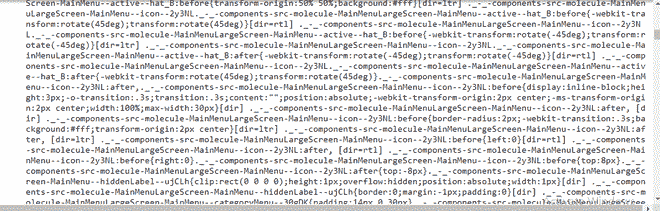
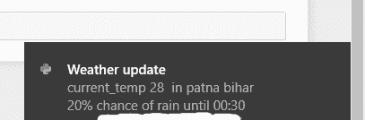

# 使用 Python 获取实时天气桌面通知

> 原文:[https://www . geesforgeks . org/get-live-weather-desktop-notifications-use-python/](https://www.geeksforgeeks.org/get-live-weather-desktop-notifications-using-python/)

我们知道天气更新在我们的日常生活中有多重要。因此，我们用一些最简单的方式向大家介绍逻辑和脚本。让我们看一个简单的 Python 脚本来显示天气信息的实时更新。

### 需要的模块

在这个脚本中，我们使用了一些库

*   **bs4** :美人汤(bs4)是一个从 HTML 和 XML 文件中拉出数据的 Python 库。要安装此模块，请在终端中键入以下命令。

```
pip install bs4
```

*   **win10toast:** 该库有助于创建桌面通知。要安装此模块，请在终端中键入以下命令。

```
pip install win10toast
```

*   **请求**:这个库可以让你极其轻松的发送 HTTP/1.1 请求。要安装此模块，请在终端中键入以下命令。

```
pip install requests

```

**进场:**

1.  *从给定的网址中提取数据。*
2.  *借助请求和靓汤刮数据。*
3.  *将数据转换成 html 代码。*
4.  *找到需要的细节，过滤掉。*
5.  *将结果保存在字符串中。*
6.  *在通知对象中传递结果。*

**让我们一步步执行脚本:**

**第一步:**导入所有依赖

## 蟒蛇 3

```
import requests
from bs4 import BeautifulSoup
from win10toast import ToastNotifier
```

**步骤 2:** 创建 ToastNotifier 类的对象。

## 蟒蛇 3

```
n = ToastNotifier()
```

**步骤 3:** 定义一个从给定网址获取数据的函数。

## 蟒蛇 3

```
def getdata(url):

    r = requests.get(url)

    return r.text
```

**步骤 4:** 现在将 URL 传递给 getdata 函数，并将该数据转换为 HTML 代码。

## 蟒蛇 3

```
htmldata = getdata("https://weather.com/en-IN/weather/today/l/25.59,85.14?par=google&temp=c/")

soup = BeautifulSoup(htmldata, 'html.parser')

print(soup.prettify())
```

执行此脚本后，您将获得如下原始数据:



原始 HTML 信息

**第五步:**找到需要的细节并过滤

## 蟒蛇 3

```
current_temp = soup.find_all("span", 
                             class_=" _-_-components-src-organism-CurrentConditions-CurrentConditions--tempValue--MHmYY")
chances_rain = soup.find_all("div", 
                             class_= "_-_-components-src-organism-CurrentConditions-CurrentConditions--precipValue--2aJSf")

temp = (str(current_temp))   
temp_rain = str(chances_rain)

result = "current_temp " + temp[128:-9] + "  in patna bihar" + "\n" +temp_rain[131:-14]
```

**步骤 6:** 现在将结果传递到通知对象中。

## 蟒蛇 3

```
n.show_toast("Weather update", result, duration = 10)
```

**输出**:



通知

**完整代码:**

## 蟒蛇 3

```
# import required libraries
import requests
from bs4 import BeautifulSoup
from win10toast import ToastNotifier

# create an object to ToastNotifier class
n = ToastNotifier()

# define a function
def getdata(url):
    r = requests.get(url)
    return r.text

htmldata = getdata("https://weather.com/en-IN/weather/today/l/25.59,85.14?par=google&temp=c/")

soup = BeautifulSoup(htmldata, 'html.parser')

current_temp = soup.find_all("span", class_= "_-_-components-src-organism-CurrentConditions-CurrentConditions--tempValue--MHmYY")

chances_rain = soup.find_all("div", class_= "_-_-components-src-organism-CurrentConditions-CurrentConditions--precipValue--2aJSf")

temp = (str(current_temp))

temp_rain = str(chances_rain)

result = "current_temp " + temp[128:-9] + "  in patna bihar" + "\n" + temp_rain[131:-14]
n.show_toast("live Weather update", 
             result, duration = 10)
```

**输出:**


实时通知