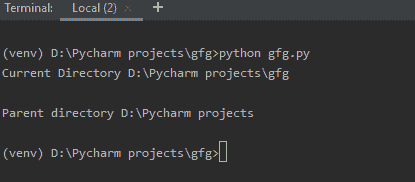
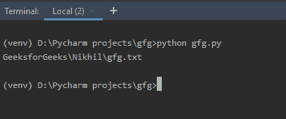

# 使用 Python 获取当前目录的父目录

> 原文:[https://www . geesforgeks . org/get-parent-of-current-directory-use-python/](https://www.geeksforgeeks.org/get-parent-of-current-directory-using-python/)

在 Python 中， **OS 模块**用于与操作系统交互。它属于 Python 的标准实用程序模块。该模块提供了一种使用操作系统相关功能的可移植方式。*os*和*os.path*模块包含许多与文件系统交互的功能。
操作系统模块提供了各种获取父目录的方法。有些方式是:

*   [使用 OS . path . abpath()](#abspath)T2】
*   [使用 OS . path . dirname()](#dirname)T2】
*   [使用 os.path.relpath()和 os.path.dirname()](#relpath)

## 使用 OS . path . abpath()

OS . path . abpath()可用于获取父目录。此方法用于获取路径的规范化版本。这个功能还需要 [os.path.join()](http://geeksforgeeks.org/python-os-path-join-method/) 和 os.pardir()的帮助。
[Python 中的 os.path.join()](http://geeksforgeeks.org/python-os-path-join-method/) 方法智能地连接一个或多个路径组件。此方法将各种路径组件串联起来，除了最后一个路径组件之外，每个非空部分后面都有一个目录分隔符(“/”)。如果要连接的最后一个路径组件为空，则在末尾放置一个目录分隔符(“/”)。

> **语法:**OS . path . abpath(路径)
> **参数:**
> **路径:**表示文件系统路径的类路径对象。
> **返回类型:**返回一个字符串，该字符串是路径的规范化版本。

**例:**

## 蟒蛇 3

```
# Python program to get parent
# directory

import os

# get current directory
path = os.getcwd()
print("Current Directory", path)

# prints parent directory
print(os.path.abspath(os.path.join(path, os.pardir)))
```

**输出:**


## 使用 os.path.dirname()

[Python 中的 os.path.dirname()](https://www.geeksforgeeks.org/python-os-path-dirname-method/) 方法用于从指定路径获取目录名。

> **语法:**OS . path . dirname(path)
> **参数:**
> **路径:**表示文件系统路径的类路径对象。
> **返回类型:**这个方法返回一个字符串值，代表指定路径的目录名。

**例:**

## 蟒蛇 3

```
# Python program to get parent
# directory

import os

# get current directory
path = os.getcwd()
print("Current Directory", path)
print()

# parent directory
parent = os.path.dirname(path)
print("Parent directory", parent)
```

**输出:**



## 使用 os.path.relpath()和 os.path.dirname()

在上面的例子中，获取父目录被限制在一个级别，也就是说，我们只能获取当前目录的父目录到一个级别。假设我们想找到父目录的父目录，那么上面的代码失败了。这可以通过同时使用 [os.path.relpath()](https://www.geeksforgeeks.org/python-os-path-relpath-method/) 和 os.path.dirname()来实现。
[Python 中的 os.path.relpath()](https://www.geeksforgeeks.org/python-os-path-relpath-method/) 方法用于从当前工作目录或给定目录中获取给定路径的相对文件路径。

> **语法:** os.path.relpath(path，start = OS . cordir)
> **参数:**
> **路径:**表示文件系统路径的类路径对象。
> **start(可选):**表示文件系统路径的类路径对象。
> 给定路径的相对路径将根据 start 指示的目录进行计算。此参数的默认值是 OS . core dir，这是操作系统用来引用当前目录的常量字符串。
> 类路径对象是表示路径的字符串或字节对象。
> **返回类型:**该方法返回一个字符串值，代表从起始目录到给定路径的相对文件路径。0222

**示例:**
为了根据用户指定的级别获取父目录，我们将创建一个函数 getParent()，该函数将路径和级别作为参数。在函数内部，for 循环将迭代+1 级次数，并将在 for 循环内部调用 os.path.dirname()。在 for 循环中调用这个函数会给我们一个起点，os.path.relpath()会从这个起点给出相对文件路径。
下面是实现。

## 蟒蛇 3

```
# Python program to get the
# parent directory

import os.path

# function to get parent
def getParent(path, levels = 1):
    common = path

    # Using for loop for getting
    # starting point required for
    # os.path.relpath()
    for i in range(levels + 1):

        # Starting point
        common = os.path.dirname(common)

    # Parent directory upto specified
    # level
    return os.path.relpath(path, common)

path = 'D:/Pycharm projects / GeeksforGeeks / Nikhil / gfg.txt'
print(getParent(path, 2))
```

**输出:**

