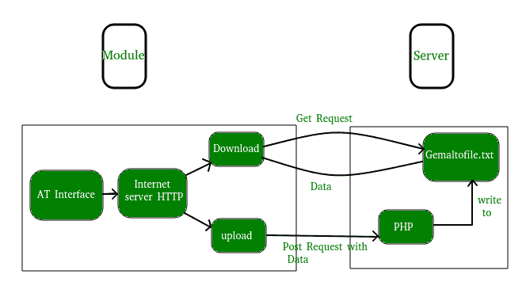
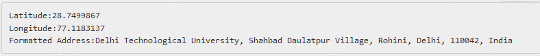

# 使用 Python 获取和发布请求

> 原文:[https://www . geesforgeks . org/get-post-requests-using-python/](https://www.geeksforgeeks.org/get-post-requests-using-python/)

这篇文章讨论了 python 中的两种 HTTP(超文本传输协议)请求方法 GET 和 post 请求以及它们在 Python 中的实现。

**什么是 HTTP？**
HTTP 是一组协议，旨在实现客户端和服务器之间的通信。它作为客户机和服务器之间的请求-响应协议。
网络浏览器可以是客户端，托管网站的计算机上的应用程序可以是服务器。

因此，要从服务器请求响应，主要有两种方法:

1.  **GET** :向服务器请求数据。
2.  **POST** :向服务器提交需要处理的数据。

这里有一个简单的图表，解释了 GET 和 POST 方法的基本概念。
现在，要在 python 中发出 HTTP 请求，我们可以使用如下几个 HTTP 库:

*   [httplib](https://docs.python.org/2/library/httplib.html)
*   [urllib](https://docs.python.org/2/library/urllib.html)
*   [请求](http://docs.python-requests.org/en/master/)

上面列出的库中最优雅和最简单的是请求。在本文中，我们将使用请求库。要下载并安装请求库，请使用以下命令:

```py
pip install requests
```

或者，从[这里](https://pypi.python.org/pypi/requests/)下载，手动安装。

**发出获取请求**

```py
# importing the requests library
import requests

# api-endpoint
URL = "http://maps.googleapis.com/maps/api/geocode/json"

# location given here
location = "delhi technological university"

# defining a params dict for the parameters to be sent to the API
PARAMS = {'address':location}

# sending get request and saving the response as response object
r = requests.get(url = URL, params = PARAMS)

# extracting data in json format
data = r.json()

# extracting latitude, longitude and formatted address 
# of the first matching location
latitude = data['results'][0]['geometry']['location']['lat']
longitude = data['results'][0]['geometry']['location']['lng']
formatted_address = data['results'][0]['formatted_address']

# printing the output
print("Latitude:%s\nLongitude:%s\nFormatted Address:%s"
      %(latitude, longitude,formatted_address))
```

输出:


上面的示例通过向谷歌地图应用编程接口发送一个获取请求来查找给定位置的纬度、经度和格式化地址。应用编程接口(API)使您能够以有限的方式访问程序的内部功能。而且大部分情况下提供的数据都是[JSON(JavaScript Object notification)](https://en.wikipedia.org/wiki/JSON)格式(在 Python 中实现为字典对象！).
 **要点推断:**

*   ```py
    PARAMS = {'address':location}
    ```

    获取请求的网址通常带有一些参数。对于请求库，参数可以定义为字典。这些参数随后被解析并添加到基本 url 或 api 端点。
    了解参数角色，创建响应对象后尝试打印 **r.url** 。你会看到这样的东西:

    ```py
    http://maps.googleapis.com/maps/api/geocode/json?address=delhi+technological+university
    ```

    这是发出获取请求的实际网址

*   ```py
    r = requests.get(url = URL, params = PARAMS)
    ```

    这里我们创建一个响应对象“r”，它将存储请求-响应。我们使用 requests.get()方法，因为我们正在发送一个 get 请求。我们传递的两个参数是 url 和参数字典。

*   ```py
    data = r.json()
    ```

    现在，为了从响应对象中检索数据，我们需要将原始响应内容转换为 JSON 类型的数据结构。这是通过使用 json()方法实现的。最后，我们通过解析 JSON 类型对象来提取所需的信息。

**发出开机自检请求**

```py
# importing the requests library
import requests

# defining the api-endpoint 
API_ENDPOINT = "http://pastebin.com/api/api_post.php"

# your API key here
API_KEY = "XXXXXXXXXXXXXXXXX"

# your source code here
source_code = '''
print("Hello, world!")
a = 1
b = 2
print(a + b)
'''

# data to be sent to api
data = {'api_dev_key':API_KEY,
        'api_option':'paste',
        'api_paste_code':source_code,
        'api_paste_format':'python'}

# sending post request and saving response as response object
r = requests.post(url = API_ENDPOINT, data = data)

# extracting response text 
pastebin_url = r.text
print("The pastebin URL is:%s"%pastebin_url)
```

这个例子解释了如何通过向 PASTEBIN 应用编程接口发送开机自检请求，将你的**源代码**粘贴到[pastebin.com](http://pastebin.com/)。
首先你需要通过[在这里](http://pastebin.com/signup)注册生成一个 API 密钥，然后在这里访问你的 [API 密钥。](https://pastebin.com/doc_api#1)

**该代码的重要特征:**

*   ```py
    data = {'api_dev_key':API_KEY,
            'api_option':'paste',
            'api_paste_code':source_code,
            'api_paste_format':'python'}
    ```

    在这里，我们还需要将一些数据传递给应用编程接口服务器。我们把这些数据储存在字典里。

*   ```py
    r = requests.post(url = API_ENDPOINT, data = data)
    ```

    这里我们创建一个响应对象“r”，它将存储请求-响应。我们使用 requests.post()方法，因为我们正在发送一个 post 请求。我们传递的两个参数是 url 和数据字典。

*   ```py
    pastebin_url = r.text
    ```

    作为响应，服务器处理发送给它的数据，并发送您的**源代码**的粘贴板网址，您可以通过 **r.text** **简单地访问该网址。**

**requests.post** 方法也可以用于许多其他任务，比如填写和提交网络表格，使用脸书图形应用编程接口在你的 FB 时间线上发布，等等。

**以下是一些需要思考的要点:**

*   当方法为 GET 时，所有表单数据都被编码到 URL 中，作为查询字符串参数追加到**动作** URL 中。通过开机自检，表单数据出现在 HTTP 请求的**消息正文**中。
*   在 GET 方法中，参数数据只限于我们可以填充到请求行(URL)中的内容。使用少于 2K 的参数是最安全的，有些服务器可以处理高达 64K 的参数。POST 方法没有这样的问题，因为我们是在 HTTP 请求的**消息体**中发送数据，而不是 URL。
*   GET 方法中只允许发送 ASCII 字符的数据。POST 方法没有这样的限制。
*   与 POST 相比，GET 的安全性较低，因为发送的数据是 URL 的一部分。因此，在发送密码或其他敏感信息时，不应使用 GET 方法。

本博客由**尼克尔·库马尔**投稿。如果你喜欢极客博客并想投稿，你也可以用 write.geeksforgeeks.org 写一篇文章或者把你的文章邮寄到 review-team@geeksforgeeks.org。看到你的文章出现在极客博客主页上，帮助其他极客。

如果你发现任何不正确的地方，或者你想分享更多关于上面讨论的话题的信息，请写评论。