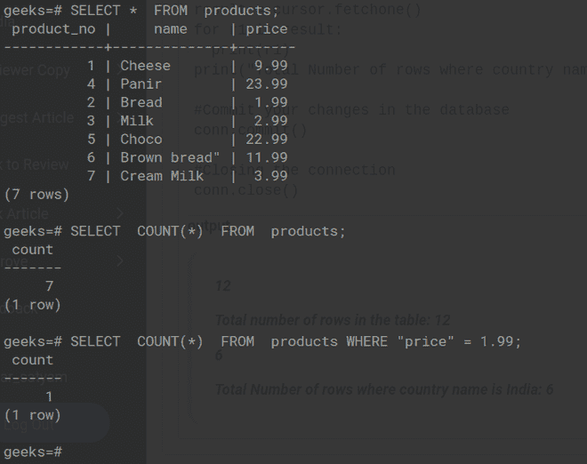
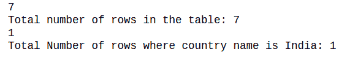

# 获取 psycopg2 计数(*)结果数

> 原文:[https://www . geesforgeks . org/get-psycopg2-count-number-of-results/](https://www.geeksforgeeks.org/get-psycopg2-count-number-of-results/)

在本文中，我们将看到如何获得 psycopg2 count(*)的结果数。

psycopg2 **count(*)** 从保存某些特定条件的数据库表中返回行数。如果没有给定条件，则返回关系中存在的元组总数。

> **语法:**
> 
> 从表名中选择计数(*)；#返回表中的总行数
> 
> 从表名选择计数(*)条件；#返回具有指定条件的行数

**让我们看看 PostgreSql 提示中的以下语法:**



首先，我们将导入 psycopg2 模块，该模块将处理 **postgreSQL** 数据库，然后建立数据库连接。然后我们将创建一个游标对象，它允许 Python 代码在数据库会话中执行 PostgreSQL 命令。然后，我们将编写一个查询来执行具有特定细节的行的总数。

对于 ex-在下面给出的代码中，我们编写第一个查询来返回表中存在的行数，编写第二个查询来返回价格名称为 1.99 的行数。最后，获取并显示行数。

## 蟒蛇 3

```
# importing psycopg2
import psycopg2

conn=psycopg2.connect(
    database="geeks",
    user="postgres",
    password="root",
    host="localhost",
    port="5432"
)

# Creating a cursor object using the cursor()
# method
cursor = conn.cursor()

# query to count total number of rows
sql = 'SELECT count(*) from products;'
data=[]

# execute the query
cursor.execute(sql,data)
results = cursor.fetchone()

#loop to print all the fetched details
for r in results:
  print(r)
print("Total number of rows in the table:", r)

# query to count number of rows
# where country name is India  
sql1 = 'SELECT count(*) from products WHERE "price" = 1.99;'
data1=['India']

# execute query
cursor.execute(sql1,data1)
result = cursor.fetchone()
for r1 in result:
  print(r1)
print("Total Number of rows where country name is India:",r1)

# Commit your changes in the database
conn.commit()

# Closing the connection
conn.close()
```

**输出:**



计算光标中的行数