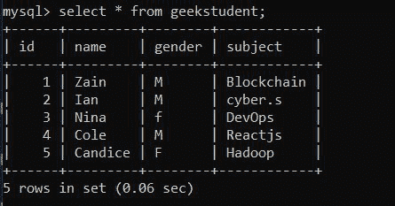
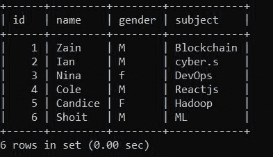

# 使用 Python 在 MySQL 数据库中插入后获取 id

> 原文:[https://www . geeksforgeeks . org/get-the-id-after-insert-in-MySQL-database-use-python/](https://www.geeksforgeeks.org/get-the-id-after-insert-into-mysql-database-using-python/)

**先决条件:**[MySQL](https://www.geeksforgeeks.org/mysql-common-mysql-queries/)[MySQL-python 的连接器](https://www.geeksforgeeks.org/mysql-connector-python-module-in-python/#:~:text=MySQL%20Connector%2FPython%20enables%20Python,for%20the%20Python%20Standard%20Library.)

这里的任务是起草一个 Python 程序，使用 SQL 支持来连接数据。每当插入到数据库中时，将打印插入行的标识。为了连接 python 和数据库，我们使用了 MySQL 连接器。mysql 连接器的工作是提供对所需语言的 MySQL 驱动程序的访问。因此，它在编程语言和 MySQL 服务器之间生成了一个连接。

### SQL 中的插入子句

顾名思义，它将数据插入数据库。使用 insert 命令时，需要遵循某些规则。要更新的数据应该与数据库列的顺序相同，或者列的名称应该与要插入的数据一起提供给查询。

**语法:**

> 插入<tablename>(第 1 列，第 2 列，…)</tablename>
> 
> VALUES(…。);

要打印最后插入行的标识，将使用**最后一行标识**。这是一个特殊的关键字，它打印最后插入的行的标识，但是要做到这一点，在使用它之前必须记住某些协议:

*   数据库的标识列应该是主键
*   标识列应该自动递增。

下面给出了相同的实现:

**使用中的数据库:**



**下面是实现:**

## 蟒蛇 3

```
import mysql.connector

mydb = mysql.connector.connect(
    host = 'localhost',
    database = 'employee',
    user = 'root',
    password = 'Your_pass'
)

cs = mydb.cursor()
statement = "INSERT INTO geekstudent( id, name,gender, subject)\
VALUES(6,'Shoit','M', 'ML')"
cs.execute(statement)
mydb.commit()

print(cs.rowcount, " record(s) added")

print(cs.lastrowid)
```

**输出:**

```
1  record(s) added
0
```

**更新的数据库输出:**

