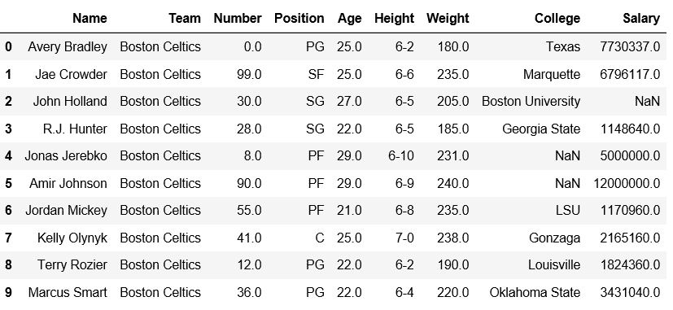
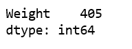
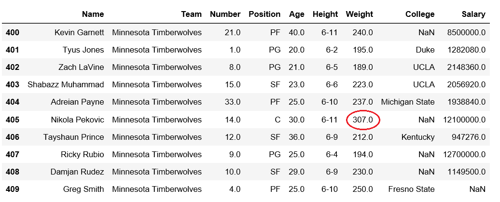
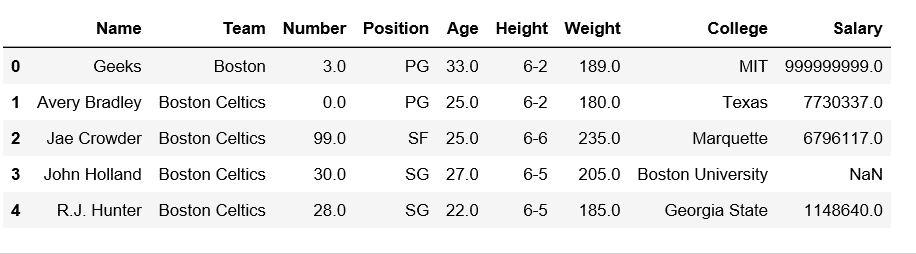
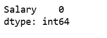

# 获取数据框列中最大值的索引

> 原文:[https://www . geesforgeks . org/get-data frame-column 中最大值的索引/](https://www.geeksforgeeks.org/get-the-index-of-maximum-value-in-dataframe-column/)

[Pandas DataFrame](https://www.geeksforgeeks.org/python-pandas-dataframe/) 是一个二维可变大小、潜在异构的表格数据结构，带有标记轴(行和列)。
我们来看看如何获取 DataFrame 列中最大值的索引。
先观察这个数据集。我们将使用这个数据的“重量”和“工资”列，以便从熊猫数据框中的特定列获得最大值的索引。

## 蟒蛇 3

```py
# importing pandas module
import pandas as pd

# making data frame
df = pd.read_csv("https://media.geeksforgeeks.org/wp-content/uploads/nba.csv")

df.head(10)
```



**代码#1:** 检查出现最大重量值的指数。

## 蟒蛇 3

```py
# importing pandas module
import pandas as pd

# making data frame
df = pd.read_csv("nba.csv")

# Returns index of maximum weight
df[['Weight']].idxmax()
```

**输出:**



我们可以验证索引中是否存在最大值。

## 蟒蛇 3

```py
# importing pandas module
import pandas as pd

# making data frame
df = pd.read_csv("nba.csv")

# from index 400 to 409
df.iloc[400:410]
```

**输出:**



**代码#2:** 我们在索引 0 处插入一个新行，有最大工资，然后验证。

## 蟒蛇 3

```py
# importing pandas module
import pandas as pd

# making data frame
df = pd.read_csv("nba.csv")

new_row = pd.DataFrame({'Name':'Geeks', 'Team':'Boston', 'Number':3,
                        'Position':'PG', 'Age':33, 'Height':'6-2',
                        'Weight':189, 'College':'MIT', 'Salary':999999999}
                         , index=[0])

df = pd.concat([new_row, df]).reset_index(drop=True)
df.head(5)
```

**输出:**



现在，让我们检查最大工资是否出现在指数 0。

## 蟒蛇 3

```py
# Returns index of minimum salary
df[['Salary']].idxmax()
```

**输出:**

