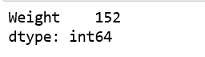
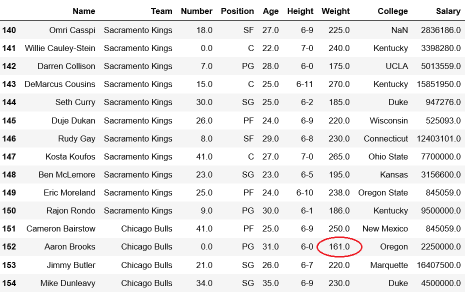
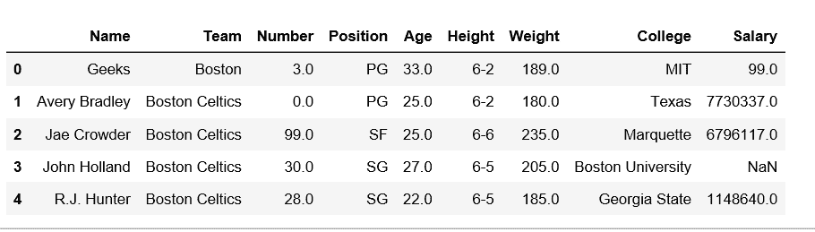
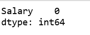

# 获取数据框列中最小值的索引

> 原文:[https://www . geesforgeks . org/get-data frame-column 中最小值的索引/](https://www.geeksforgeeks.org/get-the-index-of-minimum-value-in-dataframe-column/)

[Pandas DataFrame](https://www.geeksforgeeks.org/python-pandas-dataframe/) 是一个二维可变大小、潜在异构的表格数据结构，带有标记轴(行和列)。

让我们看看如何获得 DataFrame 列中最小值的索引。

首先观察这个数据集。我们将使用这个数据的“重量”和“工资”列，以便从熊猫数据框的一个特定列中获得最小值的索引。

```
# importing pandas module 
import pandas as pd 

# making data frame 
df = pd.read_csv("https://media.geeksforgeeks.org/wp-content/uploads/nba.csv") 

df.head(10)
```


**代码#1:** 检查存在最小重量值时的指数。

```
# importing pandas module 
import pandas as pd 

# making data frame 
df = pd.read_csv("nba.csv")

# Returns index of minimum weight
df[['Weight']].idxmin()
```

**输出:**


我们可以验证索引中是否存在最小值。

```

# importing pandas module 
import pandas as pd 

# making data frame 
df = pd.read_csv("nba.csv")

# from index 140 to 154
df.iloc[140:155]
```

**输出:**


**代码#2:** 我们在索引 0 处插入一个新行，有最低工资，然后打印最低工资。

```
# importing pandas module 
import pandas as pd 

# making data frame 
df = pd.read_csv("nba.csv")

new_row = pd.DataFrame({'Name':'Geeks', 'Team':'Boston', 'Number':3,
                        'Position':'PG', 'Age':33, 'Height':'6-2',
                        'Weight':189, 'College':'MIT', 'Salary':99}
                         , index=[0])

df = pd.concat([new_row, df]).reset_index(drop=True)
df.head(5)
```

**输出:**


现在，让我们检查最低工资是否出现在指数 0。

```
# Returns index of minimum salary
df[['Salary']].idxmin()
```

**输出:**
