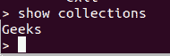

# 使用 PyMongo

获取所有收藏的名称

> 原文:[https://www . geesforgeks . org/get-the-name-of-all-collections-using-pymongo/](https://www.geeksforgeeks.org/get-the-names-of-all-collections-using-pymongo/)

**PyMongo** 是使用 Python 与 MongoDB 建立连接，执行插入、删除、更新等所有操作的模块。PyMongo 是使用 MongoDB 和 Python 的推荐方式。

**注:**关于 Python 和 MongoDB 的详细信息，请访问 [MongoDB 和 Python](https://www.geeksforgeeks.org/mongodb-and-python/) 。

让我们从**开始，使用 PyMongo** 获取所有收藏的名称

1.  **Importing PyMongo Module:** Import the PyMongo module using the command:

    ```py
    from pymongo import MongoClient
    ```

    如果您的机器上尚未安装 MongoDB，您可以参考指南:[使用 Python 安装 MongoDB 的指南](https://www.geeksforgeeks.org/guide-install-mongodb-python-windows/)

2.  **创建连接:**现在我们已经导入了模块，是时候建立与 MongoDB 服务器的连接了，该服务器大概运行在端口 27017(端口号)的 localhost(主机名)上。

    ```py
    client = MongoClient(‘localhost’, 27017)
    ```

3.  **Accessing the Database:** Since the connection to the MongoDB server is established. We can now create or use the existing database.

    ```py
    mydatabase = client.name_of_the_database
    ```

    在我们的例子中，数据库的名字是 GeeksForGeeks

    ```py
    mydatabase = client.GeeksForGeeks
    ```

4.  **List the name of all the Collections in the Database:** To list the name of all the collection in the database.

    ```py
    mydatabase.collection_names()
    ```

    collection_names()在 3.7.0 版中已被弃用。而是使用

    ```py
    mydatabase.list_collection_names()
    ```

    此方法返回数据库中的集合列表。

**示例:**

**样本数据库:**



```py
# Python Program to demonstrate
# List name of all collections using PyMongo

# Importing required libraries
from pymongo import MongoClient

# Connecting to MongoDB server
# client = MongoClient('host_name', 'port_number')
client = MongoClient(‘localhost’, 27017)

# Connecting to the database named
# GeeksForGeeks
mydatabase = client.GeeksForGeeks

# Getting the names of all the collections
# in GeeksForGeeks Database.
collections = mydatabase.list_collection_names()

# Printing the name of the collections to the console.
print(collections)
```

**输出:**

```py
['Geeks']
```