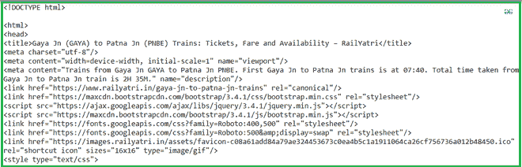
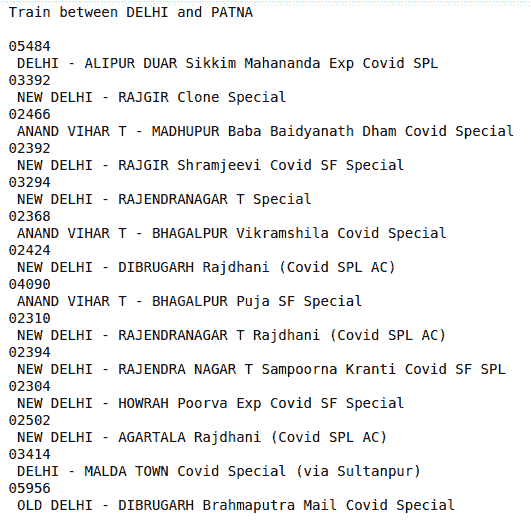
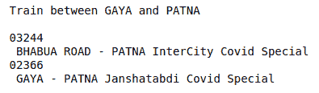

# 使用 Python 获取站间列车

> 原文:[https://www . geesforgeks . org/get-trains-站间-使用-python/](https://www.geeksforgeeks.org/get-trains-between-stations-using-python/)

假设你想使用印度铁路旅行，并想在指定的车站之间寻找火车。手动完成这项工作可能会非常忙碌。因此，在本文中，我们将编写一个脚本，该脚本将自动从 railyatri 获取数据，并将告诉火车的名称以及它们在指定车站之间的代码。

### **需要的模块**

*   [**bs4**](https://www.geeksforgeeks.org/implementing-web-scraping-python-beautiful-soup/)【T4:美人汤(bs4)是一个从 HTML 和 XML 文件中拉出数据的 Python 库。这个模块没有内置 Python。要安装此软件，请在终端中键入以下命令。

```py
pip install bs4

```

*   [**请求**](https://www.geeksforgeeks.org/python-requests-tutorial/) **:** 请求让你发送 HTTP/1.1 请求极其轻松。该模块也没有内置 Python。要安装此软件，请在终端中键入以下命令。

```py
pip install requests

```

**我们来看看脚本的分步执行。**

**第一步:**导入所有依赖

## 蟒蛇 3

```py
# import module
import requests
from bs4 import BeautifulSoup
```

**步骤 2:** 创建一个 URL 获取函数

## 蟒蛇 3

```py
# user define function 
# Scrape the data 
def getdata(url): 
    r = requests.get(url) 
    return r.text
```

**第三步:**现在将站名和站名代码合并为 URL，并将 URL 传递给 getdata()函数，并将该数据转换为 HTML 代码。

## 蟒蛇 3

```py
# input by geek
from_Station_code = "NDLS"
from_Station_name = "DELHI"

To_station_code = "PNBE"
To_station_name = "PATNA"
# url
url = "https://www.railyatri.in/booking/trains-between-stations?from_code="+from_Station_code+"&from_name="+from_Station_name+"+JN+&journey_date=+Wed&src=tbs&to_code=" + \
    To_station_code+"&to_name="+To_station_name + \
    "+JN+&user_id=-1603228437&user_token=355740&utm_source=dwebsearch_tbs_search_trains"

# pass the url
# into getdata function
htmldata = getdata(url)
soup = BeautifulSoup(htmldata, 'html.parser')

# display html code
print(soup)
```

**输出:**



**步骤 4:** 现在从 HTML 代码中找到所需的标签，并遍历结果。

## 蟒蛇 3

```py
# find the Html tag
# with find()
# and convert into string
data_str = ""
for item in soup.find_all("div", class_="col-xs-12 TrainSearchSection"):
    data_str = data_str + item.get_text()
result = data_str.split("\n")

print("Train between "+from_Station_name+" and "+To_station_name)
print("")

# Display the result
for item in result:
    if item != "":
        print(item)
```

**输出:**



**全面实施。**

## 蟒蛇 3

```py
# import module
import requests
from bs4 import BeautifulSoup

# user define function
# Scrape the data
def getdata(url):
    r = requests.get(url)
    return r.text

# input by geek
from_Station_code = "GAYA"
from_Station_name = "GAYA"

To_station_code = "PNBE"
To_station_name = "PATNA"
# url
url = "https://www.railyatri.in/booking/trains-between-stations?from_code="+from_Station_code+"&from_name="+from_Station_name+"+JN+&journey_date=+Wed&src=tbs&to_code=" + \
    To_station_code+"&to_name="+To_station_name + \
    "+JN+&user_id=-1603228437&user_token=355740&utm_source=dwebsearch_tbs_search_trains"

# pass the url
# into getdata function
htmldata = getdata(url)
soup = BeautifulSoup(htmldata, 'html.parser')

# find the Html tag
# with find()
# and convert into string
data_str = ""
for item in soup.find_all("div", class_="col-xs-12 TrainSearchSection"):
    data_str = data_str + item.get_text()
result = data_str.split("\n")

print("Train between "+from_Station_name+" and "+To_station_name)
print("")

# Display the result
for item in result:
    if item != "":
        print(item)
```

**输出:**

