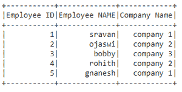

# 获取 PySpark 数据框中特定单元格的值

> 原文:[https://www . geesforgeks . org/get-value-of-a-special-cell-in-py spark-data frame/](https://www.geeksforgeeks.org/get-value-of-a-particular-cell-in-pyspark-dataframe/)

在本文中，我们将获取 pyspark 数据框中特定单元格的值。

为此，我们将使用 collect()函数获取 dataframe 中的所有行。我们可以指定收集函数的索引(单元格位置)

创建用于演示的数据帧:

## 蟒蛇 3

```
# importing module
import pyspark

# importing sparksession from pyspark.sql module
from pyspark.sql import SparkSession

# creating sparksession and giving an app name
spark = SparkSession.builder.appName('sparkdf').getOrCreate()

# list  of employee data with 5 row values
data =[["1","sravan","company 1"],
       ["2","ojaswi","company 2"],
       ["3","bobby","company 3"],
       ["4","rohith","company 2"],
       ["5","gnanesh","company 1"]]

# specify column names
columns=['Employee ID','Employee NAME',
         'Company Name']

# creating a dataframe from the lists of data
dataframe = spark.createDataFrame(data,columns)

# display dataframe
dataframe.show()
```

**输出:**



**collect():** 用于从列表格式的数据框中获取所有行的数据。

> **语法:** dataframe.collect()

**示例 1:** 演示 collect()函数的 Python 程序

## 蟒蛇 3

```
# display dataframe using collect()
dataframe.collect()
```

**输出:**

> [行(员工标识='1 '，员工姓名='sravan '，公司名称= '公司 1 ')，
> 
> 行(员工标识='2 '，员工姓名='ojaswi '，公司名称= '公司 2 ')，
> 
> 行(员工标识='3 '，员工姓名='bobby '，公司名称= '公司 3 ')，
> 
> 行(员工标识='4 '，员工姓名='rohith '，公司名称= '公司 2 ')，
> 
> 行(员工标识='5 '，员工姓名='gnanesh '，公司名称= '公司 1 ')]

**示例 2:** 获取特定行

为了获得特定的行，我们可以使用索引方法和 collect。在 pyspark 数据框中，索引从 0 开始

> **语法:**data frame . collect()[index _ number]

## 蟒蛇 3

```
# display dataframe using collect()
print("First row :",dataframe.collect()[0])

print("Third row :",dataframe.collect()[2])
```

**输出:**

> 第一行:行(员工标识='1 '，员工姓名='sravan '，公司名称= '公司 1 ')
> 
> 第三行:行(员工标识='3 '，员工姓名='bobby '，公司名称= '公司 3 ')

**示例 3:** 获取特定单元格

我们必须指定行和列索引以及 collect()函数

> **语法:**data frame . collect()[row _ index][column _ index]
> 
> 其中，row_index 是行号，column_index 是列号

这里我们从数据框的单元格中访问值。

## 蟒蛇 3

```
# first row - second column
print("first row - second column  :",
      dataframe.collect()[0][1])

# Third  row - Third column
print("Third  row - Third column  :",
      dataframe.collect()[2][1])

# Third  row - Third column
print("Third  row - Third column  :",
      dataframe.collect()[2][2])
```

**输出:**

```
first row - second column  : sravan
Third  row - Third column  : bobby
Third  row - Third column  : company 3
```