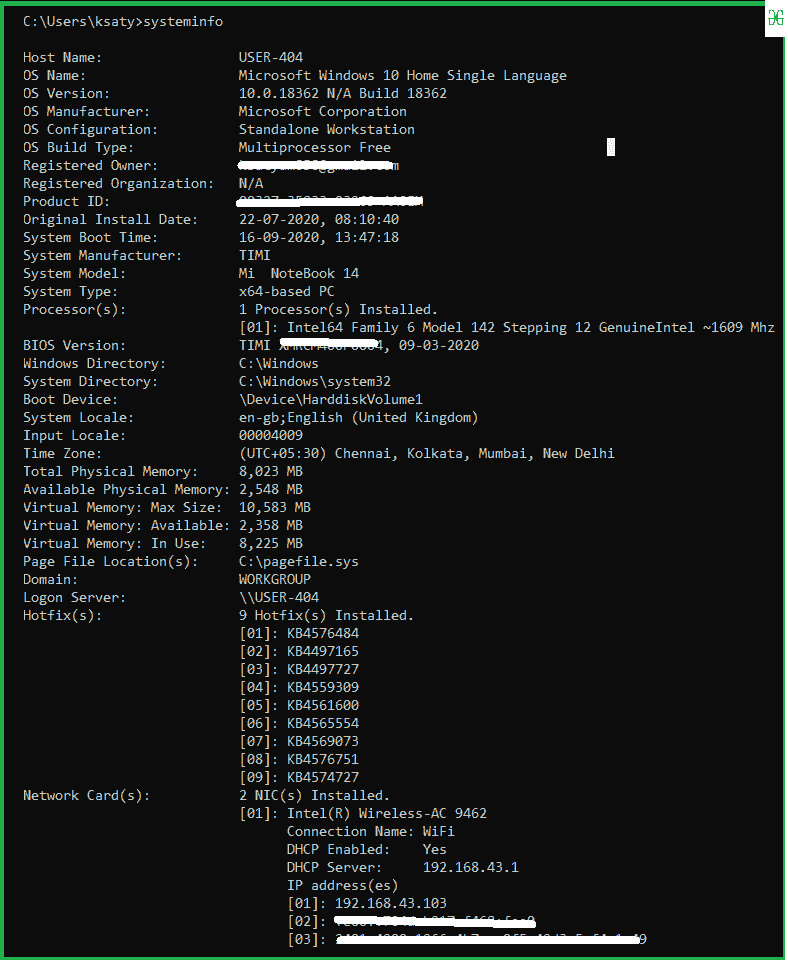

# 获取您的系统信息–使用 Python 脚本

> 原文:[https://www . geesforgeks . org/get-your-system-information-use-python-script/](https://www.geeksforgeeks.org/get-your-system-information-using-python-script/)

比方说，Ubuntu 可以通过使用中的操作系统轻松获取系统信息。但是，使用 Python 脚本获取这些系统信息不是很有趣吗？在本文中，我们将研究使用 Python 导出系统信息的各种方法。

获取信息有两种方法:

1.  使用平台模块
2.  子流程

## 1.使用平台模块:

平台模块的安装可以使用以下命令完成:

```py
pip install platform

```

**例:**

## 蟒蛇 3

```py
import platform

my_system = platform.uname()

print(f"System: {my_system.system}")
print(f"Node Name: {my_system.node}")
print(f"Release: {my_system.release}")
print(f"Version: {my_system.version}")
print(f"Machine: {my_system.machine}")
print(f"Processor: {my_system.processor}")
```

**输出:**

```py
System: Windows
Node Name: LAPTOP-PRKUI1Q9
Release: 10
Version: 10.0.18362
Machine: AMD64
Processor: Intel64 Family 6 Model 78 Stepping 3, GenuineIntel

```

## 使用 WMI 模块(仅适用于 Windows):

WMI 模块可用于获取 windows 机器的系统信息，并可使用以下命令安装:

```py
pip install wmi

```

**例:**

## 蟒蛇 3

```py
import wmi

c = wmi.WMI()   
my_system = c.Win32_ComputerSystem()[0]

print(f"Manufacturer: {my_system.Manufacturer}")
print(f"Model: {my_system. Model}")
print(f"Name: {my_system.Name}")
print(f"NumberOfProcessors: {my_system.NumberOfProcessors}")
print(f"SystemType: {my_system.SystemType}")
print(f"SystemFamily: {my_system.SystemFamily}")
```

**输出:**

```py
Manufacturer: LENOVO
Model: 80XH
Name: LAPTOP-PRKUI1Q9
NumberOfProcessors: 1
SystemType: x64-based PC
SystemFamily: ideapad 320-15ISK

```

## 使用 os 模块(仅适用于 Unix):

**示例:**

## 蟒蛇 3

```py
import os

print(os.uname())
```

**输出:**

> (' Linux '，' mycomputer.domain.user '，' 2 . 6 . 18-92 . 1 . 22 . 5 PAE '，' 1 SMP 杀死 APR 16 12:36:25 EST 2020 '，' i686 ')

## 使用 psutil 模块:

这主要用于获取系统上的运行时进程信息。
psutil 模块的安装可以使用以下命令完成:

```py
pip install psutil

```

**例:**

## 蟒蛇 3

```py
import psutil

print(f"Memory :{psutil.virtual_memory()}")
```

**输出:**

> 内存:svmem(总计=8458571776，可用=2982494208，百分比=64.7，已用=5476077568，空闲=2982494208)

## 2.使用子流程模块:

我们将使用 [**子流程**](https://docs.python.org/3/library/subprocess.html) 模块与 cmd 交互，并将信息检索到您的 python ide 中。我们可以通过子流程模块读取 cmd 命令。它是 python 中的一个内置模块

让我们看看我的逻辑，如果我们将这个 **systeminfo** 代码运行到我们的终端中，那么我们得到如下结果:



**我们写 python 代码获取信息:**

> **进场:**
> 
> *   导入模块
> *   使用 subprocess.check_output()获取命令“systeminfo”的输出
> *   用 utf-8 解码输出根据行分割元数据
> *   现在获取分割字符串，并根据自己的需要排列数据。

**实施:**

## 蟒蛇 3

```py
# import module
import subprocess

# traverse the info
Id = subprocess.check_output(['systeminfo']).decode('utf-8').split('\n')
new = []

# arrange the string into clear info
for item in Id:
    new.append(str(item.split("\r")[:-1]))
for i in new:
    print(i[2:-2])
```

**输出:**

