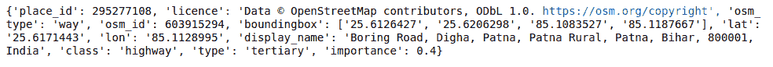
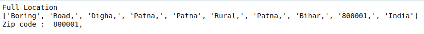

# 使用 Python 中的 GeoPy 获取给定位置的邮政编码

> 原文:[https://www . geesforgeks . org/get-zip-code-with-给定位置-使用-geopy-in-python/](https://www.geeksforgeeks.org/get-zip-code-with-given-location-using-geopy-in-python/)

在本文中，我们将编写一个 python 脚本，通过使用 **Geopy** 模块使用位置来获取邮政编码。Geopy 使 Python 开发人员能够轻松定位世界各地的地址、城市、国家和地标的坐标。

要安装 Geopy 模块，请在您的终端中运行以下命令。

```
pip install geopy

```

**进场:**

*   导入地理模块
*   初始化 Indigm API 以从输入字符串中获取位置。
*   使用 geolocator.geocode()函数获取位置。
*   现在从位置实例中提取 Zip 数据。

**分步实施:**

**步骤#1:** 导入模块。

## 蟒蛇 3

```
# import module
from geopy.geocoders import Nominatim
```

**步骤#2:** 制作一个 nominam 对象，用 geoapiExercises 参数初始化 Nominatim API。

## 蟒蛇 3

```
# initialize Nominatim API 
geolocator = Nominatim(user_agent="geoapiExercises")
```

**步骤#3:** 现在获取一个带有地理编码()的完整地址。

## 蟒蛇 3

```
place = "Boring road patna"
location = geolocator.geocode(place)
print(location)
```

**输出:**

> 印度比哈尔邦巴特那农村巴特那迪格哈无聊路 800001

**步骤#4:** 现在从给定的列表中获取信息，并用 raw 函数()解析成字典。

## 蟒蛇 3

```
data = location.raw
print(data)
```

**输出:**



**步骤#5:** 现在遍历给定字典中的邮政编码。

## 蟒蛇 3

```
loc_data = data['display_name'].split()
print("Full Location")
print(loc_data)
print("Zip code : ",loc_data[-2])
```

**输出:**



**全面实施:**

## 蟒蛇 3

```
# import module
from geopy.geocoders import Nominatim

# initialize Nominatim API 
geolocator = Nominatim(user_agent="geoapiExercises")

# place input by geek
place = "Boring road patna"
location = geolocator.geocode(place)

# traverse the data
data = location.raw
loc_data = data['display_name'].split()
print("Full Location")
print(loc_data)
print("Zip code : ",loc_data[-2])
```

**输出:**

