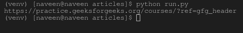

# get_property()元素法–硒蟒

> 原文:[https://www . geesforgeks . org/get _ property-element-method-selenium-python/](https://www.geeksforgeeks.org/get_property-element-method-selenium-python/)

Selenium 的 Python 模块是为使用 Python 执行自动化测试而构建的。硒 Python 绑定提供了一个简单的应用编程接口，可以使用硒网络驱动程序编写功能/验收测试。要使用硒 Python 打开网页，请使用 get 方法-硒 Python 签出–[导航链接。仅仅能够去一些地方并没有多大用处。我们真正想做的是与页面交互，或者更具体地说，与页面中的 HTML 元素交互。使用硒元素有多种策略，结账–](https://www.geeksforgeeks.org/navigating-links-using-get-method-selenium-python/)[定位策略](https://www.geeksforgeeks.org/locator-strategies-selenium-python/)

本文围绕如何在硒中使用`get_property`方法展开。`get_property`方法用于获取元素的属性，如获取锚点标签的`text_length`属性。此方法将首先尝试返回具有给定名称的属性值。如果同名属性不存在，它将返回同名属性的值。
**参数:**
名称–要检索的属性的名称。

**Syntax –**

```py
element.get_property("property name")
```

**示例–**

```py
<a href="https://www.geeksforgeeks.org/" id="link" />Text Here</a>
```

要找到一个元素，需要使用一种定位策略，例如，

```py
element = driver.find_element_by_id("link")
element = driver.find_element_by_xpath("//a[@id='link']")
```

此外，要找到多个元素，我们可以使用–

```py
elements = driver.find_elements_by_id("link")
```

现在人们可以用

```py
text_length = element.get_property("text_length")
```

## 如何在 Selenium Python 中使用 get_property 方法？

让我们用 https://www.geeksforgeeks.org/在 Selenium Python 中说明这个方法。这里我们在 geeksforgeeks 的导航栏中获得课程选项卡的 href 属性。
**节目–**

```py
# import webdriver
from selenium import webdriver

# create webdriver object
driver = webdriver.Firefox()

# get geeksforgeeks.org
driver.get("https://www.geeksforgeeks.org/")

# get element 
element = driver.find_element_by_link_text("Courses")

# get text_length property
print(element.get_property('href'))
```

**输出-**


**终端输出–**
