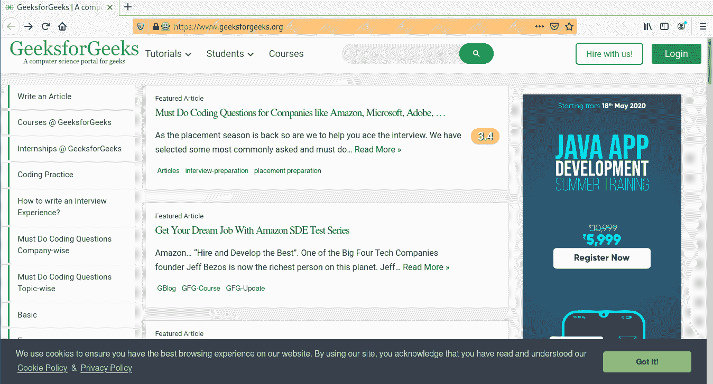
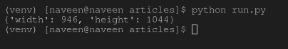

# get_window_size 驱动方法–硒蟒

> 原文:[https://www . geesforgeks . org/get _ window _ size-driver-method-selenium-python/](https://www.geeksforgeeks.org/get_window_size-driver-method-selenium-python/)

Selenium 的 Python 模块是为使用 Python 执行自动化测试而构建的。硒 Python 绑定提供了一个简单的应用编程接口，可以使用硒网络驱动程序编写功能/验收测试。要使用硒 Python 打开网页，请使用 get 方法-硒 Python 签出–[导航链接。仅仅能够去一些地方并没有多大用处。我们真正想做的是与页面交互，或者更具体地说，与页面中的 HTML 元素交互。使用硒元素有多种策略，结账–](https://www.geeksforgeeks.org/navigating-links-using-get-method-selenium-python/)[定位策略](https://www.geeksforgeeks.org/locator-strategies-selenium-python/)。Selenium WebDriver 提供了各种有用的方法来控制会话，或者换句话说，浏览器。例如，添加 cookie、按后退按钮、在选项卡间导航等。

本文围绕 Selenium 中的 get_window_size 驱动方法展开。get_window_size 方法获取当前窗口的宽度和高度。

**语法–**

```py
driver.get_window_size()
```

**示例–**
现在可以使用 get_window_size 方法作为驱动方法，如下所示–

```py
driver.get("https://www.geeksforgeeks.org/")
driver.get_window_size()
```

## 如何在 Selenium Python 中使用 get_window_size 驱动方法？

为了演示，请使用硒 Python 中的网络驱动程序 get_window_size 方法。让我们访问 https://www.geeksforgeeks.org/，对驱动程序对象进行操作。我们来看看窗户的尺寸，

**程序–**

## 蟒蛇 3

```py
# import webdriver
from selenium import webdriver

# create webdriver object
driver = webdriver.Firefox()

# get geeksforgeeks.org
driver.get("https://www.geeksforgeeks.org/")

# get window size
print(driver.get_window_size())
```

**输出–**
截图新增–



**终端输出–**

