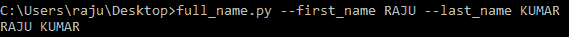

# Python 中的 Getopt 模块

> 原文:[https://www.geeksforgeeks.org/getopt-module-in-python/](https://www.geeksforgeeks.org/getopt-module-in-python/)

**getopt 模块**是一个基于 Unix `getopt()`函数建立的惯例的命令行选项解析器。它通常用于解析参数序列，如 sys.argv。换句话说，这个模块帮助脚本解析 sys.argv 中的命令行参数。它的工作方式类似于解析命令行参数的 C `getopt()`函数。

## Python getopt 函数

该模块提供的第一个功能同名，即`getopt()`。它的主要功能是解析命令行选项和参数列表。该函数的语法如下:

> **语法:** getopt.getopt(args，options，[long_options])
> 
> **参数:**
> **参数:**要传递的参数列表。
> **选项:**脚本想要识别的一串选项字母。需要参数的选项后面应该跟一个冒号(:)。
> **长选项:**长选项名称的字符串列表。需要参数的选项后面应该跟一个等号(=)。
> 
> **返回类型:**返回由两个元素组成的值:第一个是(选项，值)对的列表。第二个是选项列表被剥离后剩下的程序参数列表。

**例 1:**

```
import sys
import getopt

def full_name():
    first_name = None
    last_name = None

    argv = sys.argv[1:]

    try:
        opts, args = getopt.getopt(argv, "f:l:")

    except:
        print("Error")

    for opt, arg in opts:
        if opt in ['-f']:
            first_name = arg
        elif opt in ['-l']:
            last_name = arg

    print( first_name +" " + last_name)

full_name()    
```

**输出:**


这里我们创建了一个函数`full_name()`，从命令行获取名字和姓氏后打印全名。我们还把名字缩写为“f”，把姓氏缩写为“l”。

**示例 2:** 现在让我们来看看这样一种情况，即我们可以使用完整的形式作为“名字”和“姓氏”，而不是像“f”或“l”这样的短形式。下面的代码使用完整的表单来打印全名；

```
import sys
import getopt

def full_name():
    first_name = None
    last_name = None

    argv = sys.argv[1:]

    try:
        opts, args = getopt.getopt(argv, "f:l:", 
                                   ["first_name =",
                                    "last_name ="])

    except:
        print("Error")

    for opt, arg in opts:
        if opt in ['-f', '--first_name']:
            first_name = arg
        elif opt in ['-l', '--last_name']:
            last_name = arg

    print( first_name +" " + last_name)

full_name()
```

**输出:**



**注意:**代码中参数的短形式应使用单破折号(“-”)，长形式应使用双破折号(“–”)。