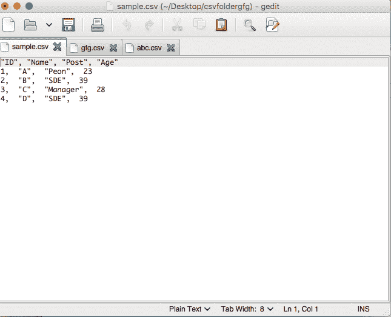
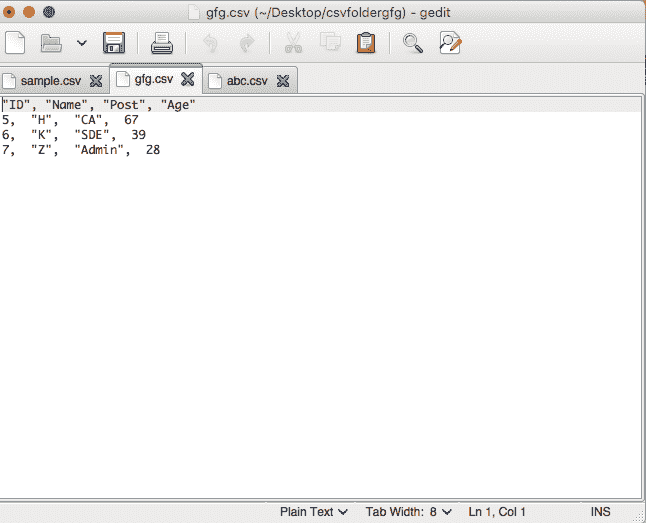
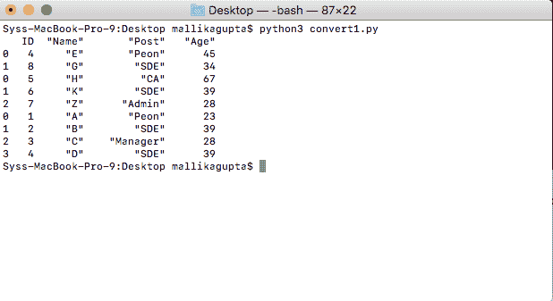

# 使用 Python 从目录中获取所有 CSV 文件

> 原文:[https://www . geeksforgeeks . org/get-all-CSV-files-from-a-directory-use-python/](https://www.geeksforgeeks.org/getting-all-csv-files-from-a-directory-using-python/)

Python 提供了许多内置的包和模块来处理工作区中的 CSV 文件。CSV 文件可以在系统的目录和子目录中访问，也可以修改或编辑。CSV 文件的内容既可以打印在外壳上，也可以以数据帧的形式保存，以便以后播放。

在本文中，我们将看到如何遍历由不同类型的文件组成的目录(文件夹/路径)中包含的 n 个 CSV 文件，并处理这些文件的内容。因此，我们将两种不同的方法应用于我们的任务。

**两种方法的输入目录:**


**使用的猪瘟病毒:**

CSV 1:



CSV 2:



**CSV 3:**


### **方法 1:使用 Glob 模块**

*   最初，指定源目录的路径，在这种情况下，使用 path 变量指定文件夹“csvfoldergfg”。

```py
path = "csvfoldergfg"
```

*   为了定位所有名称可能未知的 CSV 文件，调用 glob 模块并调用其 glob 方法。使用 [glob.glob(路径)](https://www.geeksforgeeks.org/how-to-use-glob-function-to-find-files-recursively-in-python/)为其提供路径。这将返回路径中的所有 CSV 文件列表。使用的正则表达式相当于*。csv，它匹配扩展名为. csv 的所有文件。

```py
glob.glob(path, '*.csv')
```

*   然后使用 for 循环对这些文件执行迭代，并使用 pandas 库的 [read_csv()](https://www.geeksforgeeks.org/python-read-csv-using-pandas-read_csv/) 方法将内容读入数据帧。使用这种方法提取的信息可以被操纵。

```py
read_csv(file_contents)
```

以下代码在本地计算机上执行，其中脚本和指定路径的目录都存储在同一个工作目录中:

## 蟒蛇 3

```py
# importing the required modules
import glob
import pandas as pd

# specifying the path to csv files
path = "csvfoldergfg"

# csv files in the path
files = glob.glob(path + "/*.csv")

# defining an empty list to store 
# content
data_frame = pd.DataFrame()
content = []

# checking all the csv files in the 
# specified path
for filename in files:

    # reading content of csv file
    # content.append(filename)
    df = pd.read_csv(filename, index_col=None)
    content.append(df)

# converting content to data frame
data_frame = pd.concat(content)
print(data_frame)
```

**输出:**



### **方法二:使用 OS 模块**

*   最初，使用 dir_name 字符串变量指定源目录的路径，在本例中是文件夹“csvfoldergfg”。

```py
dir_name = "csvfoldergfg"
```

*   为了定位所有名称可能未知的文件，调用 os 模块，并调用其 [listdir()](https://www.geeksforgeeks.org/python-os-listdir-method/) 方法。它是使用 os.listdir(路径)提供的路径。这将返回路径中的所有文件列表。

```py
os.listdir(dir_name)
```

*   然后使用 for 循环对这些文件执行迭代，并使用 pandas 库的 read_csv()方法将内容读入数据帧。使用这种方法提取的信息可以被操纵。

```py
read_csv(file_contents)
```

以下代码在本地计算机上执行:

## 蟒蛇 3

```py
# importing the required packaged 
# in python
import pandas as pd
import os
dir_name = "csvfoldergfg"

# specifying an empty list for content
content = []
for file in os.listdir(dir_name):

    # reading content into data frame
    df = pd.read_csv(file)
    df_list.append(df)

final_content = df.append(df for df in df_list)
print(final_content)
```

**输出:**

