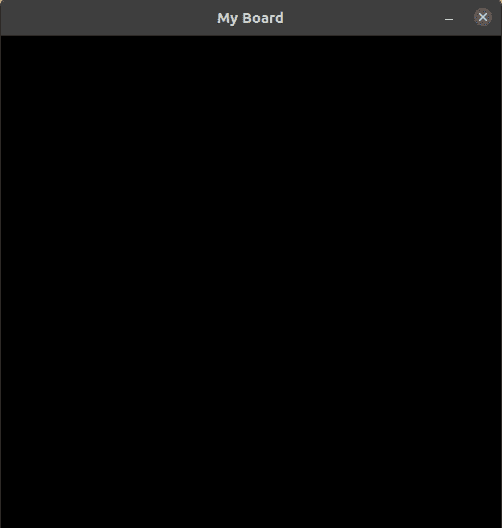
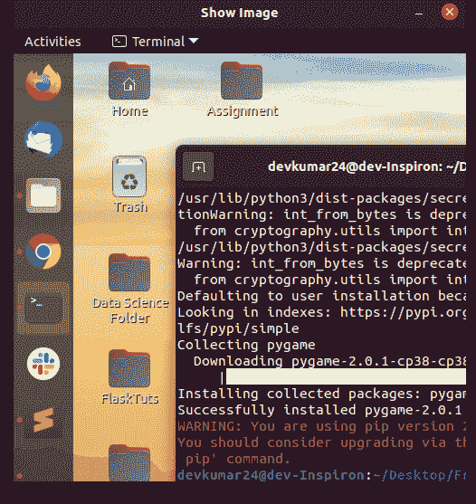
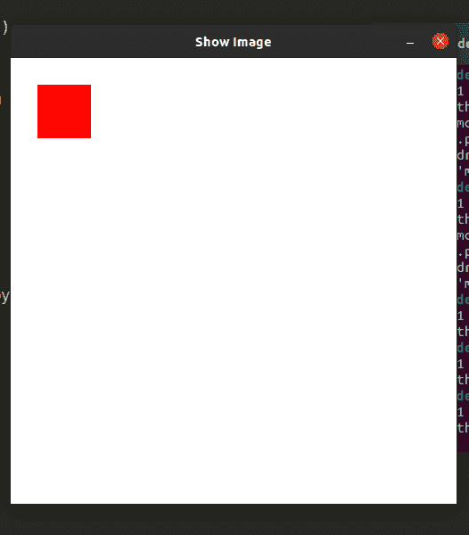

# Pygame 入门

> 原文:[https://www.geeksforgeeks.org/getting-started-with-pygame/](https://www.geeksforgeeks.org/getting-started-with-pygame/)

**Pygame** 是一套免费使用的开源 Python 模块。顾名思义，它可以用来制作游戏。你可以对游戏进行编码，然后使用特定的命令将它变成一个可执行文件，你可以与你的朋友分享，向他们展示你一直在做的工作。它包括设计用于 Python 编程语言的计算机图形和声音库。PyGame 2.0.1 是撰写本文时的最新版本。

## **设置 Pygame:**

默认情况下，Python 没有附带内置库的 PyGame。所以我们必须使用命令提示符来安装它。打开命令提示符并键入以下命令:

```py
pip install pygame
```

如果您已经安装了 PyGame，请使用以下命令检查版本:

```py
pip show pygame
```

如果您的 Pygame 没有更新到最新版本，请使用以下命令:

```py
pip install pygame --upgrade
```

如果这个命令显示一个 ModuleNotFoundError，那么很明显 pygame 没有安装。

### **简单 PyGame 示例:**

**使用的功能:**

*   **pygame.init():** 此命令用于启动 pygame 模块。
*   **pygame . display . set _ mode((500，500)):** 此命令用于制作所需大小(宽度，高度)的窗口。返回值是一个表面对象，它是我们执行不同图形操作的对象。
*   **pygame . display . set _ caption(title = " "):**此命令用于设置窗口/板的标题。
*   **pygame.event.get():** 这个用来清空事件队列。如果我们不这样做，窗口消息将开始堆积，在操作系统看来，游戏将变得没有反应。
*   **pygame。退出:**这是用来在我们点击窗口角落的关闭按钮时终止事件。

## 蟒蛇 3

```py
import pygame

pygame.init()

# CREATING CANVAS
canvas = pygame.display.set_mode((500, 500))

# TITLE OF CANVAS
pygame.display.set_caption("My Board")
exit = False

while not exit:
    for event in pygame.event.get():
        if event.type == pygame.QUIT:
            exit = True
    pygame.display.update()
```

**输出:**



### 将图像添加到 Pygame WIndow:

Blitting 是将游戏对象渲染到表面上的过程。当我们创建游戏对象时，我们应该渲染它。如果我们不渲染游戏对象，它将显示黑色窗口。在 pygame 中，有一种方法可以完成这种块传送过程，即**块传送()。**

这是任何游戏中最慢的操作之一，所以我们在使用它时需要小心，因为我们不应该在每一帧中都在屏幕上传输太多内容。

> **语法:** blit(src，dest)
> 
> **src :** 是我们要在屏幕上显示的图像的来源
> 
> **dest :** 这是我们希望图像显示的坐标。

**代码:**

## 蟒蛇 3

```py
import pygame

pygame.init()

color = (255,255,255)
position = (0,0)

# CREATING CANVAS
canvas = pygame.display.set_mode((500,500))

# TITLE OF CANVAS
pygame.display.set_caption("Show Image")

image = pygame.image.load("Screenshot.png")
exit = False

while not exit:
    canvas.fill(color)
    canvas.blit(image, dest = position)

    for event in pygame.event.get():
        if event.type == pygame.QUIT:
            exit = True

    pygame.display.update()
```

**输出:**



### Pygame 窗口中的矩形框:

在 Pygame 中，我们使用 **rect()** 方法在窗口上绘制矩形框。Pygame 使用**矩形**对象来存储和操作矩形区域。它可以由左、顶、宽和高值的组合形成。

## 蟒蛇 3

```py
import pygame

pygame.init()

color = (255,255,255)
rect_color = (255,0,0)

# CREATING CANVAS
canvas = pygame.display.set_mode((500,500))

# TITLE OF CANVAS
pygame.display.set_caption("Show Image")

image = pygame.image.load("Screenshot.png")
exit = False

while not exit:
    canvas.fill(color)
    for event in pygame.event.get():
        if event.type == pygame.QUIT:
            exit = True

    pygame.draw.rect(canvas, rect_color,
                     pygame.Rect(30,30,60,60))
    pygame.display.update()
```

**输出:**

