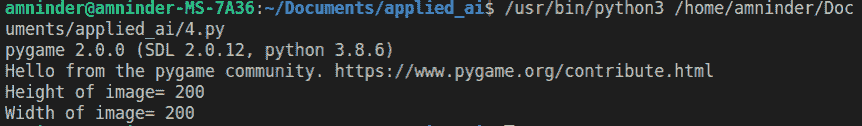
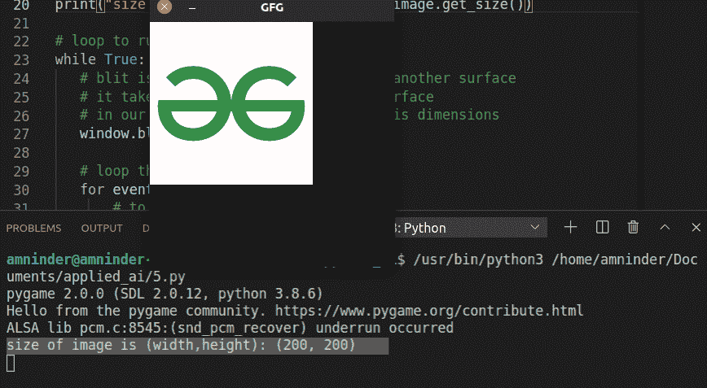

# 在 Pygame 中获取图像的宽度和高度

> 原文:[https://www . geesforgeks . org/get-width-and-height-of-a-in-image-pygame/](https://www.geeksforgeeks.org/getting-width-and-height-of-an-image-in-pygame/)

**先决条件:** [皮游戏](https://www.geeksforgeeks.org/introduction-to-pygame/)

为了在 python 程序中使用图形，我们使用了一个名为 Pygame 的模块。 **Pygame** 提供了用 Python 开发游戏和图形的高功能。如今，制作简单的 2D 游戏非常流行。为了运行使用 Pygame 模块用 Python 编写的程序，系统必须安装 Python 和 Pygame 模块。

以下是使用 Pygame 导入图像并获得该图像的高度和宽度所需的示例和步骤。

**使用的图像:** [链接到图像](https://media.geeksforgeeks.org/wp-content/cdn-uploads/gfg_200x200-min.png)


**尺寸:200×200**

### 方法 1:使用 get_width()和 get_height():

函数的名称足以说明它们的用途。

**接近**

*   汇入 pygame
*   使用 ***pygame.image.load(“在此提供图像路径”)*** 创建一个图像对象，并将其存储在一个变量中。
*   要获取图像的高度，请使用***image . get _ height()***方法 ***、*** 这里的图像是存储图像对象的变量。
*   同样，为了得到图像的宽度，我们使用***image . get _ width()***方法，这里 image 是存储图像对象的变量。
*   打印结果。

**示例:**

## 蟒蛇 3

```py
# import pygame
import pygame

# creating image object
image = pygame.image.load('/home/amninder/Pictures/Wallpapers/download.png')

# get_height method return the height of the surface pixel,
# in our case surface is image
print("Height of image= " + str(image.get_height()))

# get_width method return the width of the surface pixel,
# in our case surface is image
print("Width of image= " + str(image.get_width()))
```

**输出:**



方法 1

### 方法 2:使用 get_size():

这个函数能够返回提供给它的图像的维度作为元组的引用。

**接近**

*   导入模块
*   使用**方法创建显示对象。**
*   使用 **image.load()** 方法将图像加载到变量中。
*   使用 **blit()** 方法在显示面对象上绘制图像。
*   使用 **get_size()** 方法显示图像宽度和高度，这个 get_size()方法返回元组中的宽度和高度。例如(200，400 英镑)。
*   使用 **display.flip()** 显示内容，即在程序中调用函数时，任何绘制在显示面对象上的内容都会显示在窗口上。

**示例:**

## 蟒蛇 3

```py
import pygame as py

# Initiate pygame and the modules that comes with pygame
py.init()

# setting frame/window/surface with some dimensions
window = py.display.set_mode((300, 300))

# to set title of pygame window
py.display.set_caption("GFG")

# creating image object
image = py.image.load('/home/amninder/Pictures/Wallpapers/download.png')

# to display size of image
print("size of image is (width,height):", image.get_size())

# loop to run window continuously
while True:
    window.blit(image, (0, 0))

    # loop through the list of Event
    for event in py.event.get():
        # to end the event/loop
        if event.type == py.QUIT:

            # it will deactivate the pygame library
            py.quit()
            quit()

        # to display when screen update
        py.display.flip()
```

**输出:**



使用方法 2