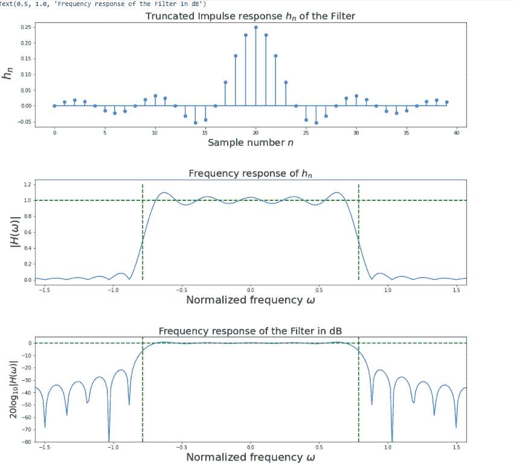
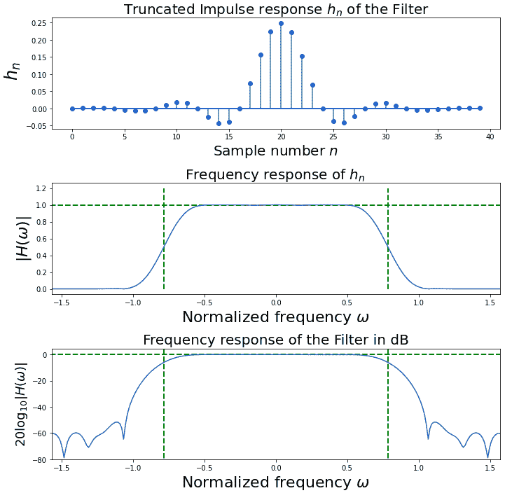

# 吉布现象矩形和汉明窗实现

> 原文:[https://www . geeksforgeeks . org/Gibbs-现象-矩形-和-汉明-窗口-实现/](https://www.geeksforgeeks.org/gibbs-phenomenon-rectangular-and-hamming-window-implementation/)

**什么是吉布现象？**

数字滤波器中的吉布现象指的是周期函数的傅里叶级数在跳跃中断附近的行为方式，傅里叶级数的部分和在中断附近有大的振荡，这可能使部分和的最大值增加到函数本身的最大值以上。因此，当项在不连续处加入傅里叶级数时，会有一个过冲。

在信号处理术语中，我们可以将吉布现象解释为滤波器的阶跃响应&通过傅里叶级数截断信号可以称为滤除信号。

**我们将通过示例问题**来理解这一点

过滤器的规格

1.  41 抽头数字低通 f.i.r 滤波器。
2.  滤波器的截止频率为π/4

我们将使用 ***矩形&汉明窗技术来实现解决方案。**T3】*

**什么是矩形窗口技术？**

在矩形窗口中，傅里叶变换收敛到 *sinc* 函数，在边缘给出矩形形状，因此称为矩形窗口。矩形在工业中没有广泛用于过滤信号。

**什么是****汉明窗术？**

汉明窗是一种更优化的信号滤波方法，因为它切断了两侧的信号点，让我们看到信号频谱的更清晰的图像。

**分步方法:**

**步骤 1:** 导入所有必需的库。

## 蟒蛇 3

```py
##import required library
import numpy as np
import scipy.signal as signal
import matplotlib.pyplot as plt
```

**步骤 2:** 用给定的过滤器规格定义变量。

## 蟒蛇 3

```py
#Given specification
wc =np.pi/4        #Cutoff frequency in radian
N1=int(input())    #Given filter length
M=(N1-1)/2         #Half length of the filter
```

**步骤 3:** 计算幅度、相位响应以获得矩形窗口系数

## 蟒蛇 3

```py
N = 512    ## Choose DFT size
n = np.arange(-M,M)  
#Desired impulse response coefficients of the lowpass
#filter with cutoff frequency wc
hd = wc / np.pi * np.sinc(wc * (n) / np.pi)

#Select the rectangular window coefficients
win =signal.boxcar(len(n))

#Perform multiplication of desired coefficients and
#window coefficients in the time domain
#instead of convolving in the frequency domain
h = hd * win # Modified filter coefficients

##Compute the frequency response of the modified filter coefficients
w,Hh = signal.freqz(h, 1, whole = True, worN = N)## get entire frequency domain
##Shift the FFT to center for plotting
wx = np.fft.fftfreq(len(w))
```

**步骤 4:** 使用 ***矩形窗口法*** 绘制滤波器的截断脉冲响应、频率响应和频率响应

## 蟒蛇 3

```py
##Plotting of the results
fig,axs = plt.subplots(3, 1)
fig.set_size_inches((16, 16))
plt.subplots_adjust(hspace = 0.5)

#Plot the modified filter coefficients
ax = axs[0]
ax.stem(n + M, h, basefmt =  'b-', use_line_collection = 'True')
ax.set_xlabel("Sample number $n{content}quot;, fontsize = 20)
ax.set_ylabel(" $h_n{content}quot;, fontsize = 24)
ax.set_title('Truncated Impulse response $h_n$ of the Filter', fontsize = 20)

#Plot the frequency response of the filter in linear units
ax = axs[1]
ax.plot(w-np.pi, abs(np.fft.fftshift(Hh)))
ax.axis(xmax = np.pi/2, xmin = -np.pi/2)
ax.vlines([-wc,wc], 0, 1.2, color = 'g', lw = 2., linestyle = '--',)
ax.hlines(1, -np.pi, np.pi, color = 'g', lw = 2., linestyle = '--',)
ax.set_xlabel(r"Normalized frequency $\omega{content}quot;,fontsize = 22)
ax.set_ylabel(r"$|H(\omega)| {content}quot;,fontsize = 22)
ax.set_title('Frequency response of $h_n$ ', fontsize = 20)

#Plot the frequency response of the filter in dB
ax=axs[2]
ax.plot(w-np.pi, 20*np.log10(abs(np.fft.fftshift(Hh))))
ax.axis(ymin = -80,xmax = np.pi/2,xmin = -np.pi/2)
ax.vlines([-wc,wc], 10, -80, color = 'g', lw = 2., linestyle = '--',)
ax.hlines(0, -np.pi, np.pi, color = 'g', lw = 2., linestyle = '--',)
ax.set_xlabel(r"Normalized frequency $\omega{content}quot;,fontsize = 22)
ax.set_ylabel(r"$20\log_{10}|H(\omega)| {content}quot;,fontsize = 18)
ax.set_title('Frequency response of the Filter in dB', fontsize = 20)
```



**步骤 5:** 计算幅度、相位响应以获得汉明窗系数的计算

## 蟒蛇 3

```py
#Desired impulse response coefficients of the lowpass filter with cutoff frequency wc
hd=wc/np.pi*np.sinc(wc*(n)/np.pi)### START CODE HERE ### (≈ 1 line of code)

#Select the rectangular window coefficients
win =signal.hamming(len(n))### START CODE HERE ### (≈ 1 line of code)

#Perform multiplication of desired coefficients and window
#coefficients in time domain
#instead of convolving in frequency domain
h = hd*win### START CODE HERE ### (≈ 1 line of code ## Modified filter coefficients

##Compute the frequency response of the modified filter coefficients
w,Hh =signal.freqz(h,1,whole=True,worN=N)### START CODE HERE ### (≈ 1 line of code)     
## get entire frequency domain

##Shift the FFT to center for plotting
wx =np.fft.fftfreq(len(w))### START CODE HERE ### (≈ 1 line of code)  
```

**步骤 6:** 使用**汉明窗法**绘制滤波器的截断脉冲响应、频率响应、频率响应

## 蟒蛇 3

```py
##Plotting of the results
fig,axs = plt.subplots(3,1)
fig.set_size_inches((10,10))
plt.subplots_adjust(hspace=0.5)

#Plot the modified filter coefficients
ax=axs[0]
ax.stem(n+M, h, basefmt='b-', use_line_collection='True')
ax.set_xlabel("Sample number $n{content}quot;,fontsize=20)
ax.set_ylabel(" $h_n{content}quot;,fontsize=24)
ax.set_title('Truncated Impulse response $h_n$ of the Filter', fontsize=20)

#Plot the frequency response of the filter in linear units
ax=axs[1]
ax.plot(w-np.pi, abs(np.fft.fftshift(Hh)))
ax.axis(xmax=np.pi/2, xmin=-np.pi/2)
ax.vlines([-wc,wc], 0, 1.2, color='g', lw=2., linestyle='--',)
ax.hlines(1, -np.pi, np.pi, color='g', lw=2., linestyle='--',)
ax.set_xlabel(r"Normalized frequency $\omega{content}quot;,fontsize=22)
ax.set_ylabel(r"$|H(\omega)| {content}quot;,fontsize=22)
ax.set_title('Frequency response of $h_n$ ', fontsize=20)

#Plot the frequency response of the filter in dB
ax=axs[2]
ax.plot(w-np.pi, 20*np.log10(abs(np.fft.fftshift(Hh))))
ax.axis(ymin=-80,xmax=np.pi/2,xmin=-np.pi/2)
ax.vlines([-wc,wc], 10, -80, color='g', lw=2., linestyle='--',)
ax.hlines(0, -np.pi, np.pi, color='g', lw=2., linestyle='--',)
ax.set_xlabel(r"Normalized frequency $\omega{content}quot;,fontsize=22)
ax.set_ylabel(r"$20\log_{10}|H(\omega)| {content}quot;,fontsize=18)
ax.set_title('Frequency response of the Filter in dB', fontsize=20)

fig.tight_layout()
plt.show()
```



## 蟒蛇 3

```py
#Desired impulse response coefficients of the lowpass filter with cutoff frequency wc
hd=wc/np.pi*np.sinc(wc*(n)/np.pi)### START CODE HERE ### (≈ 1 line of code)

#Select the rectangular window coefficients
win =signal.hamming(len(n))### START CODE HERE ### (≈ 1 line of code)

#Perform multiplication of desired coefficients and window
#coefficients in time domain
#instead of convolving in frequency domain
h = hd*win### START CODE HERE ### (≈ 1 line of code ## Modified filter coefficients

##Compute the frequency response of the modified filter coefficients
w,Hh =signal.freqz(h,1,whole=True,worN=N)### START CODE HERE ### (≈ 1 line of code)     
## get entire frequency domain

##Shift the FFT to center for plotting
wx =np.fft.fftfreq(len(w))### START CODE HERE ### (≈ 1 line of code)  
```