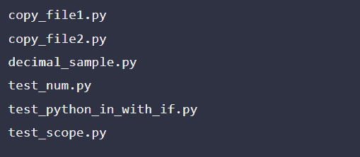
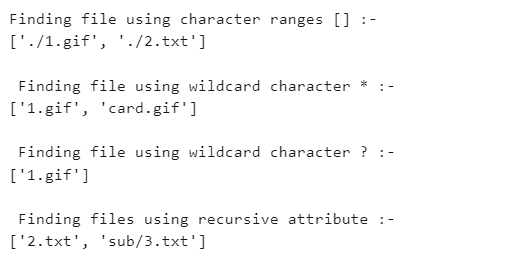
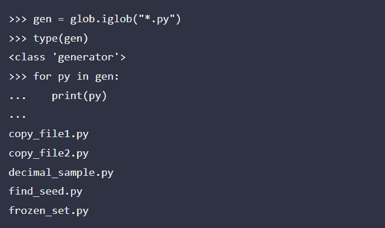
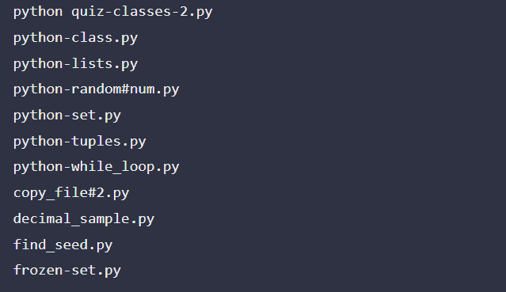

# glob–文件名模式匹配

> 原文:[https://www . geesforgeks . org/glob-filename-pattern-matching/](https://www.geeksforgeeks.org/glob-filename-pattern-matching/)

Glob 模块根据 Unix shell 规定的规则搜索所有路径名，寻找与指定模式匹配的文件。如此获得的结果以任意顺序返回。有些需求需要遍历某个位置的文件列表，大多数都有特定的模式。Python 的 glob 模块有几个功能，可以帮助在指定文件夹下列出与给定模式匹配的文件。

模式匹配是使用 **os.scandir()** 和 **fnmatch.fnmatch()** 函数完成的，而不是通过实际调用一个子外壳。与不同，glob 处理以点**开头的文件名。)**作为特例。对于 tilde 和 shell 变量扩展，使用 **os.path.expanduser()** 和 **os.path.expandvars()** 函数。

### **模式规则**

*   遵循标准的 Unix 路径扩展规则。
*   支持的特殊字符:两种不同的通配符- *，？和以[]表示的字符范围。
*   模式规则应用于文件名的段(在路径分隔符处停止，/)。
*   模式中的路径可以是相对的，也可以是绝对的。

### 应用

*   在您的程序需要在文件系统上查找名称与模式匹配的文件列表的任何情况下，它都很有用。
*   如果您需要一个文件名列表，其中包含某个扩展名、前缀或中间的任何常见字符串，请使用 glob 而不是自己编写代码来扫描目录内容。

### Glob 中的函数:

*   **glob(pathname，* recursive = False)-**它返回与给定路径名匹配的路径名列表，该列表必须是包含路径规范的字符串。列表也可以为空。
*   **iglob(pathname，* recursive = False)-**该方法创建一个 Python 生成器对象，用于列出给定目录下的文件。还返回一个迭代器，该迭代器产生与 glob()相同的值，但实际上没有同时存储它们。
*   **转义(路径名)-** 允许转义给定的字符序列。您可以发现它很方便地定位文件名中带有某些字符的文件，并匹配可能包含特殊字符的任意文本字符串。

下面是帮助您理解如何实践本模块的实现:

**例 1:**

## 蟒蛇 3

```
import glob

# search .py files
# in the current working directory
for py in glob.glob("*.py"):
    print(py)
```

**输出:**



**示例 2:** 描述通配符和范围的程序

如果递归为真，模式“**”将匹配任何文件以及零个或多个目录、子目录和指向目录的符号链接。在大型目录树中使用“**”模式可能会消耗过多的时间。

## 蟒蛇 3

```
import glob

# Using character ranges []
print('Finding file using character ranges [] :- ')
print(glob.glob('./[0-9].*'))

# Using wildcard character *
print('\n Finding file using wildcard character * :- ')
print(glob.glob('*.gif'))

# Using wildcard character ?
print('\n Finding file using wildcard character ? :- ')
print(glob.glob('?.gif'))

# Using recursive attribute
print('\n Finding files using recursive attribute :- ')
print(glob.glob('**/*.txt', recursive=True))
```

**输出:**



**例 3:**

## 蟒蛇 3

```
import glob

gen = glob.iglob("*.py")
# returns class type of gen
type(gen)

for py in gen:
    print(py)
```

**输出:**



**例 4:**

## 蟒蛇 3

```
import glob

char_seq = "-_#"

for spcl_char in char_seq:
    esc_set = "*" + glob.escape(spcl_char) + "*" + ".py"

    for py in (glob.glob(esc_set)):
        print(py)
```

**输出:**

