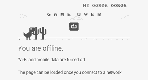

# 使用图像识别的谷歌 Chrome Dino 机器人| Python

> 原文:[https://www . geesforgeks . org/Google-chrome-dino-bot-using-image-recognition-python/](https://www.geeksforgeeks.org/google-chrome-dino-bot-using-image-recognition-python/)

当没有互联网连接时，你会在你的 Chrome 浏览器中看到什么？是的，每个人都知道屏幕上出现的恐龙游戏。因此，在本文中，我们将构建一个简单的 python 机器人，在没有用户交互的情况下玩 Chrome Dino Game。在这里，我们不使用任何机器学习或人工智能来解决这个问题，但我们将使用简单的图像/屏幕处理。



我们将与 Pyautogui 和 PIL (Python 图像库)合作实现。这个项目非常基础，只有大约 50 行代码，但它的结果会让你大吃一惊。
**使用的一些库有:**

1.  **PIL :** Python 图像库(PIL)是 Python 编程语言的免费库，增加了对打开、操作和保存许多不同图像文件格式的支持。

2.  **Pyautogui :** PyAutoGUI 是一个 Python 模块，用于以编程方式控制鼠标和键盘，无需任何用户交互。
3.  **时间:** Python“时间”模块，它允许我们处理关于时间的各种操作，它的转换和表示，在生活中的各种应用中找到它的用途。
4.  **Numpy :** NumPy 是 Python 编程语言的一个库，增加了对大型、多维数组和矩阵的支持，以及大量对这些数组进行操作的高级数学函数的集合。

**算法–**

1.  使用 Pyautogui 库点击重启按钮，使用“replaybutton”坐标。
2.  计算恐龙前面的框中所有白色像素值的总和。
3.  如果框中任何时候出现的像素值之和小于白色像素值之和，则意味着“灌木”或“鸟”要来了。所以我们要么让迪诺跳下去，要么弯腰。
4.  为了保护迪诺不受“布什”的伤害，我们跳了下去。
5.  为了保护迪诺免受“鸟”的伤害，我们总是压低我们的迪诺。

下面是 Python 实现–

## 蟒蛇 3

```
# importing above defined libraries to
# implement the functionalities
from PIL import ImageGrab, ImageOps
import pyautogui
import time
import numpy as np 

class coordinates():

    # coordinates of replay button to start the game
    replaybutton =(360, 214)
    # this coordinates represent the top-right coordinates
    # that will be used to define the front box
    dinasaur = (149, 239 )

def restartGame():

    # using pyautogui library, we are clicking on the
    # replay button without any user interaction
    pyautogui.click(coordinates.replaybutton)

    # we will keep our Bot always down that
    # will prevent him to get hit by bird
    pyautogui.keyDown('down')

def press_space():

    # releasing the Down Key
    pyautogui.keyUp('down')

    # pressing Space to overcome Bush
    pyautogui.keyDown('space')

    # so that Space Key will be recognized easily
    time.sleep(0.05)

    # printing the "Jump" statement on the
    # terminal to see the current output
    print("jump")
    time.sleep(0.10)

    # releasing the Space Key
    pyautogui.keyUp('space')

    # again pressing the Down Key to keep my Bot always down
    pyautogui.keyDown('down')

def imageGrab():
    # defining the coordinates of box in front of dinosaur
    box = (coordinates.dinasaur[0]+30, coordinates.dinasaur[1],
           coordinates.dinasaur[0]+120, coordinates.dinasaur[1]+2)

    # grabbing all the pixels values in form of RGB tuples  
    image = ImageGrab.grab(box)

    # converting RGB to Grayscale to
    # make processing easy and result faster
    grayImage = ImageOps.grayscale(image)

    # using numpy to get sum of all grayscale pixels
    a = np.array(grayImage.getcolors())

    # returning the sum
    print(a.sum())
    return a.sum()

# function to restart the game
restartGame()
while True:
     # 435 is the sum of white pixels values of box.
     # You may get different value is you are taking bigger
     # or smaller box than the box taken in this article.
     # if value returned by "imageGrab" function is not equal to 435,
     # it means either bird or bush is coming towards dinosaur
     if(imageGrab()!= 435):  
        press_space() 
        # time to recognize the operation performed by above function
        time.sleep(0.1)  
```

**输出:**

**改进:**经过一段时间，迪诺机器人游戏变得很快。鸟儿和灌木丛开始飞快地飞来。所以我们不是让我们的机器人学习所有这些东西，而是根据过去的学习来改变它的速度。所以我们的机器人将在 2000 分左右运行。为了获得更多的分数，我们不得不应用机器学习和人工智能。