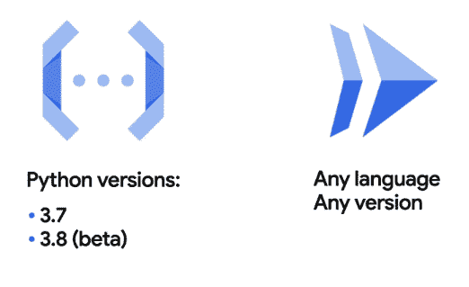
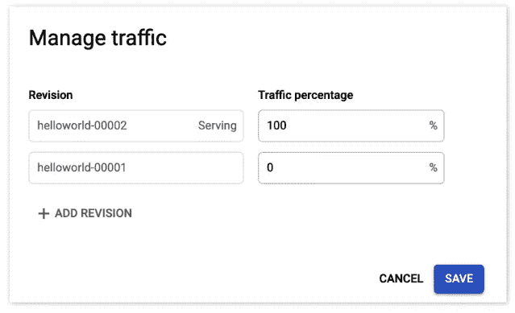

# 谷歌云平台——在谷歌云上运行不同版本的 Python 运行

> 原文:[https://www . geesforgeks . org/Google-cloud-platform-run-不同版本的 python-on-google-cloud-run/](https://www.geeksforgeeks.org/google-cloud-platform-running-different-versions-of-python-on-google-cloud-run/)

**问题陈述:**

Rinki 在 StoreCraft(Say)担任站点可靠性工程师，她随叫随到，维护他们的定制店面。StoreCraft 的系统是在内部用 Python 开发的，并且已经在虚拟机上运行了多年，这种设置与 StoreCraft 的业务一样不断发展。这些虚拟机使用略有不同的 Python 版本。这给林基和她的团队带来了额外的痛苦和工作。Rinki 正在寻找一种方法来减少这种痛苦，方法是将所有组件更新为当前的 Python，并将虚拟机迁移到更具可扩展性的东西上，如无服务器。StoreCraft 即将推出新的推荐引擎，使用 Python 3.8(2020 年最新版本)编写。但是，它依赖于 *sweet-ldap 包*，后者还不支持 Python 3。

Rinki 知道这次升级需要时间。她的团队需要确保现有系统持续运行。林基将如何在 GCP 解决这个问题？

**解决方案:**

她意识到，通过分两步完成升级，她可以最好地实现这一点。首先，转向无服务器，然后进行语言升级。由于 StoreCraft 即将推出一个新的推荐引擎，它是使用 Python 3.9 编写的。Rinki 认为这是通过完全跳过虚拟机来部署无服务器的完美选择。查看谷歌云上可用的选项，Rinki 发现，虽然她可以在**云功能**上部署，但她将被迫只使用 Python 的特定版本。然而，她发现谷歌云最新推出的名为**云跑**的无服务器产品没有这个限制。



所以她选择部署在那里。在 Cloud Run 上创建这个服务，Rinki 可以完全控制这个容器。利用 **Docker hub** 上的官方 Python 图像，她可以通过在 *Dockerfile* 的第一行指定基础图像来挑选她需要的 Python 的精确版本(即 Python 3.8)到补丁级别。由于每个云运行服务都基于自己的容器映像，每个容器映像都由自己的 Docker 文件定义，所以 Rinki 可以完全控制其设置中每个部分使用的语言。

由于每个云运行服务都有这种级别的隔离，Rinki 可以一次将每个服务移动到云运行。她还能够维护在原始虚拟机上运行的服务，直到团队能够升级。

它依赖于还不支持 Python 3 的 *sweet-ldap 包*。Rinki 能够通过在 Docker 文件中指定 Python 2 的最新版本来保持服务在现在已弃用的 Python 2.7 上运行，如下所示:

```
$ cat sweet-ldap/setup.py
...
 classifiers = [
                'Programming Language : : Python : : 2.7'
               ]
...
$ head Dockerfile
From python : 2.7.18 #final
```

一旦 *sweet-ldap 包*有了 Python 3 的支持，Rinki 就可以使用 Cloud Run 的**流量拆分**功能，通过逐步推出服务的新版本来测试这个新版本。



她可以将计数服务的新版本设置为只为 5%的访问者提供服务，这样，只有她的一些客户最终会使用新代码。如果她注意到某个东西没有按预期工作，她可以很容易地回滚到旧版本。通过依次迁移每个服务，Rinki 能够孤立地控制它们，从而允许更增量的升级过程和更可靠的环境。