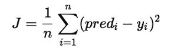
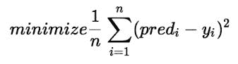
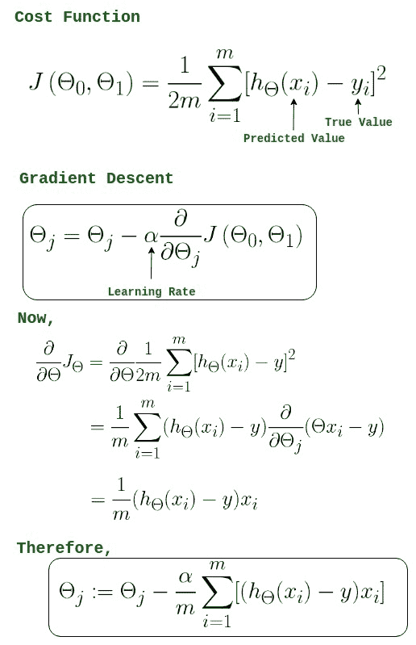
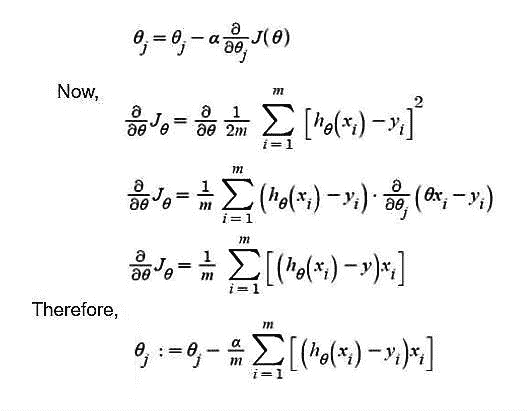
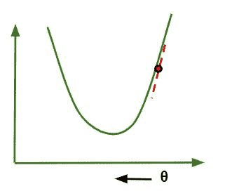
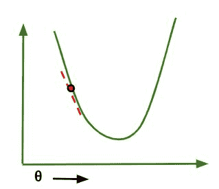
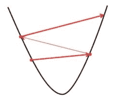
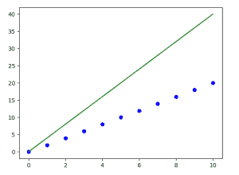
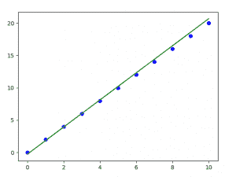

# 线性回归中的梯度下降

> 原文:[https://www . geesforgeks . org/线性回归中的梯度下降/](https://www.geeksforgeeks.org/gradient-descent-in-linear-regression/)

在线性回归中，模型的目标是根据给定的输入值(x)获得最佳拟合回归线来预测 y 的值。在训练模型时，模型计算成本函数，该函数测量预测值(pred)和真实值(y)之间的均方根误差。该模型的目标是最小化成本函数。
为了最小化成本函数，模型需要有θ <sub>1</sub> 和θ <sub>2</sub> 的最佳值。最初，模型随机选择θ <sub>1</sub> 和θ <sub>2</sub> 值，然后迭代更新这些值，以最小化成本函数，直到它达到最小值。当时间模型达到最小成本函数时，它将具有最佳的θ <sub>1</sub> 和θ <sub>2</sub> 值。利用线性方程假设方程中θ <sub>1</sub> 和θ <sub>2</sub> 的这些最终更新值，模型以其能达到的最佳方式预测 x 的值。
因此，问题来了–**θ<sub>1</sub>和θ <sub>2</sub> 值如何更新？**
**线性回归成本函数:**





**线性回归的梯度下降算法**





```
-> θ<sub>j     :</sub> Weights of the hypothesis.
-> h<sub>θ(xi) :</sub> predicted y value for ith input.
-> j     : Feature index number (can be 0, 1, 2, ......, n).
-> α     : Learning Rate of Gradient Descent.
```

我们将成本函数绘制成参数估计的函数，即假设函数的参数范围和选择特定参数集产生的成本。我们向下移动到图中的坑，寻找最小值。这样做的方法是取成本函数的导数，如上图所示。梯度下降沿最陡下降方向逐步降低成本函数。每一步的大小由参数 **α** 决定，称为**学习率**。
在梯度下降算法中，可以推断出两点:

*   **如果斜率为+ve**:θ<sub>j</sub>=θ<sub>j</sub>–(+ve 值)。因此θ <sub>j</sub> 的值减小。



*   **如果斜率为-ve**:θ<sub>j</sub>=θ<sub>j</sub>–(-ve 值)。因此θ <sub>j</sub> 的值增加。



正确学习率的选择非常重要，因为它确保梯度下降在合理的时间内收敛。:

*   如果我们选择 **α非常大**，梯度下降会超过最小值。它可能无法收敛甚至发散。



*   如果我们选择α非常小，梯度下降将采取小步骤来达到局部最小值，并将需要更长的时间来达到最小值。


对于线性回归成本，的函数图总是凸形的。

## 蟒蛇 3

```
# Implementation of gradient descent in linear regression
import numpy as np
import matplotlib.pyplot as plt

class Linear_Regression:
    def __init__(self, X, Y):
        self.X = X
        self.Y = Y
        self.b = [0, 0]

    def update_coeffs(self, learning_rate):
        Y_pred = self.predict()
        Y = self.Y
        m = len(Y)
        self.b[0] = self.b[0] - (learning_rate * ((1/m) *
                                np.sum(Y_pred - Y)))

        self.b[1] = self.b[1] - (learning_rate * ((1/m) *
                                np.sum((Y_pred - Y) * self.X)))

    def predict(self, X=[]):
        Y_pred = np.array([])
        if not X: X = self.X
        b = self.b
        for x in X:
            Y_pred = np.append(Y_pred, b[0] + (b[1] * x))

        return Y_pred

    def get_current_accuracy(self, Y_pred):
        p, e = Y_pred, self.Y
        n = len(Y_pred)
        return 1-sum(
            [
                abs(p[i]-e[i])/e[i]
                for i in range(n)
                if e[i] != 0]
        )/n
    #def predict(self, b, yi):

    def compute_cost(self, Y_pred):
        m = len(self.Y)
        J = (1 / 2*m) * (np.sum(Y_pred - self.Y)**2)
        return J

    def plot_best_fit(self, Y_pred, fig):
                f = plt.figure(fig)
                plt.scatter(self.X, self.Y, color='b')
                plt.plot(self.X, Y_pred, color='g')
                f.show()

def main():
    X = np.array([i for i in range(11)])
    Y = np.array([2*i for i in range(11)])

    regressor = Linear_Regression(X, Y)

    iterations = 0
    steps = 100
    learning_rate = 0.01
    costs = []

    #original best-fit line
    Y_pred = regressor.predict()
    regressor.plot_best_fit(Y_pred, 'Initial Best Fit Line')

    while 1:
        Y_pred = regressor.predict()
        cost = regressor.compute_cost(Y_pred)
        costs.append(cost)
        regressor.update_coeffs(learning_rate)

        iterations += 1
        if iterations % steps == 0:
            print(iterations, "epochs elapsed")
            print("Current accuracy is :",
                regressor.get_current_accuracy(Y_pred))

            stop = input("Do you want to stop (y/*)??")
            if stop == "y":
                break

    #final best-fit line
    regressor.plot_best_fit(Y_pred, 'Final Best Fit Line')

    #plot to verify cost function decreases
    h = plt.figure('Verification')
    plt.plot(range(iterations), costs, color='b')
    h.show()

    # if user wants to predict using the regressor:
    regressor.predict([i for i in range(10)])

if __name__ == '__main__':
    main()
```

**输出:**

 

**注:** 梯度下降有时也是使用 [<u>正则化</u>](https://www.geeksforgeeks.org/regularization-in-machine-learning/) 实现的。