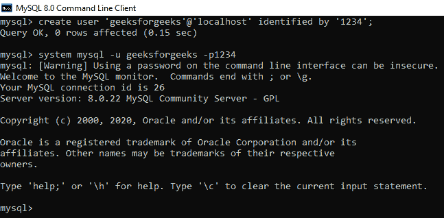
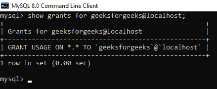
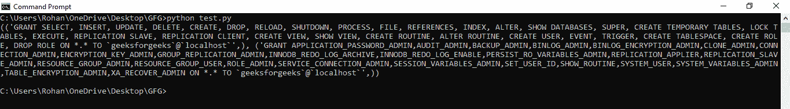
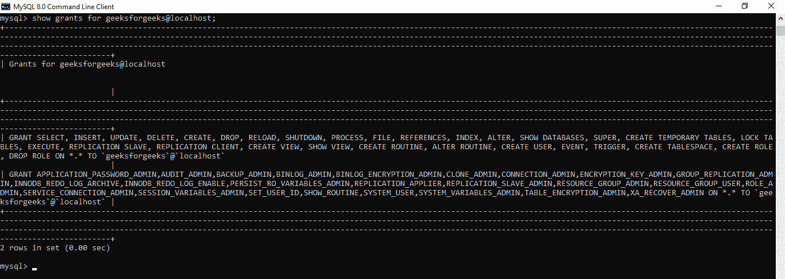

# 使用 Python 授予 MySQL 表和列权限

> 原文:[https://www . geesforgeks . org/grant-MySQL-表和列-权限-使用-python/](https://www.geeksforgeeks.org/grant-mysql-table-and-column-permissions-using-python/)

MySQL 服务器是一个开源的关系数据库管理系统，是对基于 web 的应用程序的主要支持。数据库和相关表格是许多网站和应用程序的主要组成部分，因为数据是通过网络存储和交换的。为了从 web 服务器访问 MySQL 数据库，我们使用了 Python 中的各种模块，如 PyMySQL、mysql.connector 等。

在本文中，我们将授予用户访问数据库及其 MySQL 表的权限。 *CREATE USER* 语句创建一个没有权限的用户帐户。下面给出了在 MySQL 中创建用户的语句。

```
CREATE USER 'user_name'@'localhost' IDENTIFIED BY 'password';
```

上述用户可以登录 MySQL 服务器，但不能进行任何操作，如查询数据和从表中选择数据库。在我们的案例中，**用户名**为***geeksforgeeks*****密码**为登录为 ***1234*** 。

要更改 MySQL 客户端中的用户，请使用以下命令:

```
SYSTEM MYSQL -u geeksforgeeks -p1234;
```



要检查当前用户，可以使用以下命令:

```
SELECT user();
```

上面的语句可以用来知道用户的权限。

```
SHOW GRANTS FOR user_name@localhost;
```

请参见下面的示例:



默认权限

**注意:**要授予用户 ***极客权限*** 您必须登录 ***root*** 账户。用户不能授予自己权限。

**下面是 python 程序给用户添加表和列权限*****geeks forgeeks***T6:

## 蟒蛇 3

```
# import required module
import pymysql

# establish connection to MySQL
connection = pymysql.connect(

    # specify host
    host='localhost',

    # specify root account
    user='root',

    # specify password for root account
    password='1234',

    # default port number is 3306 fro MySQL
    port=3306
)

# make a cursor to run sql queries
mycursor = connection.cursor()

# granting all permissions on all databases and their
# tables of geeksforgeeks user permission also includes
# table and column grants
mycursor.execute("Grant all on *.* to geeksforgeeks@localhost")

# print all privileges of geeksforgeeks user
mycursor.execute("Show grants for geeksforgeeks@localhost")
result = mycursor.fetchall()
print(result)

# commit privileges
mycursor.execute("Flush Privileges")

# close connection to MySQL
connection.close()
```

**输出**



Python 输出

**MySQL 终端**



MySQL 输出

我们可以看到，对 *CREATE* 和 *ALTER* MySQL 表的权限已经提供给了用户*geeks forgeek*。