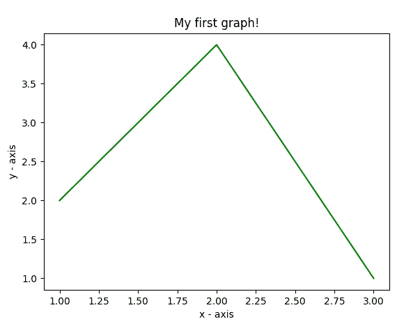
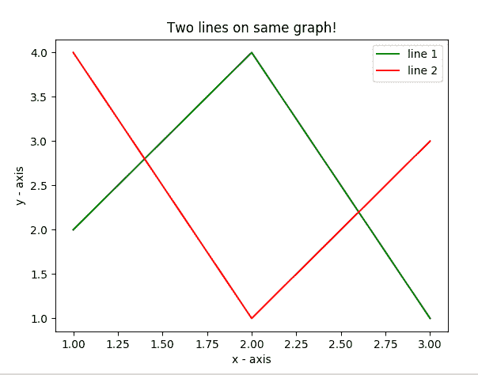
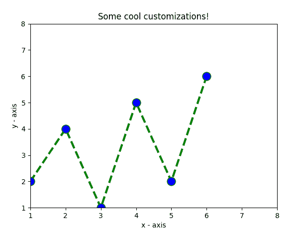
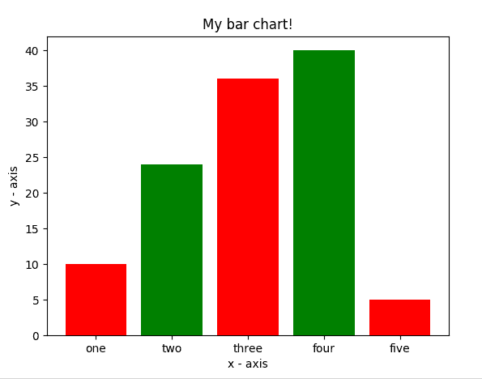
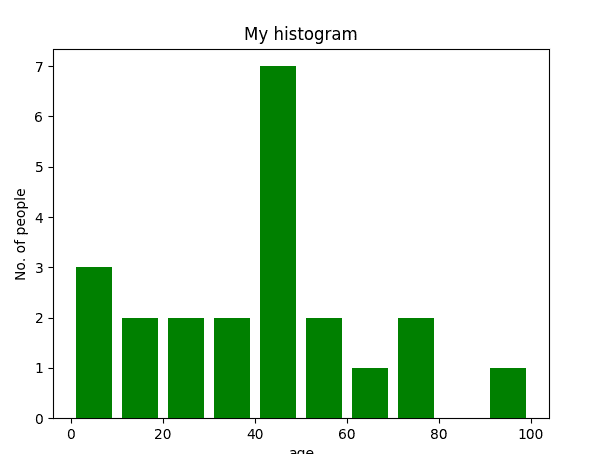
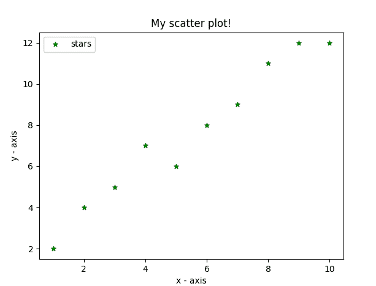
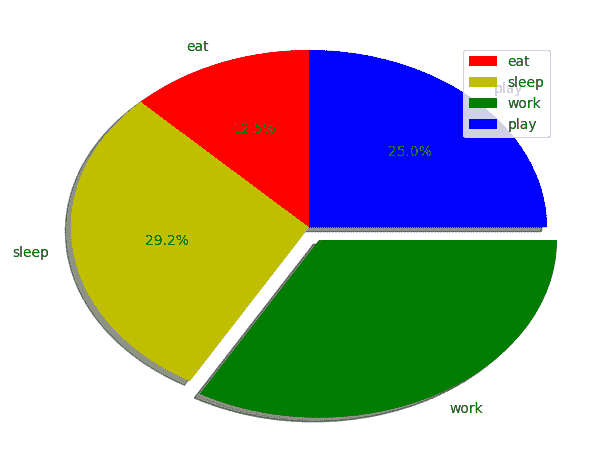
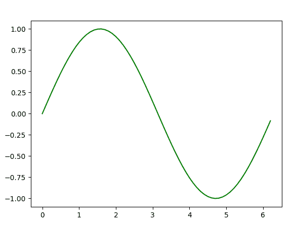

# Python 中的图形绘制|第 1 集

> 原文:[https://www . geesforgeks . org/graph-plot-in-python-set-1/](https://www.geeksforgeeks.org/graph-plotting-in-python-set-1/)

本系列将通过 [Matplotlib](https://matplotlib.org) 向您介绍 python 中的图形绘制，Matplotlib 可以说是 Python 中最流行的图形和数据可视化库。
**安装**
安装 matplotlib 最简单的方法就是使用 pip。在终端输入以下命令:

```py
pip install matplotlib
```

或者，可以从[这里](https://pypi.python.org/pypi/matplotlib)下载，手动安装。

**开始(画线)**

## 计算机编程语言

```py
# importing the required module
import matplotlib.pyplot as plt

# x axis values
x = [1,2,3]
# corresponding y axis values
y = [2,4,1]

# plotting the points
plt.plot(x, y)

# naming the x axis
plt.xlabel('x - axis')
# naming the y axis
plt.ylabel('y - axis')

# giving a title to my graph
plt.title('My first graph!')

# function to show the plot
plt.show()
```

**输出:**



代码似乎不言自明。遵循了以下步骤:

*   将 x 轴和相应的 y 轴值定义为列表。
*   使用**在画布上绘制它们。plot()** 功能。
*   使用**给 x 轴和 y 轴命名。xlabel()** 和**。依拉贝尔()**功能。
*   使用**给你的剧情一个标题。title()** 功能。
*   最后，要查看你的剧情，我们用**。show()** 功能。

**在同一地块上绘制两条或多条线**

## 计算机编程语言

```py
import matplotlib.pyplot as plt

# line 1 points
x1 = [1,2,3]
y1 = [2,4,1]
# plotting the line 1 points
plt.plot(x1, y1, label = "line 1")

# line 2 points
x2 = [1,2,3]
y2 = [4,1,3]
# plotting the line 2 points
plt.plot(x2, y2, label = "line 2")

# naming the x axis
plt.xlabel('x - axis')
# naming the y axis
plt.ylabel('y - axis')
# giving a title to my graph
plt.title('Two lines on same graph!')

# show a legend on the plot
plt.legend()

# function to show the plot
plt.show()
```

**输出:**



*   在这里，我们在同一张图上画两条直线。我们通过给它们一个名称(**标签**)来区分它们，该名称作为的参数传递。plot()函数。
*   给出线条类型和颜色信息的小矩形框称为图例。我们可以使用**为我们的剧情添加一个传说。图例()**功能。

**地块定制**

在这里，我们讨论一些适用于几乎任何情节的基本定制。

## 计算机编程语言

```py
import matplotlib.pyplot as plt

# x axis values
x = [1,2,3,4,5,6]
# corresponding y axis values
y = [2,4,1,5,2,6]

# plotting the points
plt.plot(x, y, color='green', linestyle='dashed', linewidth = 3,
         marker='o', markerfacecolor='blue', markersize=12)

# setting x and y axis range
plt.ylim(1,8)
plt.xlim(1,8)

# naming the x axis
plt.xlabel('x - axis')
# naming the y axis
plt.ylabel('y - axis')

# giving a title to my graph
plt.title('Some cool customizations!')

# function to show the plot
plt.show()
```

**输出:**



如您所见，我们已经完成了如下几项定制

*   设置线宽、线型、线条颜色。
*   设置标记、标记的面部颜色、标记的大小。
*   覆盖 x 轴和 y 轴范围。如果覆盖没有完成，pyplot 模块使用自动缩放功能来设置轴范围和比例。

**条形图**

## 计算机编程语言

```py
import matplotlib.pyplot as plt

# x-coordinates of left sides of bars
left = [1, 2, 3, 4, 5]

# heights of bars
height = [10, 24, 36, 40, 5]

# labels for bars
tick_label = ['one', 'two', 'three', 'four', 'five']

# plotting a bar chart
plt.bar(left, height, tick_label = tick_label,
        width = 0.8, color = ['red', 'green'])

# naming the x-axis
plt.xlabel('x - axis')
# naming the y-axis
plt.ylabel('y - axis')
# plot title
plt.title('My bar chart!')

# function to show the plot
plt.show()
```

**输出:**



*   这里，我们使用 **plt.bar()** 函数来绘制条形图。
*   条形左侧的 x 坐标随条形的高度一起传递。
*   也可以通过定义 **tick_labels** 给 x 轴坐标取一些名字

**直方图**

## 计算机编程语言

```py
import matplotlib.pyplot as plt

# frequencies
ages = [2,5,70,40,30,45,50,45,43,40,44,
        60,7,13,57,18,90,77,32,21,20,40]

# setting the ranges and no. of intervals
range = (0, 100)
bins = 10 

# plotting a histogram
plt.hist(ages, bins, range, color = 'green',
        histtype = 'bar', rwidth = 0.8)

# x-axis label
plt.xlabel('age')
# frequency label
plt.ylabel('No. of people')
# plot title
plt.title('My histogram')

# function to show the plot
plt.show()
```

**输出:**



*   这里，我们使用 **plt.hist()** 函数绘制直方图。
*   频率作为**年龄**列表传递。
*   可以通过定义包含最小值和最大值的元组来设置范围。
*   下一步是“ **bin** ”数值范围——即将整个数值范围划分为一系列区间——然后统计每个区间内有多少数值。这里我们定义了**箱** = 10。所以，总共有 100/10 = 10 个区间。

**散点图**

## 计算机编程语言

```py
import matplotlib.pyplot as plt

# x-axis values
x = [1,2,3,4,5,6,7,8,9,10]
# y-axis values
y = [2,4,5,7,6,8,9,11,12,12]

# plotting points as a scatter plot
plt.scatter(x, y, label= "stars", color= "green",
            marker= "*", s=30)

# x-axis label
plt.xlabel('x - axis')
# frequency label
plt.ylabel('y - axis')
# plot title
plt.title('My scatter plot!')
# showing legend
plt.legend()

# function to show the plot
plt.show()
```

**输出:**



*   这里，我们使用 **plt.scatter()** 函数绘制散点图。
*   作为一条线，我们在这里也定义了 x 和相应的 y 轴值。
*   **标记**参数用于设置用作标记的字符。其大小可以使用**的**参数来定义。

**饼图**

## 计算机编程语言

```py
import matplotlib.pyplot as plt

# defining labels
activities = ['eat', 'sleep', 'work', 'play']

# portion covered by each label
slices = [3, 7, 8, 6]

# color for each label
colors = ['r', 'y', 'g', 'b']

# plotting the pie chart
plt.pie(slices, labels = activities, colors=colors,
        startangle=90, shadow = True, explode = (0, 0, 0.1, 0),
        radius = 1.2, autopct = '%1.1f%%')

# plotting legend
plt.legend()

# showing the plot
plt.show()
```

上面程序的输出是这样的:



*   这里，我们使用 **plt.pie()** 方法绘制饼图。
*   首先，我们使用名为**活动**的列表来定义**标签**。
*   然后，可以使用另一个名为**切片**的列表来定义每个标签的一部分。
*   每个标签的颜色使用名为**颜色**的列表来定义。
*   **阴影=真**将在饼图中的每个标签下显示一个阴影。
*   **起始角度**从 x 轴逆时针旋转饼图的起点给定角度。
*   **爆炸**用于设置我们偏移每个楔形的半径分数。
*   **autoct**用于格式化每个标签的值。这里，我们将它设置为只显示小数点后 1 位的百分比值。

**绘制给定方程的曲线**

## 计算机编程语言

```py
# importing the required modules
import matplotlib.pyplot as plt
import numpy as np

# setting the x - coordinates
x = np.arange(0, 2*(np.pi), 0.1)
# setting the corresponding y - coordinates
y = np.sin(x)

# plotting the points
plt.plot(x, y)

# function to show the plot
plt.show()
```

输出

上面的程序看起来是这样的:



在这里，我们使用了 python 中的通用数组处理包 **NumPy** 。

*   要设置 x 轴值，我们使用****NP . arange()**方法，其中前两个参数用于范围，第三个参数用于逐步增量。结果是一个 NumPy 数组。**
*   **要获得相应的 y 轴值，我们只需在 NumPy 数组上使用预定义的 **np.sin()** 方法。**
*   **最后，我们通过将 x 和 y 数组传递给 **plt.plot()** 函数来绘制点。**

**因此，在这一部分，我们讨论了可以在 matplotlib 中创建的各种类型的图。还有更多情节没有涉及，但最重要的情节在这里讨论–** 

*   **[Python 中的图形绘制|第 2 集](https://www.geeksforgeeks.org/graph-plotting-python-set-2/)**
*   **[Python 中的图形绘制|第 3 集](https://www.geeksforgeeks.org/graph-plotting-python-set-3/)**

**本文由**尼克尔·库马尔**供稿。如果你喜欢极客博客并想投稿，你也可以用 write.geeksforgeeks.org 写一篇文章或者把你的文章邮寄到 review-team@geeksforgeeks.org。看到你的文章出现在极客博客主页上，帮助其他极客。
如果你发现任何不正确的地方，或者你想分享更多关于上面讨论的话题的信息，请写评论。**