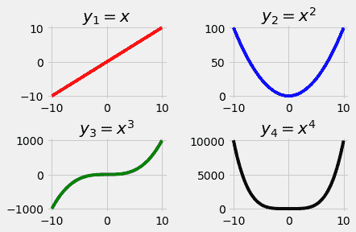
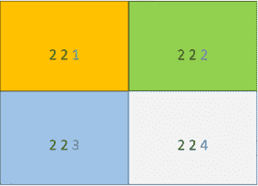
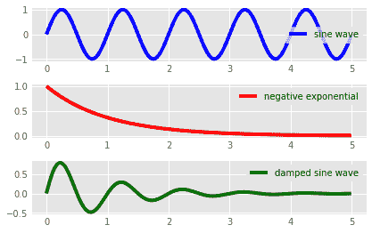
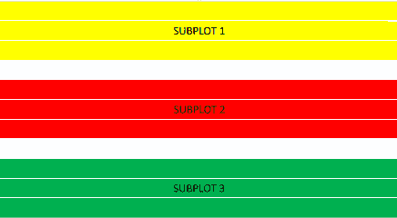
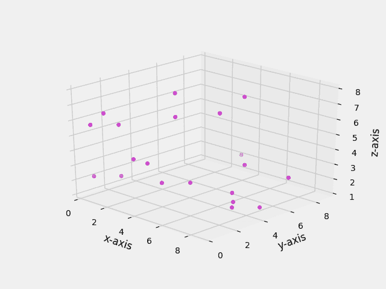
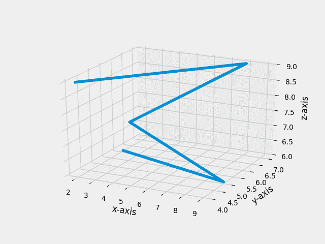
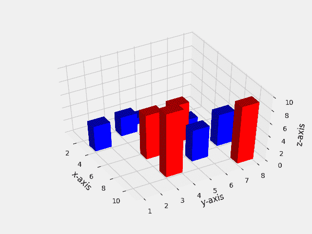
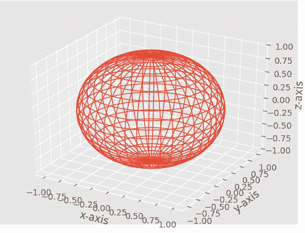

# Python 中的图形绘制|第 2 集

> 原文:[https://www.geeksforgeeks.org/graph-plotting-python-set-2/](https://www.geeksforgeeks.org/graph-plotting-python-set-2/)

[Python 中的图形绘制|第 1 集](https://www.geeksforgeeks.org/graph-plotting-in-python-set-1/)

**支线剧情**

当我们想在同一个图中显示两个或更多的情节时，需要支线剧情。我们可以用两种稍微不同的方法用两种方法来做这件事。
**方法 1**

## 计算机编程语言

```
# importing required modules
import matplotlib.pyplot as plt
import numpy as np

# function to generate coordinates
def create_plot(ptype):
    # setting the x-axis values
    x = np.arange(-10, 10, 0.01)

    # setting the y-axis values
    if ptype == 'linear':
        y = x
    elif ptype == 'quadratic':
        y = x**2
    elif ptype == 'cubic':
        y = x**3
    elif ptype == 'quartic':
        y = x**4

    return(x, y)

# setting a style to use
plt.style.use('fivethirtyeight')

# create a figure
fig = plt.figure()

# define subplots and their positions in figure
plt1 = fig.add_subplot(221)
plt2 = fig.add_subplot(222)
plt3 = fig.add_subplot(223)
plt4 = fig.add_subplot(224)

# plotting points on each subplot
x, y = create_plot('linear')
plt1.plot(x, y, color ='r')
plt1.set_title('$y_1 = x{content}apos;)

x, y = create_plot('quadratic')
plt2.plot(x, y, color ='b')
plt2.set_title('$y_2 = x^2{content}apos;)

x, y = create_plot('cubic')
plt3.plot(x, y, color ='g')
plt3.set_title('$y_3 = x^3{content}apos;)

x, y = create_plot('quartic')
plt4.plot(x, y, color ='k')
plt4.set_title('$y_4 = x^4{content}apos;)

# adjusting space between subplots
fig.subplots_adjust(hspace=.5,wspace=0.5)

# function to show the plot
plt.show()
```

输出:



让我们一步一步来看这个程序:

```
plt.style.use('fivethirtyeight')
```

*   可以通过设置不同的可用样式或您自己的样式来配置地块的样式。你可以在这里了解更多关于这个功能

```
fig = plt.figure()
```

*   图作为所有绘图元素的顶层容器。所以，我们定义一个图形为**图形**，它将包含我们所有的支线剧情。

```
plt1 = fig.add_subplot(221)
plt2 = fig.add_subplot(222)
plt3 = fig.add_subplot(223)
plt4 = fig.add_subplot(224)
```

*   这里我们使用 fig.add_subplot 方法来定义子图及其位置。功能原型是这样的:

```
add_subplot(nrows, ncols, plot_number)
```

*   如果将一个子图应用于一个图形，该图形将在概念上被分割成“n 线”*“ncol”子轴。参数“plot_number”标识函数调用必须创建的子图。“plot_number”的范围可以从 1 到最多“n rows ”*“ncols”。
    如果三个参数的值小于 10，则可以用一个 int 参数调用函数子图，其中百代表‘nrow’，十代表‘ncols’，单位代表‘plot _ number’。这意味着:我们可以写**支线剧情(234)** ，而不是**支线剧情(2，3，4)** 。
    此图将明确如何指定位置:



```
x, y = create_plot('linear')
plt1.plot(x, y, color ='r')
plt1.set_title('$y_1 = x{content}apos;)
```

*   接下来，我们在每个支线剧情上画出我们的点。首先，我们通过指定我们想要的曲线类型，使用 **create_plot** 函数生成 x 和 y 轴坐标。
    然后，我们使用**在支线剧情中绘制这些点。**剧情法。使用 **set_title** 方法设置子剧情的标题。在标题文本的开头和结尾使用 **$** 将确保‘_’(下划线)被视为下标，'^'被视为上标。

```
fig.subplots_adjust(hspace=.5,wspace=0.5)
```

*   这是另一种在子情节之间创造空间的实用方法。

```
plt.show()
```

*   最后，我们调用 plt.show()方法来显示当前的图形。

**方法二**

## 计算机编程语言

```
# importing required modules
import matplotlib.pyplot as plt
import numpy as np

# function to generate coordinates
def create_plot(ptype):
    # setting the x-axis values
    x = np.arange(0, 5, 0.01)

    # setting y-axis values
    if ptype == 'sin':
        # a sine wave
        y = np.sin(2*np.pi*x)
    elif ptype == 'exp':
        # negative exponential function
        y = np.exp(-x)
    elif ptype == 'hybrid':
        # a damped sine wave
        y = (np.sin(2*np.pi*x))*(np.exp(-x))

    return(x, y)

# setting a style to use
plt.style.use('ggplot')

# defining subplots and their positions
plt1 = plt.subplot2grid((11,1), (0,0), rowspan = 3, colspan = 1)
plt2 = plt.subplot2grid((11,1), (4,0), rowspan = 3, colspan = 1)
plt3 = plt.subplot2grid((11,1), (8,0), rowspan = 3, colspan = 1)

# plotting points on each subplot
x, y = create_plot('sin')
plt1.plot(x, y, label = 'sine wave', color ='b')
x, y = create_plot('exp')
plt2.plot(x, y, label = 'negative exponential', color = 'r')
x, y = create_plot('hybrid')
plt3.plot(x, y, label = 'damped sine wave', color = 'g')

# show legends of each subplot
plt1.legend()
plt2.legend()
plt3.legend()

# function to show plot
plt.show()
```

输出:



让我们也来看看这个项目的重要部分:

```
plt1 = plt.subplot2grid((11,1), (0,0), rowspan = 3, colspan = 1)
plt2 = plt.subplot2grid((11,1), (4,0), rowspan = 3, colspan = 1)
plt3 = plt.subplot2grid((11,1), (8,0), rowspan = 3, colspan = 1)
```

*   **子图 2grid** 类似于“pyplot.subplot”，但是使用基于 0 的索引，让子图占据多个单元格。
    让我们试着理解**子批次 2**方法的论点:
    1。参数 1:网格的几何形状
    2。参数 2:子剧情在网格中的位置
    3。参数 3: (rowspan)子图覆盖的行数。
    4。参数 4: (colspan)子图覆盖的列数。
    这个图会让这个概念更加清晰:



*   在我们的例子中，每个子图跨越 3 行 1 列，有 2 个空行(第 4、8 行)。

```
x, y = create_plot('sin')
plt1.plot(x, y, label = 'sine wave', color ='b')
```

*   这一部分没有什么特别之处，因为在一个子情节上绘制点的语法保持不变。

```
plt1.legend()
```

*   这将在图上显示子剧情的标签。

```
plt.show()
```

*   最后，我们调用 plt.show()函数来显示当前的图。

**注:**通过以上两个例子，我们可以推断，当图的大小一致时，应该使用**子图()**方法，其中当我们想要在子图的位置和大小上有更大的灵活性时，应该首选**子图 2grid()** 方法。

**三维绘图**

我们可以很容易地在 matplotlib 中绘制三维图形。现在，我们讨论一些重要且常用的三维图。

*   **标绘点**

## 计算机编程语言

```
from mpl_toolkits.mplot3d import axes3d
import matplotlib.pyplot as plt
from matplotlib import style
import numpy as np

# setting a custom style to use
style.use('ggplot')

# create a new figure for plotting
fig = plt.figure()

# create a new subplot on our figure
# and set projection as 3d
ax1 = fig.add_subplot(111, projection='3d')

# defining x, y, z co-ordinates
x = np.random.randint(0, 10, size = 20)
y = np.random.randint(0, 10, size = 20)
z = np.random.randint(0, 10, size = 20)

# plotting the points on subplot

# setting labels for the axes
ax1.set_xlabel('x-axis')
ax1.set_ylabel('y-axis')
ax1.set_zlabel('z-axis')

# function to show the plot
plt.show()
```

*   上述程序的输出将为您提供一个可以旋转或放大图的窗口。下面是截图:(暗点比亮点近)



*   现在让我们试着理解这段代码的一些重要方面。

```
from mpl_toolkits.mplot3d import axes3d
```

*   这是在三维空间绘图所需的模块。

```
ax1 = fig.add_subplot(111, projection='3d')
```

*   这里，我们在图上创建一个子场景，并将投影参数设置为 3d。

```
ax1.scatter(x, y, z, c = 'm', marker = 'o')
```

*   现在我们用**。散射()**功能绘制 XYZ 平面上的点。
*   **绘制线**

## 计算机编程语言

```
# importing required modules
from mpl_toolkits.mplot3d import axes3d
import matplotlib.pyplot as plt
from matplotlib import style
import numpy as np

# setting a custom style to use
style.use('ggplot')

# create a new figure for plotting
fig = plt.figure()

# create a new subplot on our figure
ax1 = fig.add_subplot(111, projection='3d')

# defining x, y, z co-ordinates
x = np.random.randint(0, 10, size = 5)
y = np.random.randint(0, 10, size = 5)
z = np.random.randint(0, 10, size = 5)

# plotting the points on subplot
ax1.plot_wireframe(x,y,z)

# setting the labels
ax1.set_xlabel('x-axis')
ax1.set_ylabel('y-axis')
ax1.set_zlabel('z-axis')

plt.show()
```

*   上述程序的三维图截图如下:



*   这个程序与前一个程序的主要区别是:

```
ax1.plot_wireframe(x,y,z)
```

*   我们用了**。plot _ 线框()**在给定的一组三维点上绘制线的方法。
*   **标绘条**

## 计算机编程语言

```
# importing required modules
from mpl_toolkits.mplot3d import axes3d
import matplotlib.pyplot as plt
from matplotlib import style
import numpy as np

# setting a custom style to use
style.use('ggplot')

# create a new figure for plotting
fig = plt.figure()

# create a new subplot on our figure
ax1 = fig.add_subplot(111, projection='3d')

# defining x, y, z co-ordinates for bar position
x = [1,2,3,4,5,6,7,8,9,10]
y = [4,3,1,6,5,3,7,5,3,7]
z = np.zeros(10)

# size of bars
dx = np.ones(10)              # length along x-axis
dy = np.ones(10)              # length along y-axs
dz = [1,3,4,2,6,7,5,5,10,9]   # height of bar

# setting color scheme
color = []
for h in dz:
    if h > 5:
        color.append('r')
    else:
        color.append('b')

# plotting the bars
ax1.bar3d(x, y, z, dx, dy, dz, color = color)

# setting axes labels
ax1.set_xlabel('x-axis')
ax1.set_ylabel('y-axis')
ax1.set_zlabel('z-axis')

plt.show()
```

*   创建的三维环境截图如下:



*   让我们来看看这个项目的重要方面:

```
x = [1,2,3,4,5,6,7,8,9,10]
y = [4,3,1,6,5,3,7,5,3,7]
z = np.zeros(10)
```

*   这里，我们定义了条形的基本位置。设置 z = 0 意味着所有条都从 XY 平面开始。

```
dx = np.ones(10)              # length along x-axis
dy = np.ones(10)              # length along y-axs
dz = [1,3,4,2,6,7,5,5,10,9]   # height of bar
```

*   dx、dy、dz 表示棒材的尺寸。把杆看成一个长方体，那么 dx，dy，dz 分别是它沿 x，y，z 轴的展开式。

```
for h in dz:
    if h > 5:
        color.append('r')
    else:
        color.append('b')
```

*   在这里，我们将每个条形的颜色设置为列表。对于高度大于 5 的条形，配色方案为红色，否则为蓝色。

```
ax1.bar3d(x, y, z, dx, dy, dz, color = color)
```

*   最后，我们使用 **.bar3d()** 函数来绘制条形图。
*   **绘制曲线**

## 计算机编程语言

```
# importing required modules
from mpl_toolkits.mplot3d import axes3d
import matplotlib.pyplot as plt
from matplotlib import style
import numpy as np

# setting a custom style to use
style.use('ggplot')

# create a new figure for plotting
fig = plt.figure()

# create a new subplot on our figure
ax1 = fig.add_subplot(111, projection='3d')

# get points for a mesh grid
u, v = np.mgrid[0:2*np.pi:200j, 0:np.pi:100j]

# setting x, y, z co-ordinates
x=np.cos(u)*np.sin(v)
y=np.sin(u)*np.sin(v)
z=np.cos(v)

# plotting the curve
ax1.plot_wireframe(x, y, z, rstride = 5, cstride = 5, linewidth = 1)

plt.show()
```

*   这个程序的输出会是这样的:



*   这里，我们绘制了一个球体作为网格。
    让我们来看一些重要的部分:

```
u, v = np.mgrid[0:2*np.pi:200j, 0:np.pi:100j]
```

*   我们使用 np.mgrid 来获取点，这样我们就可以创建一个网格。
    你可以在这里阅读更多关于这个[的内容。](https://docs.scipy.org/doc/numpy/reference/generated/numpy.mgrid.html)

```
x=np.cos(u)*np.sin(v)
y=np.sin(u)*np.sin(v)
z=np.cos(v)
```

*   这不过是球体的参数方程。

```
ax1.plot_wireframe(x, y, z, rstride = 5, cstride = 5, linewidth = 1)
```

*   阿甘，我们用**。plot _ 线框()**方法。在这里， **rstride** 和 **cstride** 参数可以用来设置我们的网格必须有多密集。

下一篇:[Python 中的图形绘制|第 3 集](https://www.geeksforgeeks.org/graph-plotting-python-set-3/)
本文由 **Nikhil Kumar** 供稿。如果你喜欢极客博客并想投稿，你也可以用 write.geeksforgeeks.org 写一篇文章或者把你的文章邮寄到 review-team@geeksforgeeks.org。看到你的文章出现在极客博客主页上，帮助其他极客。
如果发现有不正确的地方，或者想分享更多关于上述话题的信息，请写评论。